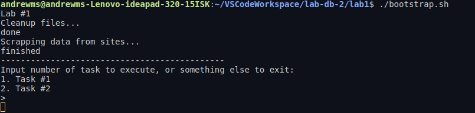
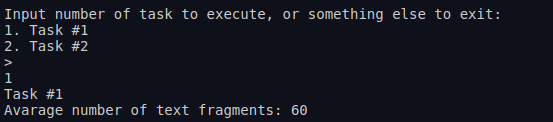
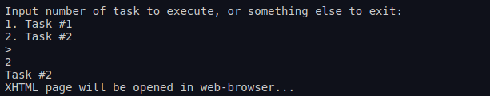
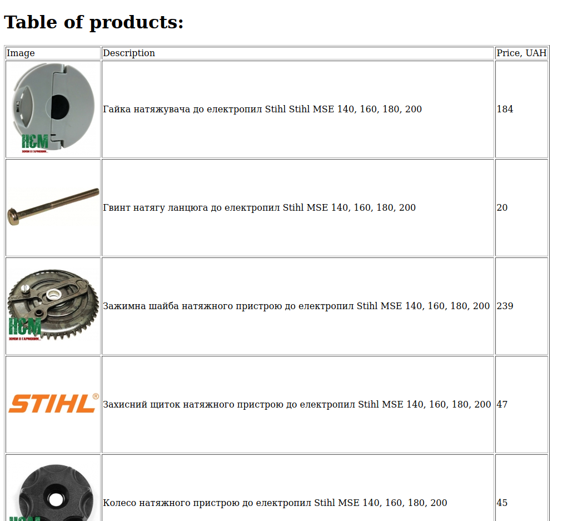

# Лабораторна робота No 1. Вивчення базових операцій обробки XML-документів

## Завдання

[Постановка завдання](docs/lab1_bd2-db2019_2020.docx.pdf)

## Варіант завдання

12 варіант згідно номера у списку групи

| Базова сторінка (завдання 1) | Зміст завдання 2     | Адреса інтернет-магазину (завдання 3) |
|------------------------------|----------------------|---------------------------------------|
| www.uartlib.org         | Середня кількість текстових фрагментів | www.hozmart.com.ua |

## Лістинг коду

### Збирання даних зі сторінки www.uartlib.org  

`src/scrapers/spiders/library.py`

```python
class LibrarySpider(scrapy.Spider):
    name = 'books'
    allowed_domains = ['uartlib.org']
    start_urls = ['http://uartlib.org/']

    def parse(self, response: Response):
        all_images = response.xpath("//img/@src[starts-with(., 'http')]")
        all_text = response.xpath("//a[@class='_blank cvplbd']/text()")
        yield {
            'url': response.url,
            'payload': [{'type': 'text', 'data': text.get().strip()} for text in all_text] +
                       [{'type': 'image', 'data': image.get()} for image in all_images]
        }
        if response.url == self.start_urls[0]:
            all_links = response.xpath(
                "//a/@href[starts-with(., 'http://uartlib.org/')]")
            selected_links = [link.get() for link in all_links][:19]
            for link in selected_links:
                yield scrapy.Request(link, self.parse)

```

### Збирання даних зі сторінки www.hozmart.com.ua

`src/scrapers/spiders/hozmart.py`

```python
class HozmartSpider(scrapy.Spider):
    name = 'hozmart'
    allowed_domains = ['www.hozmart.ua']
    start_urls = ['https://www.hozmart.com.ua/uk/953-zapchastini-do-elektropil-stihl']

    def parse(self, response: Response):
        products = response.xpath("//div[contains(@class, 'cell item')]")[:20]
        for product in products:
            yield {
                'description': product.xpath("./h3/a[@class='b1c-name-uk']/text()").get(),
                'price': product.xpath("substring-before(./p[contains(@class, 'b1c-withoutprice')]/text(),' грн.')").get(),
                'img': product.xpath("./div/a/img[@id='product']/@src[starts-with(., 'https')]").get()
            }
```

### Запис зібраних даних до файлів

`src/scrapers/pipelines.py`

```python
class ScrapersPipeline(object):
    def __init__(self):
        self.root = None

    def open_spider(self, spider):
        self.root = etree.Element("data" if spider.name == "books" else "shop")

    def close_spider(self, spider):
        with open('task%d.xml' % (1 if spider.name == "books" else 2), 'wb') as f:
            f.write(etree.tostring(self.root, encoding="UTF-8", pretty_print=True, xml_declaration=True))

    def process_item(self, item, spider):
        if spider.name == "books":
            page = etree.Element("page", url=item["url"])
            for payload in item["payload"]:
                fragment = etree.Element("fragment", type=payload["type"])
                fragment.text = payload["data"]
                page.append(fragment)
            self.root.append(page)
        else:
            product = etree.Element("product")
            desc = etree.Element("description")
            desc.text = item["description"]
            pr = etree.Element("price")
            pr.text = item["price"]
            img = etree.Element("image")
            img.text = item["img"]
            product.append(desc)
            product.append(pr)
            product.append(img)
            self.root.append(product)
        return item
```

### Завдання №1

`src/main.py`

```python
def task1():
    print("Task #1")
    root = etree.parse("task1.xml")
    count = root.xpath("count(//page/fragment[@type='text']) div count(//page)")
    print("Avarage number of text fragments: %d" % (count))
```

### Завдання №2

`src/main.py`

```python
def task2():
    print("Task #2")
    transform = etree.XSLT(etree.parse("task2.xsl"))
    result = transform(etree.parse("task2.xml"))
    result.write("task2.xhtml", pretty_print=True, encoding="UTF-8")
    print("XHTML page will be opened in web-browser...")
    webbrowser.open('file://' + os.path.realpath("task2.xhtml"))
```

`src/task2.xsl`

```xml
<?xml version="1.0" encoding="UTF-8"?>
<xsl:stylesheet version="1.0" xmlns:xsl="http://www.w3.org/1999/XSL/Transform" xmlns="http://www.w3.org/1999/xhtml">
    <xsl:output
        method="xml"
        doctype-system="http://www.w3.org/TR/xhtml11/DTD/xhtml11.dtd"
        doctype-public="-//W3C//DTD XHTML 1.1//EN"
        indent="yes"
    />
    <xsl:template match="/">
        <html xml:lang="en">
            <head>
                <title>Task 2</title>
            </head>
            <body>
                <h1>Table of products:</h1>
                <xsl:apply-templates select="/shop"/>
                <xsl:if test="count(/shop/product) = 0">
                    <p>There are no products available</p>
                </xsl:if>
            </body>
        </html>
    </xsl:template>
    <xsl:template match="/shop">
        <table border="1">
            <thead>
                <tr>
                    <td>Image</td>
                    <td>Description</td>
                    <td>Price, UAH</td>
                </tr>
            </thead>
            <tbody>
                <xsl:apply-templates select="/shop/product"/>
            </tbody>
        </table>
    </xsl:template>
    <xsl:template match="/shop/product">
        <tr>
            <td>
                 <xsl:apply-templates select="image"/>
            </td>
            <td>
                <xsl:apply-templates select="description"/>
            </td>
            <td>
                <xsl:apply-templates select="price"/>
            </td>
        </tr>
    </xsl:template>
    <xsl:template match="image">
        
            <xsl:attribute name="src">
                <xsl:value-of select="text()"/>
            </xsl:attribute>
        </img>
    </xsl:template>
    <xsl:template match="price">
        <xsl:value-of select="text()"/>
    </xsl:template>
    <xsl:template match="description">
        <xsl:value-of select="text()"/>
    </xsl:template>
</xsl:stylesheet>
```

## Лістинг згенерованих файлів

### task1.xml

```xml
<?xml version='1.0' encoding='UTF-8'?>
<data>
  <page url="http://uartlib.org/">
    <fragment type="text">Віктор Малинка. Каталог виставки творів</fragment>
    <fragment type="text">Вадим Петров. Собор: живопис, графіка</fragment>
    <fragment type="text">Олекса Новаківський. Альбом</fragment>
    <fragment type="text">Петро Левченко. Комплект репродукцій</fragment>
    <fragment type="text">Олександр Федорук. Миколи Бутович: Життя і творчість</fragment>
    <fragment type="text">Олексій Какало. Живопис</fragment>
    <fragment type="text">Анатолий Попов. Елена Кульчицкая. Графика. Живопись</fragment>
    <fragment type="text">Вадим Щербаківський. Пам`яті Василя Григоровича Кричевського</fragment>
    <fragment type="text">Ніл Хасевич. Найживіша галузь мистецтва</fragment>
    <fragment type="text">Народний художник Української РСР Сергій Федорович Шишко. Живопис. Рисунок. Каталог</fragment>
    <fragment type="text">Ярослава Музика. Каталог виставки</fragment>
    <fragment type="text">Святослав Гординський. Павло Ковжун</fragment>
    <fragment type="text">Петро Андрусів. Маляр і графік. Монографія за редакцією Святослава Гординського</fragment>
    <fragment type="text">С. Качмарська. Марія Башкірцева</fragment>
    <fragment type="text">Гравюры Василия Касияна</fragment>
    <fragment type="text">Ю. В. Белічко. Георгій Малаков</fragment>
    <fragment type="text">Ксенія Колотило. Альбом</fragment>
    <fragment type="text">Іван Гончар. Альбом</fragment>
    <fragment type="text">Сергій Шишко. Київська сюїта. Альбом</fragment>
    <fragment type="text">Сергій Адамович. Каталог</fragment>
    <fragment type="text">Міртала. Скульптура. Каталог виставки</fragment>
    <fragment type="text">Олекса Грищенко. Мої зустрічі і розмови з французькими мистцями</fragment>
    <fragment type="text">Володимир Павленко. Ліричний щоденник Миколи Глущенка</fragment>
    <fragment type="text">Іван Труш. Комплект листівок</fragment>
    <fragment type="text">Д. Антонович. Василь Лепикаш</fragment>
    <fragment type="text">Володимир Масик. Каталог виставки творів</fragment>
    <fragment type="text">Дмитро Степовик. Іван Щирський. Поетичний образ в українській барокковій гравюрі</fragment>
    <fragment type="text">В. Войтович. Микола Стороженко. Альбом</fragment>
    <fragment type="text">Микола Глущенко. Каталог виставки</fragment>
    <fragment type="text">Антон Штепа. Каталог. Твори з колекції Музею українського народного декоративного мистецтва</fragment>
    <fragment type="text">Художник — дітям. Георгій Малаков. Комплект листівок</fragment>
    <fragment type="text">Образ комуніста в українському образотворчому мистецтві. Комплект листівок</fragment>
    <fragment type="text">Ленінським шляхом. Каталог обласної художньої виставки, присвяченої 60-річчю великого жовтня</fragment>
    <fragment type="text">Своїми руками</fragment>
    <fragment type="text">Ольга Петрова. “Комедія” Данте Аліґ’єрі. Мистецький коментар XIV—XX століть</fragment>
    <fragment type="text">Занавес для художника. Альбом экспериментально-художественного объединения “ЛИТЕРА А”</fragment>
    <fragment type="text">Українські радянські художники. Довідник</fragment>
    <fragment type="text">Олекса Повстенко. Історія українського мистецтва. Частина перша</fragment>
    <fragment type="text">Віктор Давидюк. Первісна міфологія українського фольклору</fragment>
    <fragment type="text">АРКА. 1947-1948. Журнал літератури, мистецтва і критики: Бібліографічний покажчик змісту</fragment>
    <fragment type="text">Херсонський художній музей ім. О. О. Шовкуненка. Альбом</fragment>
    <fragment type="text">Народні художні промисли України: історія, сьогодення, перспективи</fragment>
    <fragment type="text">О. Ф. Розум. Таємниці друкарства</fragment>
    <fragment type="text">Ю. С. Асєєв. Мистецтво стародавнього Києва</fragment>
    <fragment type="text">Леонід Владич. Огляди. Рецензії. Статті</fragment>
    <fragment type="text">Віра Свєнціцька. Іван Руткович і становлення реалізму в українському малярстві XVII ст.</fragment>
    <fragment type="text">Данило Щербаківський. Оправи книжок у київських золотарів  XVII — XX ст.</fragment>
    <fragment type="text">Народні перлини. Українські народні пісні</fragment>
    <fragment type="text">Platon Biletsky. Soviet Ukrainian Art. Painting. Sculpture. Graphic Art</fragment>
    <fragment type="text">Ю. Ф. Лащук. Украинская народная керамика XIX — XX ст. Автореферат диссертации на соискание ученой степени доктора искусствоведения</fragment>
    <fragment type="text">Музей М. М. Коцюбинського в Чернігові. Фотоальбом</fragment>
    <fragment type="text">Мистецька шевченкіана Музею “Кобзаря”. Комплект листівок</fragment>
    <fragment type="text">Людмила Огнєва. Перлини українського монументального мистецтва на Донеччині</fragment>
    <fragment type="text">Плеяда нескорених: Алла Горська, Опанас Заливаха, Віктор Зарецький, Галина Севрук, Людмила Семикіна. Бібліографічний нарис</fragment>
    <fragment type="text">Леся Смирна. Століття нонконформізму в українському візуальному мистецтві. Монографія</fragment>
    <fragment type="text">Народные мастера Приднепровья</fragment>
    <fragment type="text">Українські народні пісні на слова Т.Г.Шевченка. Комплект листівок</fragment>
    <fragment type="text">Роман Сельський та його коло. Комплект листівок</fragment>
    <fragment type="text">Республіканська художня виставка “На варті завоювань соціалізму”. Каталог</fragment>
    <fragment type="text">Мир Земле, мир людям. Каталог выставки работ самодеятельных художников г. Киева</fragment>
    <fragment type="text">Jo-Anne Birnie Danzker, Igor Jassenjawsky, Joseph Kiblitsky. Avantgarde &amp; Ukraine</fragment>
    <fragment type="text">Горбачов Дмитро</fragment>
    <fragment type="text">Ukrajinska Avangarda 1910-1930</fragment>
    <fragment type="text">Дмитро Горбачов. Гопашно-шароварна культура як джерело світового авангарду</fragment>
    <fragment type="text">Веселовська Г. І. Український театральний авангард</fragment>
    <fragment type="text">Василий Ермилов. Каталог выставки</fragment>
    <fragment type="text">Д. О. Горбачов. Анатоль Петрицький. Нарис творчості</fragment>
    <fragment type="text">Феликс Зинько. Отец русского футуризма. Давид Бурлюк. Очерк</fragment>
    <fragment type="text">Александра Экстер. Эскизы декораций и костюмов. Из собрания ГЦТМ им. А. А. Бахрушина</fragment>
    <fragment type="text">М. В. Чернова. Борис Васильович Косарєв. Нарис життя і творчості</fragment>
    <fragment type="text">Давид Бурлюк. Филонов. Повесть</fragment>
    <fragment type="text">Антологія українського плаката першої третини ХХ століття</fragment>
    <fragment type="text">Андрій Андрейканіч. Українські майстри кіноплаката першої третини ХХ століття</fragment>
    <fragment type="text">Katharine Kuh. Alexander Archipenko. A Memorial Exhibition 1967-1969</fragment>
    <fragment type="text">Futurism and After: David Burliuk 1882-1967</fragment>
    <fragment type="text">From Utopia to Tragedy. Ukrainian Avant-Garde 1914-1934</fragment>
    <fragment type="text">Олекса Грищенко. Мої зустрічі і розмови з французькими мистцями</fragment>
    <fragment type="text">Ирина Пальмова. Художник Виктор Пальмов и его время</fragment>
    <fragment type="text">Олекса Грищенко. Мої роки в Царгороді. 1919-1920-1921</fragment>
    <fragment type="text">Анатоль Петрицький. Театральні строї. Текст В. Хмурого</fragment>
    <fragment type="text">С. І. Побожій. “Бубновий валет” і Сумщина</fragment>
    <fragment type="text">І. І. Врона. Мистецтво революції й АРМУ</fragment>
    <fragment type="text">Назадництво Гарту та заклик групи митців Авангард</fragment>
    <fragment type="text">Нова генерація, №1 – 1929</fragment>
    <fragment type="text">James Butterwick. Alexander Bogomazov. 1880-1930</fragment>
    <fragment type="text">Александр Богомазов. Мастер кубофутуризма. Работы из коллекции Джеймса Баттервика</fragment>
    <fragment type="text">Євген Холостенко. Василь Овчинніков</fragment>
    <fragment type="text">Євген Холостенко. Микола Рокицький</fragment>
    <fragment type="text">Нова генерація, №11 – 1928</fragment>
    <fragment type="text">Нова генерація, №10 – 1928</fragment>
    <fragment type="text">Андрій Андрейканіч. Марко Мегединюк. Альбом</fragment>
    <fragment type="text">Андрій Андрейканіч. Кокафонія. Микола Стринадюк</fragment>
    <fragment type="text">Андрій Андрейканіч. Микола Стринадюк. Художнє дерево</fragment>
    <fragment type="text">В. Молинь, А. Андрейканіч, І. Яремин. Василь і Микола Девдюки</fragment>
    <fragment type="text">Н. Велігоцька. Сучасне українське народне мистецтво. Альбом</fragment>
    <fragment type="text">Фарфор з Музею етнографії та художнього промислу у Львові. Комплект листівок</fragment>
    <fragment type="text">Косів. Серія “Перлини народного мистецтва”</fragment>
    <fragment type="text">Л. Є. Жоголь. Тканини в інтер`єрі</fragment>
    <fragment type="text">Баранівський фарфор</fragment>
    <fragment type="text">Ярослава Кожолянко. Буковинський традиційний одяг</fragment>
    <fragment type="text">Н. О. Глухенька. Петриківські розписи</fragment>
    <fragment type="text">Нариси з історії українського декоративно-прикладного мистецтва</fragment>
    <fragment type="text">Українське народне вбрання. Комплект листівок</fragment>
    <fragment type="text">П. Жолтовський, П. Мусієнко. Українське декоративне мистецтво</fragment>
    <fragment type="text">Петро Лінинський. Повернене з небуття. Виникнення та розвиток рельєфної кахлі в Галичині</fragment>
    <fragment type="text">Кость Шонк-Русич. Дерев`яна різьба в Україні</fragment>
    <fragment type="text">L`Art Populaire Ukrainien. Українське народне мистецтво</fragment>
    <fragment type="text">Українська народна творчість</fragment>
    <fragment type="text">Євгенія Шудря. Дослідники народного мистецтва. Бібліографічні нариси</fragment>
    <fragment type="text">К. Променицький. Петро Верна</fragment>
    <fragment type="text">Ксенія Колотило. Альбом</fragment>
    <fragment type="text">Ксенія Колотило. Альбом</fragment>
    <fragment type="text">Яків Падалка. Кераміка. Каталог виставки творів</fragment>
    <fragment type="text">Ганна Вінтоняк. Альбом. Автор-упорядник Р. В. Захарчук-Чугай</fragment>
    <fragment type="text">Традиційне вбрання Київщини 18-19 століть. Комплект листівок</fragment>
    <fragment type="text">Ярина Пилипенко. Петриківський розпис. Комплект листівок</fragment>
    <fragment type="text">Український декоративний розпис. Комплект листівок</fragment>
    <fragment type="text">Visible Symbols: Cultural Expression Among Canada`s Ukrainians</fragment>
    <fragment type="text">Віра Зайченко. Вишивка козацької старшини 17-18 століть. Техніки</fragment>
    <fragment type="text">А. К. Жук. Сучасні українські художні тканини</fragment>
    <fragment type="text">Т. М. Ткачук, К. Л. Тимус. Галицькі керамічні плитки із рельєфними зображеннями та гончарні клейма. Каталог</fragment>
    <fragment type="text">Д. Гоберман. Искусство гуцулов</fragment>
    <fragment type="text">Павлина Цвілик. Альбом</fragment>
    <fragment type="text">Подорож у казку. Путівник по осередках народної творчості Гуцульщини</fragment>
    <fragment type="text">Державний музей етнографії та художнього промислу. Альбом</fragment>
    <fragment type="text">Юрій Лащук. Закарпатська народна кераміка</fragment>
    <fragment type="text">Юрій Лащук. Українські кахлі IX-XIX століть</fragment>
    <fragment type="text">Юрій Лащук. Гуцульська кераміка</fragment>
    <fragment type="text">Олекса Бахматюк. Альбом. Стаття Юрія Лащука</fragment>
    <fragment type="text">Олег Слободян. Пістинська кераміка 19 – першої половини 20 століття</fragment>
    <fragment type="text">Юрій Лащук. Косівська кераміка</fragment>
    <fragment type="text">Д. Гоберман. Росписи гуцульских гончаров</fragment>
    <fragment type="text">Франкова батьківщина у збірці Івана Гончара</fragment>
    <fragment type="text">Ярина Пилипенко. Петриківський розпис. Комплект листівок</fragment>
    <fragment type="text">Український декоративний розпис. Комплект листівок</fragment>
    <fragment type="text">Пелагея Глущенко. Альбом</fragment>
    <fragment type="text">О. С. Найден. Орнамент українського народного розпису</fragment>
    <fragment type="text">Марфа Тимченко. Альбом. Упорядник Б. Бутник-Сіверський</fragment>
    <fragment type="text">Б. Бутник-Сиверский. Народные украинские рисунки</fragment>
    <fragment type="text">Тетяна Пата. Альбом</fragment>
    <fragment type="text">Петро Ганжа. Таємниці українського рукомесла</fragment>
    <fragment type="text">Н. О. Глухенька. Федір Панко. Декоративний живопис. Станкові твори. Підлакові розписи</fragment>
    <fragment type="text">О. Статива. Майстер декоративного розпису Надія Білокінь</fragment>
    <fragment type="text">Література. Діти. Час. 1985.</fragment>
    <fragment type="text">Література. Діти. Час. 1980.</fragment>
    <fragment type="text">Український млинологічний журнал. Випуск другий</fragment>
    <fragment type="text">Музы, №7 – 1914</fragment>
    <fragment type="text">Музы, №6 – 1914</fragment>
    <fragment type="text">Музы, №5 – 1914</fragment>
    <fragment type="text">Музы, №4 – 1914</fragment>
    <fragment type="text">Музы, №3 – 1914</fragment>
    <fragment type="text">Музы, №2 – 1914</fragment>
    <fragment type="text">Музы, №1 – 1913</fragment>
    <fragment type="text">Народна творчість та етнографія, №6 – 1976</fragment>
    <fragment type="text">Веселка, №4 – 1977</fragment>
    <fragment type="text">Веселка, №7-8 – 1974</fragment>
    <fragment type="text">Журнал Terra Incognita, № 9 – 2001</fragment>
    <fragment type="text">Журнал Terra Incognita, № 8 – 1999</fragment>
    <fragment type="text">Журнал Terra Incognita, № 7 – 1998</fragment>
    <fragment type="text">Журнал Terra Incognita, № 6 – 1997</fragment>
    <fragment type="text">Журнал Terra Incognita, № 5 – 1996</fragment>
    <fragment type="text">Журнал Terra Incognita, № 3-4 – 1995</fragment>
    <fragment type="text">Журнал Terra Incognita, № 1-2 – 1994</fragment>
    <fragment type="text">Журнал “Новый рок-н-ролл”, №8-9 – 1997</fragment>
    <fragment type="text">Журнал “Новый рок-н-ролл”, №4 – 1997</fragment>
    <fragment type="text">Журнал “Новый рок-н-ролл”, №3 – 1996</fragment>
    <fragment type="text">Журнал “Новый рок-н-ролл”, №2 – 1996</fragment>
    <fragment type="text">Журнал “Новый рок-н-ролл”, №1 – 1996</fragment>
    <fragment type="text">Журнал Художники України, №28 – 2005. Іван Пилипенко</fragment>
    <fragment type="text">Журнал Художники України, №27 – 2005. Наталія Комаринець</fragment>
    <fragment type="text">Журнал Художники України, №26 – 2005. Микола Мальцев</fragment>
    <fragment type="text">Журнал Художники України, №25 – 2005. Костянтин Камишний</fragment>
    <fragment type="text">Журнал Художники України, №24 – 2005. Михайло Алатарцев</fragment>
    <fragment type="image">https://www.facebook.com/tr?id=958519144252197&amp;ev=PageView&#13;
&amp;noscript=1</fragment>
    <fragment type="image">http://uartlib.org/wp-content/uploads/2016/11/united_kingdom_great_britain.png</fragment>
    <fragment type="image">http://uartlib.org/wp-content/uploads/2016/11/ukraine.png</fragment>
    <fragment type="image">http://uartlib.org/wp-content/uploads/2016/05/uartlibtop-1.png</fragment>
    <fragment type="image">http://uartlib.org/wp-content/uploads/2016/04/malinkacover-150x200.jpg</fragment>
    <fragment type="image">http://uartlib.org/wp-content/uploads/2015/07/vpcover-150x200.jpg</fragment>
    <fragment type="image">http://uartlib.org/wp-content/uploads/2015/10/Novakivskiyc-150x200.jpg</fragment>
    <fragment type="image">http://uartlib.org/wp-content/uploads/2014/09/PetroL-150x200.jpg</fragment>
    <fragment type="image">http://uartlib.org/wp-content/uploads/2017/11/butfedco-150x200.jpg</fragment>
    <fragment type="image">http://uartlib.org/wp-content/uploads/2018/10/kakaloco-150x200.jpg</fragment>
    <fragment type="image">http://uartlib.org/wp-content/uploads/2016/08/kulcco83-150x200.jpg</fragment>
    <fragment type="image">http://uartlib.org/wp-content/uploads/2014/09/VK1-150x200.jpg</fragment>
    <fragment type="image">http://uartlib.org/wp-content/uploads/2015/03/Hasevich2009-150x200.jpg</fragment>
    <fragment type="image">http://uartlib.org/wp-content/uploads/2019/03/MDS10334co-150x200.jpg</fragment>
    <fragment type="image">http://uartlib.org/wp-content/uploads/2019/08/img019-150x200.jpg</fragment>
    <fragment type="image">http://uartlib.org/wp-content/uploads/2017/04/kovj43co-150x200.jpg</fragment>
    <fragment type="image">http://uartlib.org/wp-content/uploads/2015/08/Andrusivcover-150x200.jpg</fragment>
    <fragment type="image">http://uartlib.org/wp-content/uploads/2014/09/Bashkirceva-150x200.jpg</fragment>
    <fragment type="image">http://uartlib.org/wp-content/uploads/2017/12/gravvasco-150x200.jpg</fragment>
    <fragment type="image">http://uartlib.org/wp-content/uploads/2018/12/img685co-150x200.jpg</fragment>
    <fragment type="image">http://uartlib.org/wp-content/uploads/2017/01/kolotylo1992-150x200.jpg</fragment>
    <fragment type="image">http://uartlib.org/wp-content/uploads/2019/11/gonchco-150x200.jpg</fragment>
    <fragment type="image">http://uartlib.org/wp-content/uploads/2017/09/shishkyivco-150x200.jpg</fragment>
    <fragment type="image">http://uartlib.org/wp-content/uploads/2018/12/img684co-150x200.jpg</fragment>
    <fragment type="image">http://uartlib.org/wp-content/uploads/2019/03/MDS10557-150x200.jpg</fragment>
    <fragment type="image">http://uartlib.org/wp-content/uploads/2017/01/grifrenchco-150x200.jpg</fragment>
    <fragment type="image">http://uartlib.org/wp-content/uploads/2017/11/pavlgluco-150x200.jpg</fragment>
    <fragment type="image">http://uartlib.org/wp-content/uploads/2015/04/trushcards-150x200.jpg</fragment>
    <fragment type="image">http://uartlib.org/wp-content/uploads/2016/08/lepcover-150x200.jpg</fragment>
    <fragment type="image">http://uartlib.org/wp-content/uploads/2016/12/masikcover-150x200.jpg</fragment>
    <fragment type="image">http://uartlib.org/wp-content/uploads/2015/08/Shirskiyc-150x200.jpg</fragment>
    <fragment type="image">http://uartlib.org/wp-content/uploads/2014/09/Storojenko-150x200.jpg</fragment>
    <fragment type="image">http://uartlib.org/wp-content/uploads/2015/04/Glucover-145x200.jpg</fragment>
    <fragment type="image">http://uartlib.org/wp-content/uploads/2017/11/shtepaco-150x200.jpg</fragment>
    <fragment type="image">http://uartlib.org/wp-content/uploads/2020/03/img166co-150x200.jpg</fragment>
    <fragment type="image">http://uartlib.org/wp-content/uploads/2020/03/img147co-150x200.jpg</fragment>
    <fragment type="image">http://uartlib.org/wp-content/uploads/2020/02/img059co-150x200.jpg</fragment>
    <fragment type="image">http://uartlib.org/wp-content/uploads/2020/02/img060co-150x200.jpg</fragment>
    <fragment type="image">http://uartlib.org/wp-content/uploads/2020/02/img049co-150x200.jpg</fragment>
    <fragment type="image">http://uartlib.org/wp-content/uploads/2020/02/literaco-150x200.jpg</fragment>
    <fragment type="image">http://uartlib.org/wp-content/uploads/2020/02/dovshco-150x200.jpg</fragment>
    <fragment type="image">http://uartlib.org/wp-content/uploads/2020/02/povsco-150x200.jpg</fragment>
    <fragment type="image">http://uartlib.org/wp-content/uploads/2020/01/img880co-150x200.jpg</fragment>
    <fragment type="image">http://uartlib.org/wp-content/uploads/2020/01/arkaco-150x200.jpg</fragment>
    <fragment type="image">http://uartlib.org/wp-content/uploads/2020/01/img850co-150x200.jpg</fragment>
    <fragment type="image">http://uartlib.org/wp-content/uploads/2020/01/img828-150x200.jpg</fragment>
    <fragment type="image">http://uartlib.org/wp-content/uploads/2020/01/img820co-150x200.jpg</fragment>
    <fragment type="image">http://uartlib.org/wp-content/uploads/2020/01/img819co-150x200.jpg</fragment>
    <fragment type="image">http://uartlib.org/wp-content/uploads/2020/01/img821co-150x200.jpg</fragment>
    <fragment type="image">http://uartlib.org/wp-content/uploads/2019/12/rutkco-150x200.jpg</fragment>
    <fragment type="image">http://uartlib.org/wp-content/uploads/2019/12/MDS13922-150x200.jpg</fragment>
    <fragment type="image">http://uartlib.org/wp-content/uploads/2019/12/MDS13847-150x200.jpg</fragment>
    <fragment type="image">http://uartlib.org/wp-content/uploads/2019/12/MDS13572-150x200.jpg</fragment>
    <fragment type="image">http://uartlib.org/wp-content/uploads/2019/11/img711-150x200.jpg</fragment>
    <fragment type="image">http://uartlib.org/wp-content/uploads/2019/11/img536-150x200.jpg</fragment>
    <fragment type="image">http://uartlib.org/wp-content/uploads/2019/11/img585-150x200.jpg</fragment>
    <fragment type="image">http://uartlib.org/wp-content/uploads/2019/11/ognevaco-150x200.jpg</fragment>
    <fragment type="image">http://uartlib.org/wp-content/uploads/2019/11/pleyaco-150x200.jpg</fragment>
    <fragment type="image">http://uartlib.org/wp-content/uploads/2019/11/nonkonformizm-150x200.jpg</fragment>
    <fragment type="image">http://uartlib.org/wp-content/uploads/2019/11/img377-150x200.jpg</fragment>
    <fragment type="image">http://uartlib.org/wp-content/uploads/2019/11/folksongs-150x200.jpg</fragment>
    <fragment type="image">http://uartlib.org/wp-content/uploads/2019/11/img265-150x200.jpg</fragment>
    <fragment type="image">http://uartlib.org/wp-content/uploads/2019/11/MDS13119co-150x200.jpg</fragment>
    <fragment type="image">http://uartlib.org/wp-content/uploads/2019/11/MDS13134co-150x200.jpg</fragment>
    <fragment type="image">http://uartlib.org/wp-content/uploads/2019/05/MDS11302-150x200.jpg</fragment>
    <fragment type="image">http://uartlib.org/wp-content/uploads/2018/12/DmytroGorbachov-150x200.jpg</fragment>
    <fragment type="image">http://uartlib.org/wp-content/uploads/2018/12/img604co-150x200.jpg</fragment>
    <fragment type="image">http://uartlib.org/wp-content/uploads/2018/12/img546co-150x200.jpg</fragment>
    <fragment type="image">http://uartlib.org/wp-content/uploads/2018/11/veselovskaco-150x200.jpg</fragment>
    <fragment type="image">http://uartlib.org/wp-content/uploads/2018/09/MDS08290-150x200.jpg</fragment>
    <fragment type="image">http://uartlib.org/wp-content/uploads/2018/06/img208-150x200.jpg</fragment>
    <fragment type="image">http://uartlib.org/wp-content/uploads/2018/06/img237-150x200.jpg</fragment>
    <fragment type="image">http://uartlib.org/wp-content/uploads/2018/06/MDS07760-150x200.jpg</fragment>
    <fragment type="image">http://uartlib.org/wp-content/uploads/2018/04/MDS07309co-150x200.jpg</fragment>
    <fragment type="image">http://uartlib.org/wp-content/uploads/2018/03/img708-150x200.jpg</fragment>
    <fragment type="image">http://uartlib.org/wp-content/uploads/2017/12/antplakco-150x200.jpg</fragment>
    <fragment type="image">http://uartlib.org/wp-content/uploads/2017/12/kinoplakataa-150x200.jpg</fragment>
    <fragment type="image">http://uartlib.org/wp-content/uploads/2017/12/arch6769-150x200.jpg</fragment>
    <fragment type="image">http://uartlib.org/wp-content/uploads/2017/03/burliukw-150x200.jpg</fragment>
    <fragment type="image">http://uartlib.org/wp-content/uploads/2017/03/utopiaua-150x200.jpg</fragment>
    <fragment type="image">http://uartlib.org/wp-content/uploads/2017/01/grifrenchco-150x200.jpg</fragment>
    <fragment type="image">http://uartlib.org/wp-content/uploads/2017/01/palmovco-150x200.jpg</fragment>
    <fragment type="image">http://uartlib.org/wp-content/uploads/2016/12/gritchcargorod-150x200.jpg</fragment>
    <fragment type="image">http://uartlib.org/wp-content/uploads/2016/11/petrstroico-150x200.jpg</fragment>
    <fragment type="image">http://uartlib.org/wp-content/uploads/2016/11/bubnvaletco-150x200.jpg</fragment>
    <fragment type="image">http://uartlib.org/wp-content/uploads/2016/08/armu26-150x200.jpg</fragment>
    <fragment type="image">http://uartlib.org/wp-content/uploads/2016/08/gart26-150x200.jpg</fragment>
    <fragment type="image">http://uartlib.org/wp-content/uploads/2015/05/generation1929-150x200.jpg</fragment>
    <fragment type="image">http://uartlib.org/wp-content/uploads/2016/07/bogomazov2016-150x200.jpg</fragment>
    <fragment type="image">http://uartlib.org/wp-content/uploads/2016/07/cubomaster-150x200.jpg</fragment>
    <fragment type="image">http://uartlib.org/wp-content/uploads/2016/07/ovchcover-150x200.jpg</fragment>
    <fragment type="image">http://uartlib.org/wp-content/uploads/2016/07/rok33-150x200.jpg</fragment>
    <fragment type="image">http://uartlib.org/wp-content/uploads/2016/10/ng1128co-150x200.jpg</fragment>
    <fragment type="image">http://uartlib.org/wp-content/uploads/2016/10/ng1028co-150x200.jpg</fragment>
    <fragment type="image">http://uartlib.org/wp-content/uploads/2017/10/marcomco-150x200.jpg</fragment>
    <fragment type="image">http://uartlib.org/wp-content/uploads/2017/10/cocamsco-150x200.jpg</fragment>
    <fragment type="image">http://uartlib.org/wp-content/uploads/2017/10/mstrcover-150x200.jpg</fragment>
    <fragment type="image">http://uartlib.org/wp-content/uploads/2017/10/devdukco-150x200.jpg</fragment>
    <fragment type="image">http://uartlib.org/wp-content/uploads/2017/10/veligockaco-150x200.jpg</fragment>
    <fragment type="image">http://uartlib.org/wp-content/uploads/2017/10/farforeco-150x200.jpg</fragment>
    <fragment type="image">http://uartlib.org/wp-content/uploads/2017/07/kosiv-150x200.jpg</fragment>
    <fragment type="image">http://uartlib.org/wp-content/uploads/2017/05/img127-150x200.jpg</fragment>
    <fragment type="image">http://uartlib.org/wp-content/uploads/2017/05/baranivka-150x200.jpg</fragment>
    <fragment type="image">http://uartlib.org/wp-content/uploads/2017/05/bukokojo-150x200.jpg</fragment>
    <fragment type="image">http://uartlib.org/wp-content/uploads/2017/03/petrrozpco-150x200.jpg</fragment>
    <fragment type="image">http://uartlib.org/wp-content/uploads/2017/03/narisi69co-150x200.jpg</fragment>
    <fragment type="image">http://uartlib.org/wp-content/uploads/2017/02/ukrfolkvbrco-150x200.jpg</fragment>
    <fragment type="image">http://uartlib.org/wp-content/uploads/2017/02/decjmco63-150x200.jpg</fragment>
    <fragment type="image">http://uartlib.org/wp-content/uploads/2017/02/linkcover-150x200.jpg</fragment>
    <fragment type="image">http://uartlib.org/wp-content/uploads/2017/02/srwoodco-150x200.jpg</fragment>
    <fragment type="image">http://uartlib.org/wp-content/uploads/2017/01/folkaurora-150x200.jpg</fragment>
    <fragment type="image">http://uartlib.org/wp-content/uploads/2017/01/folkart632co-150x200.jpg</fragment>
    <fragment type="image">http://uartlib.org/wp-content/uploads/2017/01/shudrcover-150x200.jpg</fragment>
    <fragment type="image">http://uartlib.org/wp-content/uploads/2017/01/vernacover-150x200.jpg</fragment>
    <fragment type="image">http://uartlib.org/wp-content/uploads/2017/01/kolotylo1992-150x200.jpg</fragment>
    <fragment type="image">http://uartlib.org/wp-content/uploads/2017/01/kolotyloco-150x200.jpg</fragment>
    <fragment type="image">http://uartlib.org/wp-content/uploads/2017/01/yakivcover-150x200.jpg</fragment>
    <fragment type="image">http://uartlib.org/wp-content/uploads/2016/12/gvintcover-150x200.jpg</fragment>
    <fragment type="image">http://uartlib.org/wp-content/uploads/2016/12/trvbrkco-150x200.jpg</fragment>
    <fragment type="image">http://uartlib.org/wp-content/uploads/2016/11/yapilipco-150x200.jpg</fragment>
    <fragment type="image">http://uartlib.org/wp-content/uploads/2016/10/ukrdero-150x200.jpg</fragment>
    <fragment type="image">http://uartlib.org/wp-content/uploads/2016/10/visscanco-150x200.jpg</fragment>
    <fragment type="image">http://uartlib.org/wp-content/uploads/2016/10/vishtehco-150x200.jpg</fragment>
    <fragment type="image">http://uartlib.org/wp-content/uploads/2016/10/sushuhudtk-150x200.jpg</fragment>
    <fragment type="image">http://uartlib.org/wp-content/uploads/2016/10/gonchkleyma-150x200.jpg</fragment>
    <fragment type="image">http://uartlib.org/wp-content/uploads/2016/02/hutsulart-150x200.jpg</fragment>
    <fragment type="image">http://uartlib.org/wp-content/uploads/2016/01/Cvilikc-150x200.jpg</fragment>
    <fragment type="image">http://uartlib.org/wp-content/uploads/2015/10/pokazkuc-150x200.jpg</fragment>
    <fragment type="image">http://uartlib.org/wp-content/uploads/2015/10/muzey1976c-150x200.jpg</fragment>
    <fragment type="image">http://uartlib.org/wp-content/uploads/2015/09/zakker-150x200.jpg</fragment>
    <fragment type="image">http://uartlib.org/wp-content/uploads/2015/09/ukrkahlic-150x200.jpg</fragment>
    <fragment type="image">http://uartlib.org/wp-content/uploads/2015/09/hutsulkerc-150x200.jpg</fragment>
    <fragment type="image">http://uartlib.org/wp-content/uploads/2015/08/Bahmatikc-150x200.jpg</fragment>
    <fragment type="image">http://uartlib.org/wp-content/uploads/2015/07/slobodyanc-150x200.jpg</fragment>
    <fragment type="image">http://uartlib.org/wp-content/uploads/2015/06/kolacover-150x200.jpg</fragment>
    <fragment type="image">http://uartlib.org/wp-content/uploads/2015/05/kahlia1972-150x200.jpg</fragment>
    <fragment type="image">http://uartlib.org/wp-content/uploads/2015/03/FrankoGonchar-150x200.jpg</fragment>
    <fragment type="image">http://uartlib.org/wp-content/uploads/2016/11/yapilipco-150x200.jpg</fragment>
    <fragment type="image">http://uartlib.org/wp-content/uploads/2016/10/ukrdero-150x200.jpg</fragment>
    <fragment type="image">http://uartlib.org/wp-content/uploads/2016/01/Pelageya-150x200.jpg</fragment>
    <fragment type="image">http://uartlib.org/wp-content/uploads/2015/12/naydenorrnament-150x200.jpg</fragment>
    <fragment type="image">http://uartlib.org/wp-content/uploads/2015/09/Marfac-150x200.jpg</fragment>
    <fragment type="image">http://uartlib.org/wp-content/uploads/2015/09/butnikcover-150x200.jpg</fragment>
    <fragment type="image">http://uartlib.org/wp-content/uploads/2015/07/Patac-150x200.jpg</fragment>
    <fragment type="image">http://uartlib.org/wp-content/uploads/2015/03/Rukomesloc-150x200.jpg</fragment>
    <fragment type="image">http://uartlib.org/wp-content/uploads/2015/02/FPanko-150x200.jpg</fragment>
    <fragment type="image">http://uartlib.org/wp-content/uploads/2014/09/Bilokin1-150x200.jpg</fragment>
    <fragment type="image">http://uartlib.org/wp-content/uploads/2020/02/MDS14253-150x200.jpg</fragment>
    <fragment type="image">http://uartlib.org/wp-content/uploads/2020/02/MDS14242-150x200.jpg</fragment>
    <fragment type="image">http://uartlib.org/wp-content/uploads/2019/11/MDS13263-150x200.jpg</fragment>
    <fragment type="image">http://uartlib.org/wp-content/uploads/2019/08/MDS12802-150x200.jpg</fragment>
    <fragment type="image">http://uartlib.org/wp-content/uploads/2019/08/MDS12813-150x200.jpg</fragment>
    <fragment type="image">http://uartlib.org/wp-content/uploads/2019/07/MDS12054-150x200.jpg</fragment>
    <fragment type="image">http://uartlib.org/wp-content/uploads/2019/05/tarasikco-150x200.jpg</fragment>
    <fragment type="image">http://uartlib.org/wp-content/uploads/2019/04/MDS10749co-150x200.jpg</fragment>
    <fragment type="image">http://uartlib.org/wp-content/uploads/2019/03/MDS08203-150x200.jpg</fragment>
    <fragment type="image">http://uartlib.org/wp-content/uploads/2019/03/MDS08255-150x200.jpg</fragment>
    <fragment type="image">http://uartlib.org/wp-content/uploads/2019/03/MDS08266-150x200.jpg</fragment>
    <fragment type="image">http://uartlib.org/wp-content/uploads/2019/03/img834-150x200.jpg</fragment>
    <fragment type="image">http://uartlib.org/wp-content/uploads/2019/02/img415-150x200.jpg</fragment>
    <fragment type="image">http://uartlib.org/wp-content/uploads/2018/11/hlorco-150x200.jpg</fragment>
    <fragment type="image">http://uartlib.org/wp-content/uploads/2018/09/MDS08233-150x200.jpg</fragment>
    <fragment type="image">http://uartlib.org/wp-content/uploads/2018/09/MDS08225-150x200.jpg</fragment>
    <fragment type="image">http://uartlib.org/wp-content/uploads/2018/08/img749-150x200.jpg</fragment>
    <fragment type="image">http://uartlib.org/wp-content/uploads/2018/08/MDS08171-150x200.jpg</fragment>
    <fragment type="image">http://uartlib.org/wp-content/uploads/2018/08/MDS08180-150x200.jpg</fragment>
    <fragment type="image">http://uartlib.org/wp-content/uploads/2018/07/MDS07936-150x200.jpg</fragment>
    <fragment type="image">http://uartlib.org/wp-content/uploads/2018/04/img958-150x200.jpg</fragment>
    <fragment type="image">http://uartlib.org/wp-content/uploads/2018/04/img959-150x200.jpg</fragment>
    <fragment type="image">http://uartlib.org/wp-content/uploads/2018/03/MDS06880-150x200.jpg</fragment>
    <fragment type="image">http://uartlib.org/wp-content/uploads/2018/03/img636co-150x200.jpg</fragment>
    <fragment type="image">http://uartlib.org/wp-content/uploads/2018/02/MDS06204-150x200.jpg</fragment>
    <fragment type="image">http://uartlib.org/wp-content/uploads/2018/01/indpadco-150x200.jpg</fragment>
    <fragment type="image">http://uartlib.org/wp-content/uploads/2017/12/telesiknd-150x200.jpg</fragment>
    <fragment type="image">http://uartlib.org/wp-content/uploads/2017/12/lotperfco-150x200.jpg</fragment>
    <fragment type="image">http://uartlib.org/wp-content/uploads/2017/11/olesvedco-150x200.jpg</fragment>
    <fragment type="image">http://uartlib.org/wp-content/uploads/2017/11/imivtel-150x200.jpg</fragment>
    <fragment type="image">http://uartlib.org/wp-content/uploads/2019/11/MDS13569-150x200.jpg</fragment>
    <fragment type="image">http://uartlib.org/wp-content/uploads/2019/11/MDS13568-150x200.jpg</fragment>
    <fragment type="image">http://uartlib.org/wp-content/uploads/2019/11/mlinco-1-150x200.jpg</fragment>
    <fragment type="image">http://uartlib.org/wp-content/uploads/2019/04/muz7co-150x200.jpg</fragment>
    <fragment type="image">http://uartlib.org/wp-content/uploads/2019/04/muz6co-150x200.jpg</fragment>
    <fragment type="image">http://uartlib.org/wp-content/uploads/2019/04/muz5co-150x200.jpg</fragment>
    <fragment type="image">http://uartlib.org/wp-content/uploads/2019/04/muz4co-150x200.jpg</fragment>
    <fragment type="image">http://uartlib.org/wp-content/uploads/2019/04/muz3co-150x200.jpg</fragment>
    <fragment type="image">http://uartlib.org/wp-content/uploads/2019/04/muz2co-150x200.jpg</fragment>
    <fragment type="image">http://uartlib.org/wp-content/uploads/2019/04/muz1co-150x200.jpg</fragment>
    <fragment type="image">http://uartlib.org/wp-content/uploads/2019/03/MDS10401-150x200.jpg</fragment>
    <fragment type="image">http://uartlib.org/wp-content/uploads/2018/12/MDS09554-150x200.jpg</fragment>
    <fragment type="image">http://uartlib.org/wp-content/uploads/2018/12/MDS09541-150x200.jpg</fragment>
    <fragment type="image">http://uartlib.org/wp-content/uploads/2018/11/ti9co-150x200.jpg</fragment>
    <fragment type="image">http://uartlib.org/wp-content/uploads/2018/11/ti8co-150x200.jpg</fragment>
    <fragment type="image">http://uartlib.org/wp-content/uploads/2018/11/ti7co-150x200.jpg</fragment>
    <fragment type="image">http://uartlib.org/wp-content/uploads/2018/11/ti6co-150x200.jpg</fragment>
    <fragment type="image">http://uartlib.org/wp-content/uploads/2018/11/ti5co-150x200.jpg</fragment>
    <fragment type="image">http://uartlib.org/wp-content/uploads/2018/11/ti34co-150x200.jpg</fragment>
    <fragment type="image">http://uartlib.org/wp-content/uploads/2018/11/ti12co-150x200.jpg</fragment>
    <fragment type="image">http://uartlib.org/wp-content/uploads/2018/10/nrr7co-150x200.jpg</fragment>
    <fragment type="image">http://uartlib.org/wp-content/uploads/2018/10/nrr4co-150x200.jpg</fragment>
    <fragment type="image">http://uartlib.org/wp-content/uploads/2018/10/nrr3co-150x200.jpg</fragment>
    <fragment type="image">http://uartlib.org/wp-content/uploads/2018/10/nrr2co-150x200.jpg</fragment>
    <fragment type="image">http://uartlib.org/wp-content/uploads/2018/10/nrr1co-150x200.jpg</fragment>
    <fragment type="image">http://uartlib.org/wp-content/uploads/2018/12/28co-150x200.jpg</fragment>
    <fragment type="image">http://uartlib.org/wp-content/uploads/2018/12/27co-150x200.jpg</fragment>
    <fragment type="image">http://uartlib.org/wp-content/uploads/2018/12/26co-150x200.jpg</fragment>
    <fragment type="image">http://uartlib.org/wp-content/uploads/2018/12/25co-150x200.jpg</fragment>
    <fragment type="image">http://uartlib.org/wp-content/uploads/2018/12/24co-150x200.jpg</fragment>
    <fragment type="image">http://uartlib.org/wp-content/uploads/2014/10/Agnit1-150x150-100x150.jpg</fragment>
    <fragment type="image">http://uartlib.org/wp-content/uploads/2016/05/SergiyAdamovich-150x150-100x150.jpg</fragment>
    <fragment type="image">http://uartlib.org/wp-content/uploads/2016/05/AksininOleksandr-150x150-100x150.jpg</fragment>
    <fragment type="image">http://uartlib.org/wp-content/uploads/2019/01/AndriyAleksandrovich-150x150-100x150.jpg</fragment>
    <fragment type="image">http://uartlib.org/wp-content/uploads/2018/10/IgorAleksandrovich-202x300-100x150.jpg</fragment>
    <fragment type="image">http://uartlib.org/wp-content/uploads/2016/02/fedaleksandrovich-150x150-100x150.jpg</fragment>
    <fragment type="image">http://uartlib.org/wp-content/uploads/2015/07/EmmaAnd-150x150-100x150.jpg</fragment>
    <fragment type="image">http://uartlib.org/wp-content/uploads/2017/11/IvanAndreykanich-150x150-100x150.jpg</fragment>
    <fragment type="image">http://uartlib.org/wp-content/uploads/2014/08/Andrienko-150x150-100x150.jpg</fragment>
    <fragment type="image">http://uartlib.org/wp-content/uploads/2014/12/Andrusiv-150x150-100x150.jpg</fragment>
    <fragment type="image">http://uartlib.org/wp-content/uploads/2020/01/24kartina-510x382.jpg</fragment>
    <fragment type="image">http://uartlib.org/wp-content/uploads/2019/10/img793-510x382.jpg</fragment>
    <fragment type="image">http://uartlib.org/wp-content/uploads/2019/06/ZHeltaya-komnata-1989-510x382.jpg</fragment>
    <fragment type="image">http://uartlib.org/wp-content/uploads/2018/03/sssss-510x382.jpg</fragment>
    <fragment type="image">http://uartlib.org/wp-content/uploads/2018/02/img304-510x382.jpg</fragment>
    <fragment type="image">http://uartlib.org/wp-content/uploads/2018/01/prnk-510x382.jpg</fragment>
    <fragment type="image">http://uartlib.org/wp-content/uploads/2019/09/img954.jpg</fragment>
    <fragment type="image">http://uartlib.org/wp-content/uploads/2019/08/img0032.jpg</fragment>
    <fragment type="image">http://uartlib.org/wp-content/uploads/2019/02/3.jpg</fragment>
    <fragment type="image">http://uartlib.org/wp-content/uploads/2019/01/MDS09466.jpg</fragment>
    <fragment type="image">http://uartlib.org/wp-content/uploads/2019/01/img207.jpg</fragment>
    <fragment type="image">http://uartlib.org/wp-content/uploads/2018/08/img013-Rusalka.jpg</fragment>
    <fragment type="image">http://uartlib.org/wp-content/uploads/2018/05/0109-1.gif</fragment>
    <fragment type="image">http://uartlib.org/wp-content/uploads/2018/05/MalevichArsenal.jpg</fragment>
    <fragment type="image">http://uartlib.org/wp-content/uploads/2018/04/img079.jpg</fragment>
    <fragment type="image">http://uartlib.org/wp-content/uploads/2018/01/MDS04832.jpg</fragment>
    <fragment type="image">http://uartlib.org/wp-content/uploads/2019/06/img777co-400x551.jpg</fragment>
    <fragment type="image">http://uartlib.org/wp-content/uploads/2019/05/DSCN9751-1-400x541.jpg</fragment>
    <fragment type="image">http://uartlib.org/wp-content/uploads/2018/04/Jivotkov-400x392.jpg</fragment>
    <fragment type="image">http://uartlib.org/wp-content/uploads/2016/02/img815.jpg</fragment>
    <fragment type="image">http://uartlib.org/wp-content/uploads/2016/02/img816.jpg</fragment>
    <fragment type="image">http://uartlib.org/wp-content/uploads/2018/01/MDS05757.jpg</fragment>
    <fragment type="image">http://c.bigmir.net/?v16937175&amp;s16937175&amp;t2</fragment>
  </page>
  <page url="http://uartlib.org/dopomogty-bibliotetsi/">
    <fragment type="image">https://www.facebook.com/tr?id=958519144252197&amp;ev=PageView&#13;
&amp;noscript=1</fragment>
    <fragment type="image">http://uartlib.org/wp-content/uploads/2016/11/united_kingdom_great_britain.png</fragment>
    <fragment type="image">http://uartlib.org/wp-content/uploads/2016/11/ukraine.png</fragment>
    <fragment type="image">http://uartlib.org/wp-content/uploads/2016/05/uartlibtop-1.png</fragment>
    <fragment type="image">http://uartlib.org/wp-content/uploads/2020/03/portraitfeb20.jpg</fragment>
    <fragment type="image">http://c.bigmir.net/?v16937175&amp;s16937175&amp;t2</fragment>
  </page>
  <page url="http://uartlib.org/rik-vydannya/">
    <fragment type="image">https://www.facebook.com/tr?id=958519144252197&amp;ev=PageView&#13;
&amp;noscript=1</fragment>
    <fragment type="image">http://uartlib.org/wp-content/uploads/2016/11/united_kingdom_great_britain.png</fragment>
    <fragment type="image">http://uartlib.org/wp-content/uploads/2016/11/ukraine.png</fragment>
    <fragment type="image">http://uartlib.org/wp-content/uploads/2016/05/uartlibtop-1.png</fragment>
    <fragment type="image">http://c.bigmir.net/?v16937175&amp;s16937175&amp;t2</fragment>
  </page>
  <page url="http://uartlib.org/photo/">
    <fragment type="image">https://www.facebook.com/tr?id=958519144252197&amp;ev=PageView&#13;
&amp;noscript=1</fragment>
    <fragment type="image">http://uartlib.org/wp-content/uploads/2016/11/united_kingdom_great_britain.png</fragment>
    <fragment type="image">http://uartlib.org/wp-content/uploads/2016/11/ukraine.png</fragment>
    <fragment type="image">http://uartlib.org/wp-content/uploads/2016/05/uartlibtop-1.png</fragment>
    <fragment type="image">http://uartlib.org/wp-content/uploads/2019/12/img710.jpg</fragment>
    <fragment type="image">http://uartlib.org/wp-content/uploads/2019/12/img548.jpg</fragment>
    <fragment type="image">http://uartlib.org/wp-content/uploads/2019/10/img646.jpg</fragment>
    <fragment type="image">http://uartlib.org/wp-content/uploads/2019/10/img739.jpg</fragment>
    <fragment type="image">http://uartlib.org/wp-content/uploads/2019/10/img222.jpg</fragment>
    <fragment type="image">http://uartlib.org/wp-content/uploads/2019/07/Yablonska-1973.jpg</fragment>
    <fragment type="image">http://uartlib.org/wp-content/uploads/2019/02/Ivan-Mykolajchuk-pyshe-stsenarij.-Pochatok-1980-h-rokiv.-Foto-Oleksandra-Bronshtejna.jpg</fragment>
    <fragment type="image">http://uartlib.org/wp-content/uploads/2019/02/img819.jpg</fragment>
    <fragment type="image">http://uartlib.org/wp-content/uploads/2019/02/Sergij-Paradzhanov-i-Mariya-Pryjmachenko.-Bolotnya-1973-rik.-Foto-Igorya-Gilbo..jpg</fragment>
    <fragment type="image">http://uartlib.org/wp-content/uploads/2019/02/Natsionalnyj-hudozhnij-muzej-Ukrayiny.-Foto-Borysa-Mindelya.-1982-rik..jpg</fragment>
    <fragment type="image">http://uartlib.org/wp-content/uploads/2019/02/img068.jpg</fragment>
    <fragment type="image">http://uartlib.org/wp-content/uploads/2019/02/Moye-misto-Germana-Dryukova-1934-2001.jpg</fragment>
    <fragment type="image">http://uartlib.org/wp-content/uploads/2019/02/Isak-Rabynovych-Proekt-mista-na-Marsi-do-filmu-Aelita-1924-rik.jpg</fragment>
    <fragment type="image">http://uartlib.org/wp-content/uploads/2019/02/Trush-malyuye-kvity-u-svoyemu-sadu-u-Lvovi.-1935-rik.jpg</fragment>
    <fragment type="image">http://uartlib.org/wp-content/uploads/2019/02/Hudozhnyk-Osyp-Kurylas-1916-rik.jpg</fragment>
    <fragment type="image">http://uartlib.org/wp-content/uploads/2019/02/Mama-Kazymyra-Malevycha.-1932-rik.-1.jpg</fragment>
    <fragment type="image">http://uartlib.org/wp-content/uploads/2018/04/img945.jpg</fragment>
    <fragment type="image">http://uartlib.org/wp-content/uploads/2018/04/img944.jpg</fragment>
    <fragment type="image">http://uartlib.org/wp-content/uploads/2018/04/img9432.jpg</fragment>
    <fragment type="image">http://uartlib.org/wp-content/uploads/2018/04/img939.jpg</fragment>
    <fragment type="image">http://uartlib.org/wp-content/uploads/2018/04/img9392.jpg</fragment>
    <fragment type="image">http://uartlib.org/wp-content/uploads/2018/02/DSCN4662.jpg</fragment>
    <fragment type="image">http://c.bigmir.net/?v16937175&amp;s16937175&amp;t2</fragment>
  </page>
  <page url="http://uartlib.org/notatky-z-mystetstva-ukrainian-art-digest/">
    <fragment type="text">Нотатки з мистецтва, №30 – 1990</fragment>
    <fragment type="text">Нотатки з мистецтва, №29 – 1989</fragment>
    <fragment type="text">Нотатки з мистецтва, №28 – 1988</fragment>
    <fragment type="text">Нотатки з мистецтва, №27 – 1987</fragment>
    <fragment type="text">Нотатки з мистецтва, №26 – 1986</fragment>
    <fragment type="text">Нотатки з мистецтва, №25 – 1985</fragment>
    <fragment type="text">Нотатки з мистецтва, №24 – 1984</fragment>
    <fragment type="text">Нотатки з мистецтва, №23 – 1983</fragment>
    <fragment type="text">Нотатки з мистецтва, №22 – 1982</fragment>
    <fragment type="text">Нотатки з мистецтва, №21 – 1981</fragment>
    <fragment type="text">Нотатки з мистецтва, №20 – 1980</fragment>
    <fragment type="text">Нотатки з мистецтва, №19 – 1979</fragment>
    <fragment type="text">Нотатки з мистецтва, №18 – 1978</fragment>
    <fragment type="text">Нотатки з мистецтва, №16 – 1976</fragment>
    <fragment type="text">Нотатки з мистецтва, №15 – 1975</fragment>
    <fragment type="text">Нотатки з мистецтва, №14 – 1974</fragment>
    <fragment type="text">Нотатки з мистецтва, №13 – 1973</fragment>
    <fragment type="text">Нотатки з мистецтва, №12 – 1972</fragment>
    <fragment type="text">Нотатки з мистецтва, №11 – 1971</fragment>
    <fragment type="text">Нотатки з мистецтва, №10 – 1970</fragment>
    <fragment type="text">Нотатки з мистецтва, №9 – 1969</fragment>
    <fragment type="text">Нотатки з мистецтва, №8 – 1968</fragment>
    <fragment type="text">Нотатки з мистецтва, №6 – 1967</fragment>
    <fragment type="text">Нотатки з мистецтва, №5 – 1966</fragment>
    <fragment type="text">Нотатки з мистецтва, №4 – 1966</fragment>
    <fragment type="text">Нотатки з мистецтва, №3 – 1965</fragment>
    <fragment type="text">Нотатки з мистецтва, №2 – 1964</fragment>
    <fragment type="image">https://www.facebook.com/tr?id=958519144252197&amp;ev=PageView&#13;
&amp;noscript=1</fragment>
    <fragment type="image">http://uartlib.org/wp-content/uploads/2016/11/united_kingdom_great_britain.png</fragment>
    <fragment type="image">http://uartlib.org/wp-content/uploads/2016/11/ukraine.png</fragment>
    <fragment type="image">http://uartlib.org/wp-content/uploads/2016/05/uartlibtop-1.png</fragment>
    <fragment type="image">http://uartlib.org/wp-content/uploads/2017/05/uad30-150x200.jpg</fragment>
    <fragment type="image">http://uartlib.org/wp-content/uploads/2017/04/uad29-150x200.jpg</fragment>
    <fragment type="image">http://uartlib.org/wp-content/uploads/2017/04/uad28-150x200.jpg</fragment>
    <fragment type="image">http://uartlib.org/wp-content/uploads/2017/04/uad27-150x200.jpg</fragment>
    <fragment type="image">http://uartlib.org/wp-content/uploads/2017/04/uad26-150x200.jpg</fragment>
    <fragment type="image">http://uartlib.org/wp-content/uploads/2017/04/uad25-150x200.jpg</fragment>
    <fragment type="image">http://uartlib.org/wp-content/uploads/2017/04/uad24-150x200.jpg</fragment>
    <fragment type="image">http://uartlib.org/wp-content/uploads/2017/04/uad23-150x200.jpg</fragment>
    <fragment type="image">http://uartlib.org/wp-content/uploads/2017/04/uad22-150x200.jpg</fragment>
    <fragment type="image">http://uartlib.org/wp-content/uploads/2017/04/uad21-150x200.jpg</fragment>
    <fragment type="image">http://uartlib.org/wp-content/uploads/2017/04/uad20-150x200.jpg</fragment>
    <fragment type="image">http://uartlib.org/wp-content/uploads/2017/04/uad19-150x200.jpg</fragment>
    <fragment type="image">http://uartlib.org/wp-content/uploads/2017/04/uad18-150x200.jpg</fragment>
    <fragment type="image">http://uartlib.org/wp-content/uploads/2017/03/uad16-150x200.jpg</fragment>
    <fragment type="image">http://uartlib.org/wp-content/uploads/2017/03/uad15-150x200.jpg</fragment>
    <fragment type="image">http://uartlib.org/wp-content/uploads/2017/03/uad14-150x200.jpg</fragment>
    <fragment type="image">http://uartlib.org/wp-content/uploads/2017/03/uad13-150x200.jpg</fragment>
    <fragment type="image">http://uartlib.org/wp-content/uploads/2017/03/uad12-150x200.jpg</fragment>
    <fragment type="image">http://uartlib.org/wp-content/uploads/2017/03/uad11-150x200.jpg</fragment>
    <fragment type="image">http://uartlib.org/wp-content/uploads/2017/03/uad10-150x200.jpg</fragment>
    <fragment type="image">http://uartlib.org/wp-content/uploads/2017/03/uad9-150x200.jpg</fragment>
    <fragment type="image">http://uartlib.org/wp-content/uploads/2017/03/uad8-150x200.jpg</fragment>
    <fragment type="image">http://uartlib.org/wp-content/uploads/2017/05/uad6-150x200.jpg</fragment>
    <fragment type="image">http://uartlib.org/wp-content/uploads/2017/03/uad5-150x200.jpg</fragment>
    <fragment type="image">http://uartlib.org/wp-content/uploads/2017/03/uad4-150x200.jpg</fragment>
    <fragment type="image">http://uartlib.org/wp-content/uploads/2017/03/uad3-150x200.jpg</fragment>
    <fragment type="image">http://uartlib.org/wp-content/uploads/2017/03/uad2-150x200.jpg</fragment>
    <fragment type="image">http://c.bigmir.net/?v16937175&amp;s16937175&amp;t2</fragment>
  </page>
  <page url="http://uartlib.org/zhurnal-hudozhnyky-ukrayiny/">
    <fragment type="text">Журнал Художники України, №28 – 2005. Іван Пилипенко</fragment>
    <fragment type="text">Журнал Художники України, №27 – 2005. Наталія Комаринець</fragment>
    <fragment type="text">Журнал Художники України, №26 – 2005. Микола Мальцев</fragment>
    <fragment type="text">Журнал Художники України, №25 – 2005. Костянтин Камишний</fragment>
    <fragment type="text">Журнал Художники України, №24 – 2005. Михайло Алатарцев</fragment>
    <fragment type="text">Журнал Художники України, №23 – 2005. В`ячеслав Лещенко. Тетяна Лещенко. Ганна Лещенко</fragment>
    <fragment type="text">Журнал Художники України, №22 – 2005. Олександр Вольський</fragment>
    <fragment type="text">Журнал Художники України, №21 – 2005. Іван Семесюк</fragment>
    <fragment type="text">Журнал Художники України, №20 – 2005. Юрій Гав`юк</fragment>
    <fragment type="text">Журнал Художники України, №19 – 2005. Олена Молчанова</fragment>
    <fragment type="text">Журнал Художники України, №18 – 2005. Євген Колодієв</fragment>
    <fragment type="text">Журнал Художники України, №17 – 2005. Тарас Левків</fragment>
    <fragment type="text">Журнал Художники України, №16 – 2005. Катерина Омельчук</fragment>
    <fragment type="text">Журнал Художники України, №15 – 2005. Юрій Дубінін</fragment>
    <fragment type="text">Журнал Художники України, №14 – 2005. Олександр Дубровський</fragment>
    <fragment type="text">Журнал Художники України, №13 – 2005. Олена Леус</fragment>
    <fragment type="text">Журнал Художники України, №12 – 2005. Олександр Кузьмін</fragment>
    <fragment type="text">Журнал Художники України, №11 – 2005. Юрій Супрунчук</fragment>
    <fragment type="text">Журнал Художники України, №10 – 2005. Віктор Чурсін. Віра Чурсіна. Олександр Чурсін</fragment>
    <fragment type="text">Журнал Художники України, №9 – 2005. Юрій Пацан</fragment>
    <fragment type="text">Журнал Художники України, №8 – 2005. Євген Єгоров. Сергій Єгоров</fragment>
    <fragment type="text">Журнал Художники України, №7 – 2005. Костянтин Косаревський</fragment>
    <fragment type="text">Журнал Художники України, №6 – 2005. Микола Грох</fragment>
    <fragment type="text">Журнал Художники України, №5 – 2005. Юрій Вінтаєв</fragment>
    <fragment type="text">Журнал Художники України, №4 – 2005. Наталя Лопухова</fragment>
    <fragment type="text">Журнал Художники України, №3 – 2005. Олексій Поляков</fragment>
    <fragment type="text">Журнал Художники України, №2 – 2005. Людмила Грейсер</fragment>
    <fragment type="text">Журнал Художники України, №1 – 2005. Віктор Ковтун</fragment>
    <fragment type="image">https://www.facebook.com/tr?id=958519144252197&amp;ev=PageView&#13;
&amp;noscript=1</fragment>
    <fragment type="image">http://uartlib.org/wp-content/uploads/2016/11/united_kingdom_great_britain.png</fragment>
    <fragment type="image">http://uartlib.org/wp-content/uploads/2016/11/ukraine.png</fragment>
    <fragment type="image">http://uartlib.org/wp-content/uploads/2016/05/uartlibtop-1.png</fragment>
    <fragment type="image">http://uartlib.org/wp-content/uploads/2018/12/28co-150x200.jpg</fragment>
    <fragment type="image">http://uartlib.org/wp-content/uploads/2018/12/27co-150x200.jpg</fragment>
    <fragment type="image">http://uartlib.org/wp-content/uploads/2018/12/26co-150x200.jpg</fragment>
    <fragment type="image">http://uartlib.org/wp-content/uploads/2018/12/25co-150x200.jpg</fragment>
    <fragment type="image">http://uartlib.org/wp-content/uploads/2018/12/24co-150x200.jpg</fragment>
    <fragment type="image">http://uartlib.org/wp-content/uploads/2018/12/23co-150x200.jpg</fragment>
    <fragment type="image">http://uartlib.org/wp-content/uploads/2018/12/22co-150x200.jpg</fragment>
    <fragment type="image">http://uartlib.org/wp-content/uploads/2018/12/21co-150x200.jpg</fragment>
    <fragment type="image">http://uartlib.org/wp-content/uploads/2018/12/20co-150x200.jpg</fragment>
    <fragment type="image">http://uartlib.org/wp-content/uploads/2018/12/19co-150x200.jpg</fragment>
    <fragment type="image">http://uartlib.org/wp-content/uploads/2018/12/18co-150x200.jpg</fragment>
    <fragment type="image">http://uartlib.org/wp-content/uploads/2018/12/17co-150x200.jpg</fragment>
    <fragment type="image">http://uartlib.org/wp-content/uploads/2018/12/16co-150x200.jpg</fragment>
    <fragment type="image">http://uartlib.org/wp-content/uploads/2018/12/15co-150x200.jpg</fragment>
    <fragment type="image">http://uartlib.org/wp-content/uploads/2018/12/14co-150x200.jpg</fragment>
    <fragment type="image">http://uartlib.org/wp-content/uploads/2018/12/13co-150x200.jpg</fragment>
    <fragment type="image">http://uartlib.org/wp-content/uploads/2018/12/12co-150x200.jpg</fragment>
    <fragment type="image">http://uartlib.org/wp-content/uploads/2018/12/11co-150x200.jpg</fragment>
    <fragment type="image">http://uartlib.org/wp-content/uploads/2018/10/MDS08737-150x200.jpg</fragment>
    <fragment type="image">http://uartlib.org/wp-content/uploads/2018/10/MDS08449-150x200.jpg</fragment>
    <fragment type="image">http://uartlib.org/wp-content/uploads/2018/10/MDS08728-150x200.jpg</fragment>
    <fragment type="image">http://uartlib.org/wp-content/uploads/2018/10/MDS08719-150x200.jpg</fragment>
    <fragment type="image">http://uartlib.org/wp-content/uploads/2018/08/MDS08042-150x200.jpg</fragment>
    <fragment type="image">http://uartlib.org/wp-content/uploads/2018/08/MDS08059-150x200.jpg</fragment>
    <fragment type="image">http://uartlib.org/wp-content/uploads/2018/08/MDS08050-150x200.jpg</fragment>
    <fragment type="image">http://uartlib.org/wp-content/uploads/2018/08/MDS08148-150x200.jpg</fragment>
    <fragment type="image">http://uartlib.org/wp-content/uploads/2018/08/MDS08139-150x200.jpg</fragment>
    <fragment type="image">http://uartlib.org/wp-content/uploads/2018/08/MDS08131-150x200.jpg</fragment>
    <fragment type="image">http://c.bigmir.net/?v16937175&amp;s16937175&amp;t2</fragment>
  </page>
  <page url="http://uartlib.org/nova-generatsiya/">
    <fragment type="text">Нова генерація, №11-12 – 1930</fragment>
    <fragment type="text">Нова генерація, №10 – 1930</fragment>
    <fragment type="text">Нова генерація, №8-9 – 1930</fragment>
    <fragment type="text">Нова генерація, №6-7 – 1930</fragment>
    <fragment type="text">Нова генерація, №5 – 1930</fragment>
    <fragment type="text">Нова генерація, №4 – 1930</fragment>
    <fragment type="text">Нова генерація, №3 – 1930</fragment>
    <fragment type="text">Нова генерація, №2 – 1930</fragment>
    <fragment type="text">Нова генерація, №1 – 1930</fragment>
    <fragment type="text">Нова генерація, №12 – 1929</fragment>
    <fragment type="text">Нова генерація, №11 – 1929</fragment>
    <fragment type="text">Нова генерація, №10 – 1929</fragment>
    <fragment type="text">Нова генерація, №9 – 1929</fragment>
    <fragment type="text">Нова генерація, №8 – 1929</fragment>
    <fragment type="text">Нова генерація, №7 – 1929</fragment>
    <fragment type="text">Нова генерація, №6 – 1929</fragment>
    <fragment type="text">Нова генерація, №5 – 1929</fragment>
    <fragment type="text">Нова генерація, №4 – 1929</fragment>
    <fragment type="text">Нова генерація, №3 – 1929</fragment>
    <fragment type="text">Нова генерація, №2 – 1929</fragment>
    <fragment type="text">Нова генерація, №1 – 1929</fragment>
    <fragment type="text">Нова генерація, №11 – 1928</fragment>
    <fragment type="text">Нова генерація, №10 – 1928</fragment>
    <fragment type="text">Нова генерація, №9 – 1928</fragment>
    <fragment type="text">Нова генерація, №8 – 1928</fragment>
    <fragment type="text">Нова генерація, №7 – 1928</fragment>
    <fragment type="text">Нова генерація, №5 – 1928</fragment>
    <fragment type="text">Нова генерація, №4 – 1928</fragment>
    <fragment type="text">Нова генерація, №3 – 1928</fragment>
    <fragment type="text">Нова генерація, №2 – 1928</fragment>
    <fragment type="text">Нова генерація, №1 – 1928</fragment>
    <fragment type="text">Нова генерація, №3 – 1927</fragment>
    <fragment type="text">Нова генерація, №2 – 1927</fragment>
    <fragment type="text">Нова генерація, №1 – 1927</fragment>
    <fragment type="text">Нова генерація, 1927-1930. Систематичний покажчик змісту</fragment>
    <fragment type="image">https://www.facebook.com/tr?id=958519144252197&amp;ev=PageView&#13;
&amp;noscript=1</fragment>
    <fragment type="image">http://uartlib.org/wp-content/uploads/2016/11/united_kingdom_great_britain.png</fragment>
    <fragment type="image">http://uartlib.org/wp-content/uploads/2016/11/ukraine.png</fragment>
    <fragment type="image">http://uartlib.org/wp-content/uploads/2016/05/uartlibtop-1.png</fragment>
    <fragment type="image">http://uartlib.org/wp-content/uploads/2016/07/ng111230co-150x200.jpg</fragment>
    <fragment type="image">http://uartlib.org/wp-content/uploads/2016/07/ng1030co-150x200.jpg</fragment>
    <fragment type="image">http://uartlib.org/wp-content/uploads/2016/07/ng8930co-150x200.jpg</fragment>
    <fragment type="image">http://uartlib.org/wp-content/uploads/2016/07/ng6730co-150x200.jpg</fragment>
    <fragment type="image">http://uartlib.org/wp-content/uploads/2016/07/ng530co-150x200.jpg</fragment>
    <fragment type="image">http://uartlib.org/wp-content/uploads/2016/07/ng430co-150x200.jpg</fragment>
    <fragment type="image">http://uartlib.org/wp-content/uploads/2016/07/ng330co-150x200.jpg</fragment>
    <fragment type="image">http://uartlib.org/wp-content/uploads/2016/07/ng230co-150x200.jpg</fragment>
    <fragment type="image">http://uartlib.org/wp-content/uploads/2016/07/ng130co-150x200.jpg</fragment>
    <fragment type="image">http://uartlib.org/wp-content/uploads/2016/07/ng1229co-150x200.jpg</fragment>
    <fragment type="image">http://uartlib.org/wp-content/uploads/2016/07/ng1129co-150x200.jpg</fragment>
    <fragment type="image">http://uartlib.org/wp-content/uploads/2016/07/ng1029co-150x200.jpg</fragment>
    <fragment type="image">http://uartlib.org/wp-content/uploads/2016/07/ng929co-150x200.jpg</fragment>
    <fragment type="image">http://uartlib.org/wp-content/uploads/2016/07/ng829co-150x200.jpg</fragment>
    <fragment type="image">http://uartlib.org/wp-content/uploads/2016/07/ng729co-150x200.jpg</fragment>
    <fragment type="image">http://uartlib.org/wp-content/uploads/2016/07/ng629co-150x200.jpg</fragment>
    <fragment type="image">http://uartlib.org/wp-content/uploads/2016/07/ng529co-150x200.jpg</fragment>
    <fragment type="image">http://uartlib.org/wp-content/uploads/2016/07/ng429co-150x200.jpg</fragment>
    <fragment type="image">http://uartlib.org/wp-content/uploads/2016/07/ng329co-150x200.jpg</fragment>
    <fragment type="image">http://uartlib.org/wp-content/uploads/2016/07/ng229co-150x200.jpg</fragment>
    <fragment type="image">http://uartlib.org/wp-content/uploads/2015/05/generation1929-150x200.jpg</fragment>
    <fragment type="image">http://uartlib.org/wp-content/uploads/2016/10/ng1128co-150x200.jpg</fragment>
    <fragment type="image">http://uartlib.org/wp-content/uploads/2016/10/ng1028co-150x200.jpg</fragment>
    <fragment type="image">http://uartlib.org/wp-content/uploads/2016/10/ng928co-150x200.jpg</fragment>
    <fragment type="image">http://uartlib.org/wp-content/uploads/2016/10/ng828co-150x200.jpg</fragment>
    <fragment type="image">http://uartlib.org/wp-content/uploads/2016/10/ng728co-150x200.jpg</fragment>
    <fragment type="image">http://uartlib.org/wp-content/uploads/2016/10/ng528co-150x200.jpg</fragment>
    <fragment type="image">http://uartlib.org/wp-content/uploads/2016/06/ng428co-150x200.jpg</fragment>
    <fragment type="image">http://uartlib.org/wp-content/uploads/2016/10/ng328co-150x200.jpg</fragment>
    <fragment type="image">http://uartlib.org/wp-content/uploads/2016/10/ng228co-150x200.jpg</fragment>
    <fragment type="image">http://uartlib.org/wp-content/uploads/2016/10/ng128co-150x200.jpg</fragment>
    <fragment type="image">http://uartlib.org/wp-content/uploads/2016/10/ng327co-150x200.jpg</fragment>
    <fragment type="image">http://uartlib.org/wp-content/uploads/2016/10/ng227co-150x200.jpg</fragment>
    <fragment type="image">http://uartlib.org/wp-content/uploads/2016/10/ng127co-150x200.jpg</fragment>
    <fragment type="image">http://uartlib.org/wp-content/uploads/2016/06/newg63-150x200.jpg</fragment>
    <fragment type="image">http://c.bigmir.net/?v16937175&amp;s16937175&amp;t2</fragment>
  </page>
  <page url="http://uartlib.org/ukrayinski-mystetstvoznavtsi/">
    <fragment type="text">Горбачов Дмитро</fragment>
    <fragment type="text">Скалацький Кім</fragment>
    <fragment type="text">Врона Іван</fragment>
    <fragment type="text">Таранушенко Стефан</fragment>
    <fragment type="text">Вовк Федір</fragment>
    <fragment type="text">Пещанський Володимир</fragment>
    <fragment type="image">https://www.facebook.com/tr?id=958519144252197&amp;ev=PageView&#13;
&amp;noscript=1</fragment>
    <fragment type="image">http://uartlib.org/wp-content/uploads/2016/11/united_kingdom_great_britain.png</fragment>
    <fragment type="image">http://uartlib.org/wp-content/uploads/2016/11/ukraine.png</fragment>
    <fragment type="image">http://uartlib.org/wp-content/uploads/2016/05/uartlibtop-1.png</fragment>
    <fragment type="image">http://uartlib.org/wp-content/uploads/2018/12/DmytroGorbachov-150x200.jpg</fragment>
    <fragment type="image">http://uartlib.org/wp-content/uploads/2018/11/KimSkalackiy-150x200.jpg</fragment>
    <fragment type="image">http://uartlib.org/wp-content/uploads/2017/09/IvanVrona-226x300-150x200.jpg</fragment>
    <fragment type="image">http://uartlib.org/wp-content/uploads/2017/03/StefanTaranushenko-300x400-150x200.jpg</fragment>
    <fragment type="image">http://uartlib.org/wp-content/uploads/2017/03/FedirVovk-150x200.jpg</fragment>
    <fragment type="image">http://uartlib.org/wp-content/uploads/2017/03/VolodymyrPeshanskiy-300x400-150x200.jpg</fragment>
    <fragment type="image">http://uartlib.org/wp-content/uploads/2019/06/img777co-400x551.jpg</fragment>
    <fragment type="image">http://uartlib.org/wp-content/uploads/2019/05/DSCN9751-1-400x541.jpg</fragment>
    <fragment type="image">http://uartlib.org/wp-content/uploads/2018/04/Jivotkov-400x392.jpg</fragment>
    <fragment type="image">http://uartlib.org/wp-content/uploads/2016/02/img815.jpg</fragment>
    <fragment type="image">http://uartlib.org/wp-content/uploads/2016/02/img816.jpg</fragment>
    <fragment type="image">http://uartlib.org/wp-content/uploads/2018/01/MDS05757.jpg</fragment>
    <fragment type="image">http://c.bigmir.net/?v16937175&amp;s16937175&amp;t2</fragment>
  </page>
  <page url="http://uartlib.org/zhurnali/">
    <fragment type="text">Література. Діти. Час. 1985.</fragment>
    <fragment type="text">Література. Діти. Час. 1980.</fragment>
    <fragment type="text">Український млинологічний журнал. Випуск другий</fragment>
    <fragment type="text">Музы, №7 – 1914</fragment>
    <fragment type="text">Музы, №6 – 1914</fragment>
    <fragment type="text">Музы, №5 – 1914</fragment>
    <fragment type="text">Музы, №4 – 1914</fragment>
    <fragment type="text">Музы, №3 – 1914</fragment>
    <fragment type="text">Музы, №2 – 1914</fragment>
    <fragment type="text">Музы, №1 – 1913</fragment>
    <fragment type="text">Народна творчість та етнографія, №6 – 1976</fragment>
    <fragment type="text">Веселка, №4 – 1977</fragment>
    <fragment type="text">Веселка, №7-8 – 1974</fragment>
    <fragment type="text">Журнал Terra Incognita, № 9 – 2001</fragment>
    <fragment type="text">Журнал Terra Incognita, № 8 – 1999</fragment>
    <fragment type="text">Журнал Terra Incognita, № 7 – 1998</fragment>
    <fragment type="text">Журнал Terra Incognita, № 6 – 1997</fragment>
    <fragment type="text">Журнал Terra Incognita, № 5 – 1996</fragment>
    <fragment type="text">Журнал Terra Incognita, № 3-4 – 1995</fragment>
    <fragment type="text">Журнал Terra Incognita, № 1-2 – 1994</fragment>
    <fragment type="text">Журнал “Новый рок-н-ролл”, №8-9 – 1997</fragment>
    <fragment type="text">Журнал “Новый рок-н-ролл”, №4 – 1997</fragment>
    <fragment type="text">Журнал “Новый рок-н-ролл”, №3 – 1996</fragment>
    <fragment type="text">Журнал “Новый рок-н-ролл”, №2 – 1996</fragment>
    <fragment type="text">Журнал “Новый рок-н-ролл”, №1 – 1996</fragment>
    <fragment type="text">Журнал Художники України, №28 – 2005. Іван Пилипенко</fragment>
    <fragment type="text">Журнал Художники України, №27 – 2005. Наталія Комаринець</fragment>
    <fragment type="text">Журнал Художники України, №26 – 2005. Микола Мальцев</fragment>
    <fragment type="text">Журнал Художники України, №25 – 2005. Костянтин Камишний</fragment>
    <fragment type="text">Журнал Художники України, №24 – 2005. Михайло Алатарцев</fragment>
    <fragment type="text">Нова генерація, №11-12 – 1930</fragment>
    <fragment type="text">Нова генерація, №10 – 1930</fragment>
    <fragment type="text">Нова генерація, №8-9 – 1930</fragment>
    <fragment type="text">Нова генерація, №6-7 – 1930</fragment>
    <fragment type="text">Нова генерація, №5 – 1930</fragment>
    <fragment type="text">Нова генерація, №4 – 1930</fragment>
    <fragment type="text">Нова генерація, №3 – 1930</fragment>
    <fragment type="text">Нова генерація, №2 – 1930</fragment>
    <fragment type="text">Нова генерація, №1 – 1930</fragment>
    <fragment type="text">Нова генерація, №12 – 1929</fragment>
    <fragment type="text">Нова генерація, №11 – 1929</fragment>
    <fragment type="text">Нова генерація, №10 – 1929</fragment>
    <fragment type="text">Нова генерація, №9 – 1929</fragment>
    <fragment type="text">Нова генерація, №8 – 1929</fragment>
    <fragment type="text">Нова генерація, №7 – 1929</fragment>
    <fragment type="text">Нова генерація, №6 – 1929</fragment>
    <fragment type="text">Нова генерація, №5 – 1929</fragment>
    <fragment type="text">Нова генерація, №4 – 1929</fragment>
    <fragment type="text">Нова генерація, №3 – 1929</fragment>
    <fragment type="text">Нова генерація, №2 – 1929</fragment>
    <fragment type="text">Нова генерація, №1 – 1929</fragment>
    <fragment type="text">Нова генерація, №11 – 1928</fragment>
    <fragment type="text">Нова генерація, №10 – 1928</fragment>
    <fragment type="text">Нова генерація, №9 – 1928</fragment>
    <fragment type="text">Нова генерація, №8 – 1928</fragment>
    <fragment type="text">Нова генерація, №7 – 1928</fragment>
    <fragment type="text">Нова генерація, №5 – 1928</fragment>
    <fragment type="text">Нова генерація, №4 – 1928</fragment>
    <fragment type="text">Нова генерація, №3 – 1928</fragment>
    <fragment type="text">Нова генерація, №2 – 1928</fragment>
    <fragment type="text">Нова генерація, №1 – 1928</fragment>
    <fragment type="text">Нова генерація, №3 – 1927</fragment>
    <fragment type="text">Нова генерація, №2 – 1927</fragment>
    <fragment type="text">Нова генерація, №1 – 1927</fragment>
    <fragment type="text">Нова генерація, 1927-1930. Систематичний покажчик змісту</fragment>
    <fragment type="text">Нотатки з мистецтва, №30 – 1990</fragment>
    <fragment type="text">Нотатки з мистецтва, №29 – 1989</fragment>
    <fragment type="text">Нотатки з мистецтва, №28 – 1988</fragment>
    <fragment type="text">Нотатки з мистецтва, №27 – 1987</fragment>
    <fragment type="text">Нотатки з мистецтва, №26 – 1986</fragment>
    <fragment type="text">Нотатки з мистецтва, №25 – 1985</fragment>
    <fragment type="text">Нотатки з мистецтва, №24 – 1984</fragment>
    <fragment type="text">Нотатки з мистецтва, №23 – 1983</fragment>
    <fragment type="text">Нотатки з мистецтва, №22 – 1982</fragment>
    <fragment type="text">Нотатки з мистецтва, №21 – 1981</fragment>
    <fragment type="text">Нотатки з мистецтва, №20 – 1980</fragment>
    <fragment type="text">Нотатки з мистецтва, №19 – 1979</fragment>
    <fragment type="text">Нотатки з мистецтва, №18 – 1978</fragment>
    <fragment type="text">Нотатки з мистецтва, №16 – 1976</fragment>
    <fragment type="text">Нотатки з мистецтва, №15 – 1975</fragment>
    <fragment type="text">Нотатки з мистецтва, №14 – 1974</fragment>
    <fragment type="text">Нотатки з мистецтва, №13 – 1973</fragment>
    <fragment type="text">Нотатки з мистецтва, №12 – 1972</fragment>
    <fragment type="text">Нотатки з мистецтва, №11 – 1971</fragment>
    <fragment type="text">Нотатки з мистецтва, №10 – 1970</fragment>
    <fragment type="text">Нотатки з мистецтва, №9 – 1969</fragment>
    <fragment type="text">Нотатки з мистецтва, №8 – 1968</fragment>
    <fragment type="text">Нотатки з мистецтва, №6 – 1967</fragment>
    <fragment type="text">Нотатки з мистецтва, №5 – 1966</fragment>
    <fragment type="text">Нотатки з мистецтва, №4 – 1966</fragment>
    <fragment type="text">Нотатки з мистецтва, №3 – 1965</fragment>
    <fragment type="text">Нотатки з мистецтва, №2 – 1964</fragment>
    <fragment type="text">Журнал Художники України, №28 – 2005. Іван Пилипенко</fragment>
    <fragment type="text">Журнал Художники України, №27 – 2005. Наталія Комаринець</fragment>
    <fragment type="text">Журнал Художники України, №26 – 2005. Микола Мальцев</fragment>
    <fragment type="text">Журнал Художники України, №25 – 2005. Костянтин Камишний</fragment>
    <fragment type="text">Журнал Художники України, №24 – 2005. Михайло Алатарцев</fragment>
    <fragment type="text">Журнал Художники України, №23 – 2005. В`ячеслав Лещенко. Тетяна Лещенко. Ганна Лещенко</fragment>
    <fragment type="text">Журнал Художники України, №22 – 2005. Олександр Вольський</fragment>
    <fragment type="text">Журнал Художники України, №21 – 2005. Іван Семесюк</fragment>
    <fragment type="text">Журнал Художники України, №20 – 2005. Юрій Гав`юк</fragment>
    <fragment type="text">Журнал Художники України, №19 – 2005. Олена Молчанова</fragment>
    <fragment type="text">Журнал Художники України, №18 – 2005. Євген Колодієв</fragment>
    <fragment type="text">Журнал Художники України, №17 – 2005. Тарас Левків</fragment>
    <fragment type="text">Журнал Художники України, №16 – 2005. Катерина Омельчук</fragment>
    <fragment type="text">Журнал Художники України, №15 – 2005. Юрій Дубінін</fragment>
    <fragment type="text">Журнал Художники України, №14 – 2005. Олександр Дубровський</fragment>
    <fragment type="text">Журнал Художники України, №13 – 2005. Олена Леус</fragment>
    <fragment type="text">Журнал Художники України, №12 – 2005. Олександр Кузьмін</fragment>
    <fragment type="text">Журнал Художники України, №11 – 2005. Юрій Супрунчук</fragment>
    <fragment type="text">Журнал Художники України, №10 – 2005. Віктор Чурсін. Віра Чурсіна. Олександр Чурсін</fragment>
    <fragment type="text">Журнал Художники України, №9 – 2005. Юрій Пацан</fragment>
    <fragment type="text">Журнал Художники України, №8 – 2005. Євген Єгоров. Сергій Єгоров</fragment>
    <fragment type="text">Журнал Художники України, №7 – 2005. Костянтин Косаревський</fragment>
    <fragment type="text">Журнал Художники України, №6 – 2005. Микола Грох</fragment>
    <fragment type="text">Журнал Художники України, №5 – 2005. Юрій Вінтаєв</fragment>
    <fragment type="text">Журнал Художники України, №4 – 2005. Наталя Лопухова</fragment>
    <fragment type="text">Журнал Художники України, №3 – 2005. Олексій Поляков</fragment>
    <fragment type="text">Журнал Художники України, №2 – 2005. Людмила Грейсер</fragment>
    <fragment type="text">Журнал Художники України, №1 – 2005. Віктор Ковтун</fragment>
    <fragment type="image">https://www.facebook.com/tr?id=958519144252197&amp;ev=PageView&#13;
&amp;noscript=1</fragment>
    <fragment type="image">http://uartlib.org/wp-content/uploads/2016/11/united_kingdom_great_britain.png</fragment>
    <fragment type="image">http://uartlib.org/wp-content/uploads/2016/11/ukraine.png</fragment>
    <fragment type="image">http://uartlib.org/wp-content/uploads/2016/05/uartlibtop-1.png</fragment>
    <fragment type="image">http://uartlib.org/wp-content/uploads/2019/11/MDS13569-150x200.jpg</fragment>
    <fragment type="image">http://uartlib.org/wp-content/uploads/2019/11/MDS13568-150x200.jpg</fragment>
    <fragment type="image">http://uartlib.org/wp-content/uploads/2019/11/mlinco-1-150x200.jpg</fragment>
    <fragment type="image">http://uartlib.org/wp-content/uploads/2019/04/muz7co-150x200.jpg</fragment>
    <fragment type="image">http://uartlib.org/wp-content/uploads/2019/04/muz6co-150x200.jpg</fragment>
    <fragment type="image">http://uartlib.org/wp-content/uploads/2019/04/muz5co-150x200.jpg</fragment>
    <fragment type="image">http://uartlib.org/wp-content/uploads/2019/04/muz4co-150x200.jpg</fragment>
    <fragment type="image">http://uartlib.org/wp-content/uploads/2019/04/muz3co-150x200.jpg</fragment>
    <fragment type="image">http://uartlib.org/wp-content/uploads/2019/04/muz2co-150x200.jpg</fragment>
    <fragment type="image">http://uartlib.org/wp-content/uploads/2019/04/muz1co-150x200.jpg</fragment>
    <fragment type="image">http://uartlib.org/wp-content/uploads/2019/03/MDS10401-150x200.jpg</fragment>
    <fragment type="image">http://uartlib.org/wp-content/uploads/2018/12/MDS09554-150x200.jpg</fragment>
    <fragment type="image">http://uartlib.org/wp-content/uploads/2018/12/MDS09541-150x200.jpg</fragment>
    <fragment type="image">http://uartlib.org/wp-content/uploads/2018/11/ti9co-150x200.jpg</fragment>
    <fragment type="image">http://uartlib.org/wp-content/uploads/2018/11/ti8co-150x200.jpg</fragment>
    <fragment type="image">http://uartlib.org/wp-content/uploads/2018/11/ti7co-150x200.jpg</fragment>
    <fragment type="image">http://uartlib.org/wp-content/uploads/2018/11/ti6co-150x200.jpg</fragment>
    <fragment type="image">http://uartlib.org/wp-content/uploads/2018/11/ti5co-150x200.jpg</fragment>
    <fragment type="image">http://uartlib.org/wp-content/uploads/2018/11/ti34co-150x200.jpg</fragment>
    <fragment type="image">http://uartlib.org/wp-content/uploads/2018/11/ti12co-150x200.jpg</fragment>
    <fragment type="image">http://uartlib.org/wp-content/uploads/2018/10/nrr7co-150x200.jpg</fragment>
    <fragment type="image">http://uartlib.org/wp-content/uploads/2018/10/nrr4co-150x200.jpg</fragment>
    <fragment type="image">http://uartlib.org/wp-content/uploads/2018/10/nrr3co-150x200.jpg</fragment>
    <fragment type="image">http://uartlib.org/wp-content/uploads/2018/10/nrr2co-150x200.jpg</fragment>
    <fragment type="image">http://uartlib.org/wp-content/uploads/2018/10/nrr1co-150x200.jpg</fragment>
    <fragment type="image">http://uartlib.org/wp-content/uploads/2018/12/28co-150x200.jpg</fragment>
    <fragment type="image">http://uartlib.org/wp-content/uploads/2018/12/27co-150x200.jpg</fragment>
    <fragment type="image">http://uartlib.org/wp-content/uploads/2018/12/26co-150x200.jpg</fragment>
    <fragment type="image">http://uartlib.org/wp-content/uploads/2018/12/25co-150x200.jpg</fragment>
    <fragment type="image">http://uartlib.org/wp-content/uploads/2018/12/24co-150x200.jpg</fragment>
    <fragment type="image">http://uartlib.org/wp-content/uploads/2016/07/ng111230co-150x200.jpg</fragment>
    <fragment type="image">http://uartlib.org/wp-content/uploads/2016/07/ng1030co-150x200.jpg</fragment>
    <fragment type="image">http://uartlib.org/wp-content/uploads/2016/07/ng8930co-150x200.jpg</fragment>
    <fragment type="image">http://uartlib.org/wp-content/uploads/2016/07/ng6730co-150x200.jpg</fragment>
    <fragment type="image">http://uartlib.org/wp-content/uploads/2016/07/ng530co-150x200.jpg</fragment>
    <fragment type="image">http://uartlib.org/wp-content/uploads/2016/07/ng430co-150x200.jpg</fragment>
    <fragment type="image">http://uartlib.org/wp-content/uploads/2016/07/ng330co-150x200.jpg</fragment>
    <fragment type="image">http://uartlib.org/wp-content/uploads/2016/07/ng230co-150x200.jpg</fragment>
    <fragment type="image">http://uartlib.org/wp-content/uploads/2016/07/ng130co-150x200.jpg</fragment>
    <fragment type="image">http://uartlib.org/wp-content/uploads/2016/07/ng1229co-150x200.jpg</fragment>
    <fragment type="image">http://uartlib.org/wp-content/uploads/2016/07/ng1129co-150x200.jpg</fragment>
    <fragment type="image">http://uartlib.org/wp-content/uploads/2016/07/ng1029co-150x200.jpg</fragment>
    <fragment type="image">http://uartlib.org/wp-content/uploads/2016/07/ng929co-150x200.jpg</fragment>
    <fragment type="image">http://uartlib.org/wp-content/uploads/2016/07/ng829co-150x200.jpg</fragment>
    <fragment type="image">http://uartlib.org/wp-content/uploads/2016/07/ng729co-150x200.jpg</fragment>
    <fragment type="image">http://uartlib.org/wp-content/uploads/2016/07/ng629co-150x200.jpg</fragment>
    <fragment type="image">http://uartlib.org/wp-content/uploads/2016/07/ng529co-150x200.jpg</fragment>
    <fragment type="image">http://uartlib.org/wp-content/uploads/2016/07/ng429co-150x200.jpg</fragment>
    <fragment type="image">http://uartlib.org/wp-content/uploads/2016/07/ng329co-150x200.jpg</fragment>
    <fragment type="image">http://uartlib.org/wp-content/uploads/2016/07/ng229co-150x200.jpg</fragment>
    <fragment type="image">http://uartlib.org/wp-content/uploads/2015/05/generation1929-150x200.jpg</fragment>
    <fragment type="image">http://uartlib.org/wp-content/uploads/2016/10/ng1128co-150x200.jpg</fragment>
    <fragment type="image">http://uartlib.org/wp-content/uploads/2016/10/ng1028co-150x200.jpg</fragment>
    <fragment type="image">http://uartlib.org/wp-content/uploads/2016/10/ng928co-150x200.jpg</fragment>
    <fragment type="image">http://uartlib.org/wp-content/uploads/2016/10/ng828co-150x200.jpg</fragment>
    <fragment type="image">http://uartlib.org/wp-content/uploads/2016/10/ng728co-150x200.jpg</fragment>
    <fragment type="image">http://uartlib.org/wp-content/uploads/2016/10/ng528co-150x200.jpg</fragment>
    <fragment type="image">http://uartlib.org/wp-content/uploads/2016/06/ng428co-150x200.jpg</fragment>
    <fragment type="image">http://uartlib.org/wp-content/uploads/2016/10/ng328co-150x200.jpg</fragment>
    <fragment type="image">http://uartlib.org/wp-content/uploads/2016/10/ng228co-150x200.jpg</fragment>
    <fragment type="image">http://uartlib.org/wp-content/uploads/2016/10/ng128co-150x200.jpg</fragment>
    <fragment type="image">http://uartlib.org/wp-content/uploads/2016/10/ng327co-150x200.jpg</fragment>
    <fragment type="image">http://uartlib.org/wp-content/uploads/2016/10/ng227co-150x200.jpg</fragment>
    <fragment type="image">http://uartlib.org/wp-content/uploads/2016/10/ng127co-150x200.jpg</fragment>
    <fragment type="image">http://uartlib.org/wp-content/uploads/2016/06/newg63-150x200.jpg</fragment>
    <fragment type="image">http://uartlib.org/wp-content/uploads/2017/05/uad30-150x200.jpg</fragment>
    <fragment type="image">http://uartlib.org/wp-content/uploads/2017/04/uad29-150x200.jpg</fragment>
    <fragment type="image">http://uartlib.org/wp-content/uploads/2017/04/uad28-150x200.jpg</fragment>
    <fragment type="image">http://uartlib.org/wp-content/uploads/2017/04/uad27-150x200.jpg</fragment>
    <fragment type="image">http://uartlib.org/wp-content/uploads/2017/04/uad26-150x200.jpg</fragment>
    <fragment type="image">http://uartlib.org/wp-content/uploads/2017/04/uad25-150x200.jpg</fragment>
    <fragment type="image">http://uartlib.org/wp-content/uploads/2017/04/uad24-150x200.jpg</fragment>
    <fragment type="image">http://uartlib.org/wp-content/uploads/2017/04/uad23-150x200.jpg</fragment>
    <fragment type="image">http://uartlib.org/wp-content/uploads/2017/04/uad22-150x200.jpg</fragment>
    <fragment type="image">http://uartlib.org/wp-content/uploads/2017/04/uad21-150x200.jpg</fragment>
    <fragment type="image">http://uartlib.org/wp-content/uploads/2017/04/uad20-150x200.jpg</fragment>
    <fragment type="image">http://uartlib.org/wp-content/uploads/2017/04/uad19-150x200.jpg</fragment>
    <fragment type="image">http://uartlib.org/wp-content/uploads/2017/04/uad18-150x200.jpg</fragment>
    <fragment type="image">http://uartlib.org/wp-content/uploads/2017/03/uad16-150x200.jpg</fragment>
    <fragment type="image">http://uartlib.org/wp-content/uploads/2017/03/uad15-150x200.jpg</fragment>
    <fragment type="image">http://uartlib.org/wp-content/uploads/2017/03/uad14-150x200.jpg</fragment>
    <fragment type="image">http://uartlib.org/wp-content/uploads/2017/03/uad13-150x200.jpg</fragment>
    <fragment type="image">http://uartlib.org/wp-content/uploads/2017/03/uad12-150x200.jpg</fragment>
    <fragment type="image">http://uartlib.org/wp-content/uploads/2017/03/uad11-150x200.jpg</fragment>
    <fragment type="image">http://uartlib.org/wp-content/uploads/2017/03/uad10-150x200.jpg</fragment>
    <fragment type="image">http://uartlib.org/wp-content/uploads/2017/03/uad9-150x200.jpg</fragment>
    <fragment type="image">http://uartlib.org/wp-content/uploads/2017/03/uad8-150x200.jpg</fragment>
    <fragment type="image">http://uartlib.org/wp-content/uploads/2017/05/uad6-150x200.jpg</fragment>
    <fragment type="image">http://uartlib.org/wp-content/uploads/2017/03/uad5-150x200.jpg</fragment>
    <fragment type="image">http://uartlib.org/wp-content/uploads/2017/03/uad4-150x200.jpg</fragment>
    <fragment type="image">http://uartlib.org/wp-content/uploads/2017/03/uad3-150x200.jpg</fragment>
    <fragment type="image">http://uartlib.org/wp-content/uploads/2017/03/uad2-150x200.jpg</fragment>
    <fragment type="image">http://uartlib.org/wp-content/uploads/2018/12/28co-150x200.jpg</fragment>
    <fragment type="image">http://uartlib.org/wp-content/uploads/2018/12/27co-150x200.jpg</fragment>
    <fragment type="image">http://uartlib.org/wp-content/uploads/2018/12/26co-150x200.jpg</fragment>
    <fragment type="image">http://uartlib.org/wp-content/uploads/2018/12/25co-150x200.jpg</fragment>
    <fragment type="image">http://uartlib.org/wp-content/uploads/2018/12/24co-150x200.jpg</fragment>
    <fragment type="image">http://uartlib.org/wp-content/uploads/2018/12/23co-150x200.jpg</fragment>
    <fragment type="image">http://uartlib.org/wp-content/uploads/2018/12/22co-150x200.jpg</fragment>
    <fragment type="image">http://uartlib.org/wp-content/uploads/2018/12/21co-150x200.jpg</fragment>
    <fragment type="image">http://uartlib.org/wp-content/uploads/2018/12/20co-150x200.jpg</fragment>
    <fragment type="image">http://uartlib.org/wp-content/uploads/2018/12/19co-150x200.jpg</fragment>
    <fragment type="image">http://uartlib.org/wp-content/uploads/2018/12/18co-150x200.jpg</fragment>
    <fragment type="image">http://uartlib.org/wp-content/uploads/2018/12/17co-150x200.jpg</fragment>
    <fragment type="image">http://uartlib.org/wp-content/uploads/2018/12/16co-150x200.jpg</fragment>
    <fragment type="image">http://uartlib.org/wp-content/uploads/2018/12/15co-150x200.jpg</fragment>
    <fragment type="image">http://uartlib.org/wp-content/uploads/2018/12/14co-150x200.jpg</fragment>
    <fragment type="image">http://uartlib.org/wp-content/uploads/2018/12/13co-150x200.jpg</fragment>
    <fragment type="image">http://uartlib.org/wp-content/uploads/2018/12/12co-150x200.jpg</fragment>
    <fragment type="image">http://uartlib.org/wp-content/uploads/2018/12/11co-150x200.jpg</fragment>
    <fragment type="image">http://uartlib.org/wp-content/uploads/2018/10/MDS08737-150x200.jpg</fragment>
    <fragment type="image">http://uartlib.org/wp-content/uploads/2018/10/MDS08449-150x200.jpg</fragment>
    <fragment type="image">http://uartlib.org/wp-content/uploads/2018/10/MDS08728-150x200.jpg</fragment>
    <fragment type="image">http://uartlib.org/wp-content/uploads/2018/10/MDS08719-150x200.jpg</fragment>
    <fragment type="image">http://uartlib.org/wp-content/uploads/2018/08/MDS08042-150x200.jpg</fragment>
    <fragment type="image">http://uartlib.org/wp-content/uploads/2018/08/MDS08059-150x200.jpg</fragment>
    <fragment type="image">http://uartlib.org/wp-content/uploads/2018/08/MDS08050-150x200.jpg</fragment>
    <fragment type="image">http://uartlib.org/wp-content/uploads/2018/08/MDS08148-150x200.jpg</fragment>
    <fragment type="image">http://uartlib.org/wp-content/uploads/2018/08/MDS08139-150x200.jpg</fragment>
    <fragment type="image">http://uartlib.org/wp-content/uploads/2018/08/MDS08131-150x200.jpg</fragment>
    <fragment type="image">http://uartlib.org/wp-content/uploads/2019/06/img777co-400x551.jpg</fragment>
    <fragment type="image">http://uartlib.org/wp-content/uploads/2019/05/DSCN9751-1-400x541.jpg</fragment>
    <fragment type="image">http://uartlib.org/wp-content/uploads/2018/04/Jivotkov-400x392.jpg</fragment>
    <fragment type="image">http://uartlib.org/wp-content/uploads/2016/02/img815.jpg</fragment>
    <fragment type="image">http://uartlib.org/wp-content/uploads/2016/02/img816.jpg</fragment>
    <fragment type="image">http://uartlib.org/wp-content/uploads/2018/01/MDS05757.jpg</fragment>
    <fragment type="image">http://c.bigmir.net/?v16937175&amp;s16937175&amp;t2</fragment>
  </page>
  <page url="http://uartlib.org/petrikivskiy-rozpis/">
    <fragment type="text">Ярина Пилипенко. Петриківський розпис. Комплект листівок</fragment>
    <fragment type="text">Український декоративний розпис. Комплект листівок</fragment>
    <fragment type="text">Пелагея Глущенко. Альбом</fragment>
    <fragment type="text">О. С. Найден. Орнамент українського народного розпису</fragment>
    <fragment type="text">Марфа Тимченко. Альбом. Упорядник Б. Бутник-Сіверський</fragment>
    <fragment type="text">Б. Бутник-Сиверский. Народные украинские рисунки</fragment>
    <fragment type="text">Тетяна Пата. Альбом</fragment>
    <fragment type="text">Петро Ганжа. Таємниці українського рукомесла</fragment>
    <fragment type="text">Н. О. Глухенька. Федір Панко. Декоративний живопис. Станкові твори. Підлакові розписи</fragment>
    <fragment type="text">О. Статива. Майстер декоративного розпису Надія Білокінь</fragment>
    <fragment type="image">https://www.facebook.com/tr?id=958519144252197&amp;ev=PageView&#13;
&amp;noscript=1</fragment>
    <fragment type="image">http://uartlib.org/wp-content/uploads/2016/11/united_kingdom_great_britain.png</fragment>
    <fragment type="image">http://uartlib.org/wp-content/uploads/2016/11/ukraine.png</fragment>
    <fragment type="image">http://uartlib.org/wp-content/uploads/2016/05/uartlibtop-1.png</fragment>
    <fragment type="image">http://uartlib.org/wp-content/uploads/2016/11/yapilipco-150x200.jpg</fragment>
    <fragment type="image">http://uartlib.org/wp-content/uploads/2016/10/ukrdero-150x200.jpg</fragment>
    <fragment type="image">http://uartlib.org/wp-content/uploads/2016/01/Pelageya-150x200.jpg</fragment>
    <fragment type="image">http://uartlib.org/wp-content/uploads/2015/12/naydenorrnament-150x200.jpg</fragment>
    <fragment type="image">http://uartlib.org/wp-content/uploads/2015/09/Marfac-150x200.jpg</fragment>
    <fragment type="image">http://uartlib.org/wp-content/uploads/2015/09/butnikcover-150x200.jpg</fragment>
    <fragment type="image">http://uartlib.org/wp-content/uploads/2015/07/Patac-150x200.jpg</fragment>
    <fragment type="image">http://uartlib.org/wp-content/uploads/2015/03/Rukomesloc-150x200.jpg</fragment>
    <fragment type="image">http://uartlib.org/wp-content/uploads/2015/02/FPanko-150x200.jpg</fragment>
    <fragment type="image">http://uartlib.org/wp-content/uploads/2014/09/Bilokin1-150x200.jpg</fragment>
    <fragment type="image">http://uartlib.org/wp-content/uploads/2015/03/Bilokin1-400x400-300x300.jpg</fragment>
    <fragment type="image">http://uartlib.org/wp-content/uploads/2014/09/Bilokin-249x300.jpg</fragment>
    <fragment type="image">http://uartlib.org/wp-content/uploads/2015/10/MarfaTimchenko-278x300.jpg</fragment>
    <fragment type="image">http://uartlib.org/wp-content/uploads/2015/02/FedirPanko-300x284.jpg</fragment>
    <fragment type="image">http://uartlib.org/wp-content/uploads/2015/08/TetyanaPata-282x300.jpg</fragment>
    <fragment type="image">http://uartlib.org/wp-content/uploads/2016/01/PelageyaGlushenko-239x300.jpg</fragment>
    <fragment type="image">http://uartlib.org/wp-content/uploads/2019/06/img777co-400x551.jpg</fragment>
    <fragment type="image">http://uartlib.org/wp-content/uploads/2019/05/DSCN9751-1-400x541.jpg</fragment>
    <fragment type="image">http://uartlib.org/wp-content/uploads/2018/04/Jivotkov-400x392.jpg</fragment>
    <fragment type="image">http://uartlib.org/wp-content/uploads/2016/02/img815.jpg</fragment>
    <fragment type="image">http://uartlib.org/wp-content/uploads/2016/02/img816.jpg</fragment>
    <fragment type="image">http://uartlib.org/wp-content/uploads/2018/01/MDS05757.jpg</fragment>
    <fragment type="image">http://c.bigmir.net/?v16937175&amp;s16937175&amp;t2</fragment>
  </page>
  <page url="http://uartlib.org/huzul/">
    <fragment type="text">Т. М. Ткачук, К. Л. Тимус. Галицькі керамічні плитки із рельєфними зображеннями та гончарні клейма. Каталог</fragment>
    <fragment type="text">Д. Гоберман. Искусство гуцулов</fragment>
    <fragment type="text">Павлина Цвілик. Альбом</fragment>
    <fragment type="text">Подорож у казку. Путівник по осередках народної творчості Гуцульщини</fragment>
    <fragment type="text">Державний музей етнографії та художнього промислу. Альбом</fragment>
    <fragment type="text">Юрій Лащук. Закарпатська народна кераміка</fragment>
    <fragment type="text">Юрій Лащук. Українські кахлі IX-XIX століть</fragment>
    <fragment type="text">Юрій Лащук. Гуцульська кераміка</fragment>
    <fragment type="text">Олекса Бахматюк. Альбом. Стаття Юрія Лащука</fragment>
    <fragment type="text">Олег Слободян. Пістинська кераміка 19 – першої половини 20 століття</fragment>
    <fragment type="text">Юрій Лащук. Косівська кераміка</fragment>
    <fragment type="text">Д. Гоберман. Росписи гуцульских гончаров</fragment>
    <fragment type="text">Франкова батьківщина у збірці Івана Гончара</fragment>
    <fragment type="image">https://www.facebook.com/tr?id=958519144252197&amp;ev=PageView&#13;
&amp;noscript=1</fragment>
    <fragment type="image">http://uartlib.org/wp-content/uploads/2016/11/united_kingdom_great_britain.png</fragment>
    <fragment type="image">http://uartlib.org/wp-content/uploads/2016/11/ukraine.png</fragment>
    <fragment type="image">http://uartlib.org/wp-content/uploads/2016/05/uartlibtop-1.png</fragment>
    <fragment type="image">http://uartlib.org/wp-content/uploads/2016/10/gonchkleyma-150x200.jpg</fragment>
    <fragment type="image">http://uartlib.org/wp-content/uploads/2016/02/hutsulart-150x200.jpg</fragment>
    <fragment type="image">http://uartlib.org/wp-content/uploads/2016/01/Cvilikc-150x200.jpg</fragment>
    <fragment type="image">http://uartlib.org/wp-content/uploads/2015/10/pokazkuc-150x200.jpg</fragment>
    <fragment type="image">http://uartlib.org/wp-content/uploads/2015/10/muzey1976c-150x200.jpg</fragment>
    <fragment type="image">http://uartlib.org/wp-content/uploads/2015/09/zakker-150x200.jpg</fragment>
    <fragment type="image">http://uartlib.org/wp-content/uploads/2015/09/ukrkahlic-150x200.jpg</fragment>
    <fragment type="image">http://uartlib.org/wp-content/uploads/2015/09/hutsulkerc-150x200.jpg</fragment>
    <fragment type="image">http://uartlib.org/wp-content/uploads/2015/08/Bahmatikc-150x200.jpg</fragment>
    <fragment type="image">http://uartlib.org/wp-content/uploads/2015/07/slobodyanc-150x200.jpg</fragment>
    <fragment type="image">http://uartlib.org/wp-content/uploads/2015/06/kolacover-150x200.jpg</fragment>
    <fragment type="image">http://uartlib.org/wp-content/uploads/2015/05/kahlia1972-150x200.jpg</fragment>
    <fragment type="image">http://uartlib.org/wp-content/uploads/2015/03/FrankoGonchar-150x200.jpg</fragment>
    <fragment type="image">http://uartlib.org/wp-content/uploads/2016/01/pavlina1-1-400x400-300x300.jpg</fragment>
    <fragment type="image">http://uartlib.org/wp-content/uploads/2016/01/Olexa11-400x400-300x300.jpg</fragment>
    <fragment type="image">http://uartlib.org/wp-content/uploads/2015/08/OBahmatiuk-221x300.jpg</fragment>
    <fragment type="image">http://uartlib.org/wp-content/uploads/2015/08/PetroKoshak-198x300.jpg</fragment>
    <fragment type="image">http://uartlib.org/wp-content/uploads/2015/06/nophoto-225x300.jpg</fragment>
    <fragment type="image">http://uartlib.org/wp-content/uploads/2015/12/BiloskurskiyOsip-239x300.jpg</fragment>
    <fragment type="image">http://uartlib.org/wp-content/uploads/2016/01/PavlinaCvilik-251x300.jpg</fragment>
    <fragment type="image">http://uartlib.org/wp-content/uploads/2019/06/img777co-400x551.jpg</fragment>
    <fragment type="image">http://uartlib.org/wp-content/uploads/2019/05/DSCN9751-1-400x541.jpg</fragment>
    <fragment type="image">http://uartlib.org/wp-content/uploads/2018/04/Jivotkov-400x392.jpg</fragment>
    <fragment type="image">http://uartlib.org/wp-content/uploads/2016/02/img815.jpg</fragment>
    <fragment type="image">http://uartlib.org/wp-content/uploads/2016/02/img816.jpg</fragment>
    <fragment type="image">http://uartlib.org/wp-content/uploads/2018/01/MDS05757.jpg</fragment>
    <fragment type="image">http://c.bigmir.net/?v16937175&amp;s16937175&amp;t2</fragment>
  </page>
  <page url="http://uartlib.org/uzhytkove-mystetstvo/">
    <fragment type="text">Андрій Андрейканіч. Марко Мегединюк. Альбом</fragment>
    <fragment type="text">Андрій Андрейканіч. Кокафонія. Микола Стринадюк</fragment>
    <fragment type="text">Андрій Андрейканіч. Микола Стринадюк. Художнє дерево</fragment>
    <fragment type="text">В. Молинь, А. Андрейканіч, І. Яремин. Василь і Микола Девдюки</fragment>
    <fragment type="text">Н. Велігоцька. Сучасне українське народне мистецтво. Альбом</fragment>
    <fragment type="text">Фарфор з Музею етнографії та художнього промислу у Львові. Комплект листівок</fragment>
    <fragment type="text">Косів. Серія “Перлини народного мистецтва”</fragment>
    <fragment type="text">Л. Є. Жоголь. Тканини в інтер`єрі</fragment>
    <fragment type="text">Баранівський фарфор</fragment>
    <fragment type="text">Ярослава Кожолянко. Буковинський традиційний одяг</fragment>
    <fragment type="text">Н. О. Глухенька. Петриківські розписи</fragment>
    <fragment type="text">Нариси з історії українського декоративно-прикладного мистецтва</fragment>
    <fragment type="text">Українське народне вбрання. Комплект листівок</fragment>
    <fragment type="text">П. Жолтовський, П. Мусієнко. Українське декоративне мистецтво</fragment>
    <fragment type="text">Петро Лінинський. Повернене з небуття. Виникнення та розвиток рельєфної кахлі в Галичині</fragment>
    <fragment type="text">Кость Шонк-Русич. Дерев`яна різьба в Україні</fragment>
    <fragment type="text">L`Art Populaire Ukrainien. Українське народне мистецтво</fragment>
    <fragment type="text">Українська народна творчість</fragment>
    <fragment type="text">Євгенія Шудря. Дослідники народного мистецтва. Бібліографічні нариси</fragment>
    <fragment type="text">К. Променицький. Петро Верна</fragment>
    <fragment type="text">Ксенія Колотило. Альбом</fragment>
    <fragment type="text">Ксенія Колотило. Альбом</fragment>
    <fragment type="text">Яків Падалка. Кераміка. Каталог виставки творів</fragment>
    <fragment type="text">Ганна Вінтоняк. Альбом. Автор-упорядник Р. В. Захарчук-Чугай</fragment>
    <fragment type="text">Традиційне вбрання Київщини 18-19 століть. Комплект листівок</fragment>
    <fragment type="text">Ярина Пилипенко. Петриківський розпис. Комплект листівок</fragment>
    <fragment type="text">Український декоративний розпис. Комплект листівок</fragment>
    <fragment type="text">Visible Symbols: Cultural Expression Among Canada`s Ukrainians</fragment>
    <fragment type="text">Віра Зайченко. Вишивка козацької старшини 17-18 століть. Техніки</fragment>
    <fragment type="text">А. К. Жук. Сучасні українські художні тканини</fragment>
    <fragment type="text">Колотило Ксенія</fragment>
    <fragment type="text">Верна Петро</fragment>
    <fragment type="text">Падалка Яків</fragment>
    <fragment type="text">Вінтоняк Ганна</fragment>
    <fragment type="text">Пилипенко Ярина</fragment>
    <fragment type="text">Міловзоров Олександр</fragment>
    <fragment type="text">Василащук Ганна</fragment>
    <fragment type="text">Ярошевич Уляна</fragment>
    <fragment type="image">https://www.facebook.com/tr?id=958519144252197&amp;ev=PageView&#13;
&amp;noscript=1</fragment>
    <fragment type="image">http://uartlib.org/wp-content/uploads/2016/11/united_kingdom_great_britain.png</fragment>
    <fragment type="image">http://uartlib.org/wp-content/uploads/2016/11/ukraine.png</fragment>
    <fragment type="image">http://uartlib.org/wp-content/uploads/2016/05/uartlibtop-1.png</fragment>
    <fragment type="image">http://uartlib.org/wp-content/uploads/2017/10/marcomco-150x200.jpg</fragment>
    <fragment type="image">http://uartlib.org/wp-content/uploads/2017/10/cocamsco-150x200.jpg</fragment>
    <fragment type="image">http://uartlib.org/wp-content/uploads/2017/10/mstrcover-150x200.jpg</fragment>
    <fragment type="image">http://uartlib.org/wp-content/uploads/2017/10/devdukco-150x200.jpg</fragment>
    <fragment type="image">http://uartlib.org/wp-content/uploads/2017/10/veligockaco-150x200.jpg</fragment>
    <fragment type="image">http://uartlib.org/wp-content/uploads/2017/10/farforeco-150x200.jpg</fragment>
    <fragment type="image">http://uartlib.org/wp-content/uploads/2017/07/kosiv-150x200.jpg</fragment>
    <fragment type="image">http://uartlib.org/wp-content/uploads/2017/05/img127-150x200.jpg</fragment>
    <fragment type="image">http://uartlib.org/wp-content/uploads/2017/05/baranivka-150x200.jpg</fragment>
    <fragment type="image">http://uartlib.org/wp-content/uploads/2017/05/bukokojo-150x200.jpg</fragment>
    <fragment type="image">http://uartlib.org/wp-content/uploads/2017/03/petrrozpco-150x200.jpg</fragment>
    <fragment type="image">http://uartlib.org/wp-content/uploads/2017/03/narisi69co-150x200.jpg</fragment>
    <fragment type="image">http://uartlib.org/wp-content/uploads/2017/02/ukrfolkvbrco-150x200.jpg</fragment>
    <fragment type="image">http://uartlib.org/wp-content/uploads/2017/02/decjmco63-150x200.jpg</fragment>
    <fragment type="image">http://uartlib.org/wp-content/uploads/2017/02/linkcover-150x200.jpg</fragment>
    <fragment type="image">http://uartlib.org/wp-content/uploads/2017/02/srwoodco-150x200.jpg</fragment>
    <fragment type="image">http://uartlib.org/wp-content/uploads/2017/01/folkaurora-150x200.jpg</fragment>
    <fragment type="image">http://uartlib.org/wp-content/uploads/2017/01/folkart632co-150x200.jpg</fragment>
    <fragment type="image">http://uartlib.org/wp-content/uploads/2017/01/shudrcover-150x200.jpg</fragment>
    <fragment type="image">http://uartlib.org/wp-content/uploads/2017/01/vernacover-150x200.jpg</fragment>
    <fragment type="image">http://uartlib.org/wp-content/uploads/2017/01/kolotylo1992-150x200.jpg</fragment>
    <fragment type="image">http://uartlib.org/wp-content/uploads/2017/01/kolotyloco-150x200.jpg</fragment>
    <fragment type="image">http://uartlib.org/wp-content/uploads/2017/01/yakivcover-150x200.jpg</fragment>
    <fragment type="image">http://uartlib.org/wp-content/uploads/2016/12/gvintcover-150x200.jpg</fragment>
    <fragment type="image">http://uartlib.org/wp-content/uploads/2016/12/trvbrkco-150x200.jpg</fragment>
    <fragment type="image">http://uartlib.org/wp-content/uploads/2016/11/yapilipco-150x200.jpg</fragment>
    <fragment type="image">http://uartlib.org/wp-content/uploads/2016/10/ukrdero-150x200.jpg</fragment>
    <fragment type="image">http://uartlib.org/wp-content/uploads/2016/10/visscanco-150x200.jpg</fragment>
    <fragment type="image">http://uartlib.org/wp-content/uploads/2016/10/vishtehco-150x200.jpg</fragment>
    <fragment type="image">http://uartlib.org/wp-content/uploads/2016/10/sushuhudtk-150x200.jpg</fragment>
    <fragment type="image">http://uartlib.org/wp-content/uploads/2016/12/img312-400x400-300x300.jpg</fragment>
    <fragment type="image">http://uartlib.org/wp-content/uploads/2015/03/Bilokin1-400x400-300x300.jpg</fragment>
    <fragment type="image">http://uartlib.org/wp-content/uploads/2015/03/Ganzha1-400x400-300x300.jpg</fragment>
    <fragment type="image">http://uartlib.org/wp-content/uploads/2014/12/SaenkoSwans-300x300.jpg</fragment>
    <fragment type="image">http://uartlib.org/wp-content/uploads/2014/11/DovgoshiyaPtah-400x400-300x300.jpg</fragment>
    <fragment type="image">http://uartlib.org/wp-content/uploads/2014/11/YArina-Gomenyuk_Primari_1971-400x400-300x300.jpg</fragment>
    <fragment type="image">http://uartlib.org/wp-content/uploads/2017/01/KseniyaKolotylo-300x400-150x200.jpg</fragment>
    <fragment type="image">http://uartlib.org/wp-content/uploads/2017/01/PetroVerna-150x200.jpg</fragment>
    <fragment type="image">http://uartlib.org/wp-content/uploads/2017/01/YakivPadalka-300x400-150x200.jpg</fragment>
    <fragment type="image">http://uartlib.org/wp-content/uploads/2016/12/GannaVintoniak-150x200.jpg</fragment>
    <fragment type="image">http://uartlib.org/wp-content/uploads/2016/11/YarinaPilipenko-150x200.jpg</fragment>
    <fragment type="image">http://uartlib.org/wp-content/uploads/2016/06/OleksandrMilovzorov-300x400-150x200.jpg</fragment>
    <fragment type="image">http://uartlib.org/wp-content/uploads/2016/05/GannaVasilashuk-150x200.jpg</fragment>
    <fragment type="image">http://uartlib.org/wp-content/uploads/2016/05/UlianaYaroshevichp-300x400-150x200.jpg</fragment>
    <fragment type="image">http://uartlib.org/wp-content/uploads/2019/06/img777co-400x551.jpg</fragment>
    <fragment type="image">http://uartlib.org/wp-content/uploads/2019/05/DSCN9751-1-400x541.jpg</fragment>
    <fragment type="image">http://uartlib.org/wp-content/uploads/2018/04/Jivotkov-400x392.jpg</fragment>
    <fragment type="image">http://uartlib.org/wp-content/uploads/2016/02/img815.jpg</fragment>
    <fragment type="image">http://uartlib.org/wp-content/uploads/2016/02/img816.jpg</fragment>
    <fragment type="image">http://uartlib.org/wp-content/uploads/2018/01/MDS05757.jpg</fragment>
    <fragment type="image">http://c.bigmir.net/?v16937175&amp;s16937175&amp;t2</fragment>
  </page>
  <page url="http://uartlib.org/ukrayinskiy-avangard/">
    <fragment type="text">Jo-Anne Birnie Danzker, Igor Jassenjawsky, Joseph Kiblitsky. Avantgarde &amp; Ukraine</fragment>
    <fragment type="text">Горбачов Дмитро</fragment>
    <fragment type="text">Ukrajinska Avangarda 1910-1930</fragment>
    <fragment type="text">Дмитро Горбачов. Гопашно-шароварна культура як джерело світового авангарду</fragment>
    <fragment type="text">Веселовська Г. І. Український театральний авангард</fragment>
    <fragment type="text">Василий Ермилов. Каталог выставки</fragment>
    <fragment type="text">Д. О. Горбачов. Анатоль Петрицький. Нарис творчості</fragment>
    <fragment type="text">Феликс Зинько. Отец русского футуризма. Давид Бурлюк. Очерк</fragment>
    <fragment type="text">Александра Экстер. Эскизы декораций и костюмов. Из собрания ГЦТМ им. А. А. Бахрушина</fragment>
    <fragment type="text">М. В. Чернова. Борис Васильович Косарєв. Нарис життя і творчості</fragment>
    <fragment type="text">Давид Бурлюк. Филонов. Повесть</fragment>
    <fragment type="text">Антологія українського плаката першої третини ХХ століття</fragment>
    <fragment type="text">Андрій Андрейканіч. Українські майстри кіноплаката першої третини ХХ століття</fragment>
    <fragment type="text">Katharine Kuh. Alexander Archipenko. A Memorial Exhibition 1967-1969</fragment>
    <fragment type="text">Futurism and After: David Burliuk 1882-1967</fragment>
    <fragment type="text">From Utopia to Tragedy. Ukrainian Avant-Garde 1914-1934</fragment>
    <fragment type="text">Олекса Грищенко. Мої зустрічі і розмови з французькими мистцями</fragment>
    <fragment type="text">Ирина Пальмова. Художник Виктор Пальмов и его время</fragment>
    <fragment type="text">Олекса Грищенко. Мої роки в Царгороді. 1919-1920-1921</fragment>
    <fragment type="text">Анатоль Петрицький. Театральні строї. Текст В. Хмурого</fragment>
    <fragment type="text">С. І. Побожій. “Бубновий валет” і Сумщина</fragment>
    <fragment type="text">І. І. Врона. Мистецтво революції й АРМУ</fragment>
    <fragment type="text">Назадництво Гарту та заклик групи митців Авангард</fragment>
    <fragment type="text">Нова генерація, №1 – 1929</fragment>
    <fragment type="text">James Butterwick. Alexander Bogomazov. 1880-1930</fragment>
    <fragment type="text">Александр Богомазов. Мастер кубофутуризма. Работы из коллекции Джеймса Баттервика</fragment>
    <fragment type="text">Євген Холостенко. Василь Овчинніков</fragment>
    <fragment type="text">Євген Холостенко. Микола Рокицький</fragment>
    <fragment type="text">Нова генерація, №11 – 1928</fragment>
    <fragment type="text">Нова генерація, №10 – 1928</fragment>
    <fragment type="text">Овчинников Василь</fragment>
    <fragment type="text">Діндо Жозефіна</fragment>
    <fragment type="text">Делоне Соня</fragment>
    <fragment type="text">Редько Климент</fragment>
    <fragment type="text">Косарев Борис</fragment>
    <fragment type="text">Диченко Ігор</fragment>
    <fragment type="text">Піскорський Костянтин</fragment>
    <fragment type="text">Пустовійт Гаврило</fragment>
    <fragment type="image">https://www.facebook.com/tr?id=958519144252197&amp;ev=PageView&#13;
&amp;noscript=1</fragment>
    <fragment type="image">http://uartlib.org/wp-content/uploads/2016/11/united_kingdom_great_britain.png</fragment>
    <fragment type="image">http://uartlib.org/wp-content/uploads/2016/11/ukraine.png</fragment>
    <fragment type="image">http://uartlib.org/wp-content/uploads/2016/05/uartlibtop-1.png</fragment>
    <fragment type="image">http://uartlib.org/wp-content/uploads/2019/05/MDS11302-150x200.jpg</fragment>
    <fragment type="image">http://uartlib.org/wp-content/uploads/2018/12/DmytroGorbachov-150x200.jpg</fragment>
    <fragment type="image">http://uartlib.org/wp-content/uploads/2018/12/img604co-150x200.jpg</fragment>
    <fragment type="image">http://uartlib.org/wp-content/uploads/2018/12/img546co-150x200.jpg</fragment>
    <fragment type="image">http://uartlib.org/wp-content/uploads/2018/11/veselovskaco-150x200.jpg</fragment>
    <fragment type="image">http://uartlib.org/wp-content/uploads/2018/09/MDS08290-150x200.jpg</fragment>
    <fragment type="image">http://uartlib.org/wp-content/uploads/2018/06/img208-150x200.jpg</fragment>
    <fragment type="image">http://uartlib.org/wp-content/uploads/2018/06/img237-150x200.jpg</fragment>
    <fragment type="image">http://uartlib.org/wp-content/uploads/2018/06/MDS07760-150x200.jpg</fragment>
    <fragment type="image">http://uartlib.org/wp-content/uploads/2018/04/MDS07309co-150x200.jpg</fragment>
    <fragment type="image">http://uartlib.org/wp-content/uploads/2018/03/img708-150x200.jpg</fragment>
    <fragment type="image">http://uartlib.org/wp-content/uploads/2017/12/antplakco-150x200.jpg</fragment>
    <fragment type="image">http://uartlib.org/wp-content/uploads/2017/12/kinoplakataa-150x200.jpg</fragment>
    <fragment type="image">http://uartlib.org/wp-content/uploads/2017/12/arch6769-150x200.jpg</fragment>
    <fragment type="image">http://uartlib.org/wp-content/uploads/2017/03/burliukw-150x200.jpg</fragment>
    <fragment type="image">http://uartlib.org/wp-content/uploads/2017/03/utopiaua-150x200.jpg</fragment>
    <fragment type="image">http://uartlib.org/wp-content/uploads/2017/01/grifrenchco-150x200.jpg</fragment>
    <fragment type="image">http://uartlib.org/wp-content/uploads/2017/01/palmovco-150x200.jpg</fragment>
    <fragment type="image">http://uartlib.org/wp-content/uploads/2016/12/gritchcargorod-150x200.jpg</fragment>
    <fragment type="image">http://uartlib.org/wp-content/uploads/2016/11/petrstroico-150x200.jpg</fragment>
    <fragment type="image">http://uartlib.org/wp-content/uploads/2016/11/bubnvaletco-150x200.jpg</fragment>
    <fragment type="image">http://uartlib.org/wp-content/uploads/2016/08/armu26-150x200.jpg</fragment>
    <fragment type="image">http://uartlib.org/wp-content/uploads/2016/08/gart26-150x200.jpg</fragment>
    <fragment type="image">http://uartlib.org/wp-content/uploads/2015/05/generation1929-150x200.jpg</fragment>
    <fragment type="image">http://uartlib.org/wp-content/uploads/2016/07/bogomazov2016-150x200.jpg</fragment>
    <fragment type="image">http://uartlib.org/wp-content/uploads/2016/07/cubomaster-150x200.jpg</fragment>
    <fragment type="image">http://uartlib.org/wp-content/uploads/2016/07/ovchcover-150x200.jpg</fragment>
    <fragment type="image">http://uartlib.org/wp-content/uploads/2016/07/rok33-150x200.jpg</fragment>
    <fragment type="image">http://uartlib.org/wp-content/uploads/2016/10/ng1128co-150x200.jpg</fragment>
    <fragment type="image">http://uartlib.org/wp-content/uploads/2016/10/ng1028co-150x200.jpg</fragment>
    <fragment type="image">http://uartlib.org/wp-content/uploads/2017/03/MDS01223-400x400-300x300.jpg</fragment>
    <fragment type="image">http://uartlib.org/wp-content/uploads/2016/03/Tatlinmain-400x400-300x300.jpg</fragment>
    <fragment type="image">http://uartlib.org/wp-content/uploads/2016/03/self-portrait-1910-400x400-300x300.jpg</fragment>
    <fragment type="image">http://uartlib.org/wp-content/uploads/2015/07/Arhipenko5-400x400-300x300.jpg</fragment>
    <fragment type="image">http://uartlib.org/wp-content/uploads/2015/03/Andrandr-400x400-300x300.jpg</fragment>
    <fragment type="image">http://uartlib.org/wp-content/uploads/2015/03/andrdivchata-400x400-300x300.jpg</fragment>
    <fragment type="image">http://uartlib.org/wp-content/uploads/2015/02/Exter1-400x400-300x300.jpg</fragment>
    <fragment type="image">http://uartlib.org/wp-content/uploads/2015/02/Malevich1-400x400-300x300.jpg</fragment>
    <fragment type="image">http://uartlib.org/wp-content/uploads/2014/11/TatlinOgolena-400x400-300x300.jpg</fragment>
    <fragment type="image">http://uartlib.org/wp-content/uploads/2014/11/PetrUrss-400x400-300x300.jpg</fragment>
    <fragment type="image">http://uartlib.org/wp-content/uploads/2014/11/MellerAllo-400x400-300x300.jpg</fragment>
    <fragment type="image">http://uartlib.org/wp-content/uploads/2014/11/BogomazovDivchina-400x400-300x300.jpg</fragment>
    <fragment type="image">http://uartlib.org/wp-content/uploads/2014/11/BurliukUkr-400x400-300x300.jpg</fragment>
    <fragment type="image">http://uartlib.org/wp-content/uploads/2016/07/VasylOvchinnikov-300x400-150x200.jpg</fragment>
    <fragment type="image">http://uartlib.org/wp-content/uploads/2016/04/JosefinaDindo-150x200.jpg</fragment>
    <fragment type="image">http://uartlib.org/wp-content/uploads/2016/04/SoniaDelaunay-150x200.jpg</fragment>
    <fragment type="image">http://uartlib.org/wp-content/uploads/2016/03/KlimentRedko-300x400-150x200.jpg</fragment>
    <fragment type="image">http://uartlib.org/wp-content/uploads/2016/02/BorisKosarev-150x200.jpg</fragment>
    <fragment type="image">http://uartlib.org/wp-content/uploads/2015/07/dychenko1-150x200.jpg</fragment>
    <fragment type="image">http://uartlib.org/wp-content/uploads/2015/05/PiskorskyK-300x400-150x200.jpg</fragment>
    <fragment type="image">http://uartlib.org/wp-content/uploads/2015/04/PustoviytG-300x400-150x200.jpg</fragment>
    <fragment type="image">http://uartlib.org/wp-content/uploads/2019/06/img777co-400x551.jpg</fragment>
    <fragment type="image">http://uartlib.org/wp-content/uploads/2019/05/DSCN9751-1-400x541.jpg</fragment>
    <fragment type="image">http://uartlib.org/wp-content/uploads/2018/04/Jivotkov-400x392.jpg</fragment>
    <fragment type="image">http://uartlib.org/wp-content/uploads/2016/02/img815.jpg</fragment>
    <fragment type="image">http://uartlib.org/wp-content/uploads/2016/02/img816.jpg</fragment>
    <fragment type="image">http://uartlib.org/wp-content/uploads/2018/01/MDS05757.jpg</fragment>
    <fragment type="image">http://c.bigmir.net/?v16937175&amp;s16937175&amp;t2</fragment>
  </page>
  <page url="http://uartlib.org/allbooks/istoriya-ukrayinskogo-mistetstva/">
    <fragment type="text">Художник — дітям. Георгій Малаков. Комплект листівок</fragment>
    <fragment type="text">Образ комуніста в українському образотворчому мистецтві. Комплект листівок</fragment>
    <fragment type="text">Ленінським шляхом. Каталог обласної художньої виставки, присвяченої 60-річчю великого жовтня</fragment>
    <fragment type="text">Своїми руками</fragment>
    <fragment type="text">Ольга Петрова. “Комедія” Данте Аліґ’єрі. Мистецький коментар XIV—XX століть</fragment>
    <fragment type="text">Занавес для художника. Альбом экспериментально-художественного объединения “ЛИТЕРА А”</fragment>
    <fragment type="text">Українські радянські художники. Довідник</fragment>
    <fragment type="text">Олекса Повстенко. Історія українського мистецтва. Частина перша</fragment>
    <fragment type="text">Віктор Давидюк. Первісна міфологія українського фольклору</fragment>
    <fragment type="text">АРКА. 1947-1948. Журнал літератури, мистецтва і критики: Бібліографічний покажчик змісту</fragment>
    <fragment type="text">Херсонський художній музей ім. О. О. Шовкуненка. Альбом</fragment>
    <fragment type="text">Народні художні промисли України: історія, сьогодення, перспективи</fragment>
    <fragment type="text">О. Ф. Розум. Таємниці друкарства</fragment>
    <fragment type="text">Ю. С. Асєєв. Мистецтво стародавнього Києва</fragment>
    <fragment type="text">Леонід Владич. Огляди. Рецензії. Статті</fragment>
    <fragment type="text">Віра Свєнціцька. Іван Руткович і становлення реалізму в українському малярстві XVII ст.</fragment>
    <fragment type="text">Данило Щербаківський. Оправи книжок у київських золотарів  XVII — XX ст.</fragment>
    <fragment type="text">Народні перлини. Українські народні пісні</fragment>
    <fragment type="text">Platon Biletsky. Soviet Ukrainian Art. Painting. Sculpture. Graphic Art</fragment>
    <fragment type="text">Ю. Ф. Лащук. Украинская народная керамика XIX — XX ст. Автореферат диссертации на соискание ученой степени доктора искусствоведения</fragment>
    <fragment type="text">Музей М. М. Коцюбинського в Чернігові. Фотоальбом</fragment>
    <fragment type="text">Мистецька шевченкіана Музею “Кобзаря”. Комплект листівок</fragment>
    <fragment type="text">Людмила Огнєва. Перлини українського монументального мистецтва на Донеччині</fragment>
    <fragment type="text">Плеяда нескорених: Алла Горська, Опанас Заливаха, Віктор Зарецький, Галина Севрук, Людмила Семикіна. Бібліографічний нарис</fragment>
    <fragment type="text">Леся Смирна. Століття нонконформізму в українському візуальному мистецтві. Монографія</fragment>
    <fragment type="text">Народные мастера Приднепровья</fragment>
    <fragment type="text">Українські народні пісні на слова Т.Г.Шевченка. Комплект листівок</fragment>
    <fragment type="text">Роман Сельський та його коло. Комплект листівок</fragment>
    <fragment type="text">Республіканська художня виставка “На варті завоювань соціалізму”. Каталог</fragment>
    <fragment type="text">Мир Земле, мир людям. Каталог выставки работ самодеятельных художников г. Киева</fragment>
    <fragment type="text">Jo-Anne Birnie Danzker, Igor Jassenjawsky, Joseph Kiblitsky. Avantgarde &amp; Ukraine</fragment>
    <fragment type="text">Горбачов Дмитро</fragment>
    <fragment type="text">Ukrajinska Avangarda 1910-1930</fragment>
    <fragment type="text">Дмитро Горбачов. Гопашно-шароварна культура як джерело світового авангарду</fragment>
    <fragment type="text">Веселовська Г. І. Український театральний авангард</fragment>
    <fragment type="text">Василий Ермилов. Каталог выставки</fragment>
    <fragment type="text">Д. О. Горбачов. Анатоль Петрицький. Нарис творчості</fragment>
    <fragment type="text">Феликс Зинько. Отец русского футуризма. Давид Бурлюк. Очерк</fragment>
    <fragment type="text">Александра Экстер. Эскизы декораций и костюмов. Из собрания ГЦТМ им. А. А. Бахрушина</fragment>
    <fragment type="text">М. В. Чернова. Борис Васильович Косарєв. Нарис життя і творчості</fragment>
    <fragment type="text">Давид Бурлюк. Филонов. Повесть</fragment>
    <fragment type="text">Антологія українського плаката першої третини ХХ століття</fragment>
    <fragment type="text">Андрій Андрейканіч. Українські майстри кіноплаката першої третини ХХ століття</fragment>
    <fragment type="text">Katharine Kuh. Alexander Archipenko. A Memorial Exhibition 1967-1969</fragment>
    <fragment type="text">Futurism and After: David Burliuk 1882-1967</fragment>
    <fragment type="text">From Utopia to Tragedy. Ukrainian Avant-Garde 1914-1934</fragment>
    <fragment type="text">Олекса Грищенко. Мої зустрічі і розмови з французькими мистцями</fragment>
    <fragment type="text">Ирина Пальмова. Художник Виктор Пальмов и его время</fragment>
    <fragment type="text">Олекса Грищенко. Мої роки в Царгороді. 1919-1920-1921</fragment>
    <fragment type="text">Анатоль Петрицький. Театральні строї. Текст В. Хмурого</fragment>
    <fragment type="text">С. І. Побожій. “Бубновий валет” і Сумщина</fragment>
    <fragment type="text">І. І. Врона. Мистецтво революції й АРМУ</fragment>
    <fragment type="text">Назадництво Гарту та заклик групи митців Авангард</fragment>
    <fragment type="text">Нова генерація, №1 – 1929</fragment>
    <fragment type="text">James Butterwick. Alexander Bogomazov. 1880-1930</fragment>
    <fragment type="text">Александр Богомазов. Мастер кубофутуризма. Работы из коллекции Джеймса Баттервика</fragment>
    <fragment type="text">Євген Холостенко. Василь Овчинніков</fragment>
    <fragment type="text">Євген Холостенко. Микола Рокицький</fragment>
    <fragment type="text">Нова генерація, №11 – 1928</fragment>
    <fragment type="text">Нова генерація, №10 – 1928</fragment>
    <fragment type="text">Андрій Андрейканіч. Марко Мегединюк. Альбом</fragment>
    <fragment type="text">Андрій Андрейканіч. Кокафонія. Микола Стринадюк</fragment>
    <fragment type="text">Андрій Андрейканіч. Микола Стринадюк. Художнє дерево</fragment>
    <fragment type="text">В. Молинь, А. Андрейканіч, І. Яремин. Василь і Микола Девдюки</fragment>
    <fragment type="text">Н. Велігоцька. Сучасне українське народне мистецтво. Альбом</fragment>
    <fragment type="text">Фарфор з Музею етнографії та художнього промислу у Львові. Комплект листівок</fragment>
    <fragment type="text">Косів. Серія “Перлини народного мистецтва”</fragment>
    <fragment type="text">Л. Є. Жоголь. Тканини в інтер`єрі</fragment>
    <fragment type="text">Баранівський фарфор</fragment>
    <fragment type="text">Ярослава Кожолянко. Буковинський традиційний одяг</fragment>
    <fragment type="text">Н. О. Глухенька. Петриківські розписи</fragment>
    <fragment type="text">Нариси з історії українського декоративно-прикладного мистецтва</fragment>
    <fragment type="text">Українське народне вбрання. Комплект листівок</fragment>
    <fragment type="text">П. Жолтовський, П. Мусієнко. Українське декоративне мистецтво</fragment>
    <fragment type="text">Петро Лінинський. Повернене з небуття. Виникнення та розвиток рельєфної кахлі в Галичині</fragment>
    <fragment type="text">Кость Шонк-Русич. Дерев`яна різьба в Україні</fragment>
    <fragment type="text">L`Art Populaire Ukrainien. Українське народне мистецтво</fragment>
    <fragment type="text">Українська народна творчість</fragment>
    <fragment type="text">Євгенія Шудря. Дослідники народного мистецтва. Бібліографічні нариси</fragment>
    <fragment type="text">К. Променицький. Петро Верна</fragment>
    <fragment type="text">Ксенія Колотило. Альбом</fragment>
    <fragment type="text">Ксенія Колотило. Альбом</fragment>
    <fragment type="text">Яків Падалка. Кераміка. Каталог виставки творів</fragment>
    <fragment type="text">Ганна Вінтоняк. Альбом. Автор-упорядник Р. В. Захарчук-Чугай</fragment>
    <fragment type="text">Традиційне вбрання Київщини 18-19 століть. Комплект листівок</fragment>
    <fragment type="text">Ярина Пилипенко. Петриківський розпис. Комплект листівок</fragment>
    <fragment type="text">Український декоративний розпис. Комплект листівок</fragment>
    <fragment type="text">Visible Symbols: Cultural Expression Among Canada`s Ukrainians</fragment>
    <fragment type="text">Віра Зайченко. Вишивка козацької старшини 17-18 століть. Техніки</fragment>
    <fragment type="text">А. К. Жук. Сучасні українські художні тканини</fragment>
    <fragment type="text">Т. М. Ткачук, К. Л. Тимус. Галицькі керамічні плитки із рельєфними зображеннями та гончарні клейма. Каталог</fragment>
    <fragment type="text">Д. Гоберман. Искусство гуцулов</fragment>
    <fragment type="text">Павлина Цвілик. Альбом</fragment>
    <fragment type="text">Подорож у казку. Путівник по осередках народної творчості Гуцульщини</fragment>
    <fragment type="text">Державний музей етнографії та художнього промислу. Альбом</fragment>
    <fragment type="text">Юрій Лащук. Закарпатська народна кераміка</fragment>
    <fragment type="text">Юрій Лащук. Українські кахлі IX-XIX століть</fragment>
    <fragment type="text">Юрій Лащук. Гуцульська кераміка</fragment>
    <fragment type="text">Олекса Бахматюк. Альбом. Стаття Юрія Лащука</fragment>
    <fragment type="text">Олег Слободян. Пістинська кераміка 19 – першої половини 20 століття</fragment>
    <fragment type="text">Юрій Лащук. Косівська кераміка</fragment>
    <fragment type="text">Д. Гоберман. Росписи гуцульских гончаров</fragment>
    <fragment type="text">Франкова батьківщина у збірці Івана Гончара</fragment>
    <fragment type="text">Ярина Пилипенко. Петриківський розпис. Комплект листівок</fragment>
    <fragment type="text">Український декоративний розпис. Комплект листівок</fragment>
    <fragment type="text">Пелагея Глущенко. Альбом</fragment>
    <fragment type="text">О. С. Найден. Орнамент українського народного розпису</fragment>
    <fragment type="text">Марфа Тимченко. Альбом. Упорядник Б. Бутник-Сіверський</fragment>
    <fragment type="text">Б. Бутник-Сиверский. Народные украинские рисунки</fragment>
    <fragment type="text">Тетяна Пата. Альбом</fragment>
    <fragment type="text">Петро Ганжа. Таємниці українського рукомесла</fragment>
    <fragment type="text">Н. О. Глухенька. Федір Панко. Декоративний живопис. Станкові твори. Підлакові розписи</fragment>
    <fragment type="text">О. Статива. Майстер декоративного розпису Надія Білокінь</fragment>
    <fragment type="text">Література. Діти. Час. 1985.</fragment>
    <fragment type="text">Література. Діти. Час. 1980.</fragment>
    <fragment type="text">Український млинологічний журнал. Випуск другий</fragment>
    <fragment type="text">Музы, №7 – 1914</fragment>
    <fragment type="text">Музы, №6 – 1914</fragment>
    <fragment type="text">Музы, №5 – 1914</fragment>
    <fragment type="text">Музы, №4 – 1914</fragment>
    <fragment type="text">Музы, №3 – 1914</fragment>
    <fragment type="text">Музы, №2 – 1914</fragment>
    <fragment type="text">Музы, №1 – 1913</fragment>
    <fragment type="text">Народна творчість та етнографія, №6 – 1976</fragment>
    <fragment type="text">Веселка, №4 – 1977</fragment>
    <fragment type="text">Веселка, №7-8 – 1974</fragment>
    <fragment type="text">Журнал Terra Incognita, № 9 – 2001</fragment>
    <fragment type="text">Журнал Terra Incognita, № 8 – 1999</fragment>
    <fragment type="text">Журнал Terra Incognita, № 7 – 1998</fragment>
    <fragment type="text">Журнал Terra Incognita, № 6 – 1997</fragment>
    <fragment type="text">Журнал Terra Incognita, № 5 – 1996</fragment>
    <fragment type="text">Журнал Terra Incognita, № 3-4 – 1995</fragment>
    <fragment type="text">Журнал Terra Incognita, № 1-2 – 1994</fragment>
    <fragment type="text">Журнал “Новый рок-н-ролл”, №8-9 – 1997</fragment>
    <fragment type="text">Журнал “Новый рок-н-ролл”, №4 – 1997</fragment>
    <fragment type="text">Журнал “Новый рок-н-ролл”, №3 – 1996</fragment>
    <fragment type="text">Журнал “Новый рок-н-ролл”, №2 – 1996</fragment>
    <fragment type="text">Журнал “Новый рок-н-ролл”, №1 – 1996</fragment>
    <fragment type="text">Журнал Художники України, №28 – 2005. Іван Пилипенко</fragment>
    <fragment type="text">Журнал Художники України, №27 – 2005. Наталія Комаринець</fragment>
    <fragment type="text">Журнал Художники України, №26 – 2005. Микола Мальцев</fragment>
    <fragment type="text">Журнал Художники України, №25 – 2005. Костянтин Камишний</fragment>
    <fragment type="text">Журнал Художники України, №24 – 2005. Михайло Алатарцев</fragment>
    <fragment type="image">https://www.facebook.com/tr?id=958519144252197&amp;ev=PageView&#13;
&amp;noscript=1</fragment>
    <fragment type="image">http://uartlib.org/wp-content/uploads/2016/11/united_kingdom_great_britain.png</fragment>
    <fragment type="image">http://uartlib.org/wp-content/uploads/2016/11/ukraine.png</fragment>
    <fragment type="image">http://uartlib.org/wp-content/uploads/2016/05/uartlibtop-1.png</fragment>
    <fragment type="image">http://uartlib.org/wp-content/uploads/2020/03/img166co-150x200.jpg</fragment>
    <fragment type="image">http://uartlib.org/wp-content/uploads/2020/03/img147co-150x200.jpg</fragment>
    <fragment type="image">http://uartlib.org/wp-content/uploads/2020/02/img059co-150x200.jpg</fragment>
    <fragment type="image">http://uartlib.org/wp-content/uploads/2020/02/img060co-150x200.jpg</fragment>
    <fragment type="image">http://uartlib.org/wp-content/uploads/2020/02/img049co-150x200.jpg</fragment>
    <fragment type="image">http://uartlib.org/wp-content/uploads/2020/02/literaco-150x200.jpg</fragment>
    <fragment type="image">http://uartlib.org/wp-content/uploads/2020/02/dovshco-150x200.jpg</fragment>
    <fragment type="image">http://uartlib.org/wp-content/uploads/2020/02/povsco-150x200.jpg</fragment>
    <fragment type="image">http://uartlib.org/wp-content/uploads/2020/01/img880co-150x200.jpg</fragment>
    <fragment type="image">http://uartlib.org/wp-content/uploads/2020/01/arkaco-150x200.jpg</fragment>
    <fragment type="image">http://uartlib.org/wp-content/uploads/2020/01/img850co-150x200.jpg</fragment>
    <fragment type="image">http://uartlib.org/wp-content/uploads/2020/01/img828-150x200.jpg</fragment>
    <fragment type="image">http://uartlib.org/wp-content/uploads/2020/01/img820co-150x200.jpg</fragment>
    <fragment type="image">http://uartlib.org/wp-content/uploads/2020/01/img819co-150x200.jpg</fragment>
    <fragment type="image">http://uartlib.org/wp-content/uploads/2020/01/img821co-150x200.jpg</fragment>
    <fragment type="image">http://uartlib.org/wp-content/uploads/2019/12/rutkco-150x200.jpg</fragment>
    <fragment type="image">http://uartlib.org/wp-content/uploads/2019/12/MDS13922-150x200.jpg</fragment>
    <fragment type="image">http://uartlib.org/wp-content/uploads/2019/12/MDS13847-150x200.jpg</fragment>
    <fragment type="image">http://uartlib.org/wp-content/uploads/2019/12/MDS13572-150x200.jpg</fragment>
    <fragment type="image">http://uartlib.org/wp-content/uploads/2019/11/img711-150x200.jpg</fragment>
    <fragment type="image">http://uartlib.org/wp-content/uploads/2019/11/img536-150x200.jpg</fragment>
    <fragment type="image">http://uartlib.org/wp-content/uploads/2019/11/img585-150x200.jpg</fragment>
    <fragment type="image">http://uartlib.org/wp-content/uploads/2019/11/ognevaco-150x200.jpg</fragment>
    <fragment type="image">http://uartlib.org/wp-content/uploads/2019/11/pleyaco-150x200.jpg</fragment>
    <fragment type="image">http://uartlib.org/wp-content/uploads/2019/11/nonkonformizm-150x200.jpg</fragment>
    <fragment type="image">http://uartlib.org/wp-content/uploads/2019/11/img377-150x200.jpg</fragment>
    <fragment type="image">http://uartlib.org/wp-content/uploads/2019/11/folksongs-150x200.jpg</fragment>
    <fragment type="image">http://uartlib.org/wp-content/uploads/2019/11/img265-150x200.jpg</fragment>
    <fragment type="image">http://uartlib.org/wp-content/uploads/2019/11/MDS13119co-150x200.jpg</fragment>
    <fragment type="image">http://uartlib.org/wp-content/uploads/2019/11/MDS13134co-150x200.jpg</fragment>
    <fragment type="image">http://uartlib.org/wp-content/uploads/2020/03/wortenco-150x200.jpg</fragment>
    <fragment type="image">http://uartlib.org/wp-content/uploads/2020/03/MDS14391co-150x200.jpg</fragment>
    <fragment type="image">http://uartlib.org/wp-content/uploads/2020/03/MDS14413co-150x200.jpg</fragment>
    <fragment type="image">http://uartlib.org/wp-content/uploads/2020/02/img047co-150x200.jpg</fragment>
    <fragment type="image">http://uartlib.org/wp-content/uploads/2020/02/img048co-150x200.jpg</fragment>
    <fragment type="image">http://uartlib.org/wp-content/uploads/2020/02/img981co-150x200.jpg</fragment>
    <fragment type="image">http://uartlib.org/wp-content/uploads/2020/02/img980co-150x200.jpg</fragment>
    <fragment type="image">http://uartlib.org/wp-content/uploads/2020/01/img903co-150x200.jpg</fragment>
    <fragment type="image">http://uartlib.org/wp-content/uploads/2020/01/MDS14218co-150x200.jpg</fragment>
    <fragment type="image">http://uartlib.org/wp-content/uploads/2020/01/img911co-150x200.jpg</fragment>
    <fragment type="image">http://uartlib.org/wp-content/uploads/2020/01/MDS14195co-150x200.jpg</fragment>
    <fragment type="image">http://uartlib.org/wp-content/uploads/2020/01/img901co-150x200.jpg</fragment>
    <fragment type="image">http://uartlib.org/wp-content/uploads/2020/01/img879co-150x200.jpg</fragment>
    <fragment type="image">http://uartlib.org/wp-content/uploads/2020/01/img851co-150x200.jpg</fragment>
    <fragment type="image">http://uartlib.org/wp-content/uploads/2019/12/MDS14025-150x200.jpg</fragment>
    <fragment type="image">http://uartlib.org/wp-content/uploads/2019/12/MDS13990-150x200.jpg</fragment>
    <fragment type="image">http://uartlib.org/wp-content/uploads/2019/12/MDS13955-150x200.jpg</fragment>
    <fragment type="image">http://uartlib.org/wp-content/uploads/2019/12/MDS13970-150x200.jpg</fragment>
    <fragment type="image">http://uartlib.org/wp-content/uploads/2019/12/img605-150x200.jpg</fragment>
    <fragment type="image">http://uartlib.org/wp-content/uploads/2019/12/gikuyiugf-150x200.jpg</fragment>
    <fragment type="image">http://uartlib.org/wp-content/uploads/2019/12/ghgfhjghj-150x200.jpg</fragment>
    <fragment type="image">http://uartlib.org/wp-content/uploads/2019/12/MDS13846-150x200.jpg</fragment>
    <fragment type="image">http://uartlib.org/wp-content/uploads/2019/12/MDS13848-150x200.jpg</fragment>
    <fragment type="image">http://uartlib.org/wp-content/uploads/2019/12/MDS13811-150x200.jpg</fragment>
    <fragment type="image">http://uartlib.org/wp-content/uploads/2019/12/MDS13810-150x200.jpg</fragment>
    <fragment type="image">http://uartlib.org/wp-content/uploads/2019/11/img861co-150x200.jpg</fragment>
    <fragment type="image">http://uartlib.org/wp-content/uploads/2019/11/img620co-150x200.jpg</fragment>
    <fragment type="image">http://uartlib.org/wp-content/uploads/2019/11/levichco-150x200.jpg</fragment>
    <fragment type="image">http://uartlib.org/wp-content/uploads/2019/11/gonchco-150x200.jpg</fragment>
    <fragment type="image">http://uartlib.org/wp-content/uploads/2019/11/rapayco-150x200.jpg</fragment>
    <fragment type="image">http://uartlib.org/wp-content/uploads/2019/05/MDS11302-150x200.jpg</fragment>
    <fragment type="image">http://uartlib.org/wp-content/uploads/2018/12/DmytroGorbachov-150x200.jpg</fragment>
    <fragment type="image">http://uartlib.org/wp-content/uploads/2018/12/img604co-150x200.jpg</fragment>
    <fragment type="image">http://uartlib.org/wp-content/uploads/2018/12/img546co-150x200.jpg</fragment>
    <fragment type="image">http://uartlib.org/wp-content/uploads/2018/11/veselovskaco-150x200.jpg</fragment>
    <fragment type="image">http://uartlib.org/wp-content/uploads/2018/09/MDS08290-150x200.jpg</fragment>
    <fragment type="image">http://uartlib.org/wp-content/uploads/2018/06/img208-150x200.jpg</fragment>
    <fragment type="image">http://uartlib.org/wp-content/uploads/2018/06/img237-150x200.jpg</fragment>
    <fragment type="image">http://uartlib.org/wp-content/uploads/2018/06/MDS07760-150x200.jpg</fragment>
    <fragment type="image">http://uartlib.org/wp-content/uploads/2018/04/MDS07309co-150x200.jpg</fragment>
    <fragment type="image">http://uartlib.org/wp-content/uploads/2018/03/img708-150x200.jpg</fragment>
    <fragment type="image">http://uartlib.org/wp-content/uploads/2017/12/antplakco-150x200.jpg</fragment>
    <fragment type="image">http://uartlib.org/wp-content/uploads/2017/12/kinoplakataa-150x200.jpg</fragment>
    <fragment type="image">http://uartlib.org/wp-content/uploads/2017/12/arch6769-150x200.jpg</fragment>
    <fragment type="image">http://uartlib.org/wp-content/uploads/2017/03/burliukw-150x200.jpg</fragment>
    <fragment type="image">http://uartlib.org/wp-content/uploads/2017/03/utopiaua-150x200.jpg</fragment>
    <fragment type="image">http://uartlib.org/wp-content/uploads/2017/01/grifrenchco-150x200.jpg</fragment>
    <fragment type="image">http://uartlib.org/wp-content/uploads/2017/01/palmovco-150x200.jpg</fragment>
    <fragment type="image">http://uartlib.org/wp-content/uploads/2016/12/gritchcargorod-150x200.jpg</fragment>
    <fragment type="image">http://uartlib.org/wp-content/uploads/2016/11/petrstroico-150x200.jpg</fragment>
    <fragment type="image">http://uartlib.org/wp-content/uploads/2016/11/bubnvaletco-150x200.jpg</fragment>
    <fragment type="image">http://uartlib.org/wp-content/uploads/2016/08/armu26-150x200.jpg</fragment>
    <fragment type="image">http://uartlib.org/wp-content/uploads/2016/08/gart26-150x200.jpg</fragment>
    <fragment type="image">http://uartlib.org/wp-content/uploads/2015/05/generation1929-150x200.jpg</fragment>
    <fragment type="image">http://uartlib.org/wp-content/uploads/2016/07/bogomazov2016-150x200.jpg</fragment>
    <fragment type="image">http://uartlib.org/wp-content/uploads/2016/07/cubomaster-150x200.jpg</fragment>
    <fragment type="image">http://uartlib.org/wp-content/uploads/2016/07/ovchcover-150x200.jpg</fragment>
    <fragment type="image">http://uartlib.org/wp-content/uploads/2016/07/rok33-150x200.jpg</fragment>
    <fragment type="image">http://uartlib.org/wp-content/uploads/2016/10/ng1128co-150x200.jpg</fragment>
    <fragment type="image">http://uartlib.org/wp-content/uploads/2016/10/ng1028co-150x200.jpg</fragment>
    <fragment type="image">http://uartlib.org/wp-content/uploads/2017/10/marcomco-150x200.jpg</fragment>
    <fragment type="image">http://uartlib.org/wp-content/uploads/2017/10/cocamsco-150x200.jpg</fragment>
    <fragment type="image">http://uartlib.org/wp-content/uploads/2017/10/mstrcover-150x200.jpg</fragment>
    <fragment type="image">http://uartlib.org/wp-content/uploads/2017/10/devdukco-150x200.jpg</fragment>
    <fragment type="image">http://uartlib.org/wp-content/uploads/2017/10/veligockaco-150x200.jpg</fragment>
    <fragment type="image">http://uartlib.org/wp-content/uploads/2017/10/farforeco-150x200.jpg</fragment>
    <fragment type="image">http://uartlib.org/wp-content/uploads/2017/07/kosiv-150x200.jpg</fragment>
    <fragment type="image">http://uartlib.org/wp-content/uploads/2017/05/img127-150x200.jpg</fragment>
    <fragment type="image">http://uartlib.org/wp-content/uploads/2017/05/baranivka-150x200.jpg</fragment>
    <fragment type="image">http://uartlib.org/wp-content/uploads/2017/05/bukokojo-150x200.jpg</fragment>
    <fragment type="image">http://uartlib.org/wp-content/uploads/2017/03/petrrozpco-150x200.jpg</fragment>
    <fragment type="image">http://uartlib.org/wp-content/uploads/2017/03/narisi69co-150x200.jpg</fragment>
    <fragment type="image">http://uartlib.org/wp-content/uploads/2017/02/ukrfolkvbrco-150x200.jpg</fragment>
    <fragment type="image">http://uartlib.org/wp-content/uploads/2017/02/decjmco63-150x200.jpg</fragment>
    <fragment type="image">http://uartlib.org/wp-content/uploads/2017/02/linkcover-150x200.jpg</fragment>
    <fragment type="image">http://uartlib.org/wp-content/uploads/2017/02/srwoodco-150x200.jpg</fragment>
    <fragment type="image">http://uartlib.org/wp-content/uploads/2017/01/folkaurora-150x200.jpg</fragment>
    <fragment type="image">http://uartlib.org/wp-content/uploads/2017/01/folkart632co-150x200.jpg</fragment>
    <fragment type="image">http://uartlib.org/wp-content/uploads/2017/01/shudrcover-150x200.jpg</fragment>
    <fragment type="image">http://uartlib.org/wp-content/uploads/2017/01/vernacover-150x200.jpg</fragment>
    <fragment type="image">http://uartlib.org/wp-content/uploads/2017/01/kolotylo1992-150x200.jpg</fragment>
    <fragment type="image">http://uartlib.org/wp-content/uploads/2017/01/kolotyloco-150x200.jpg</fragment>
    <fragment type="image">http://uartlib.org/wp-content/uploads/2017/01/yakivcover-150x200.jpg</fragment>
    <fragment type="image">http://uartlib.org/wp-content/uploads/2016/12/gvintcover-150x200.jpg</fragment>
    <fragment type="image">http://uartlib.org/wp-content/uploads/2016/12/trvbrkco-150x200.jpg</fragment>
    <fragment type="image">http://uartlib.org/wp-content/uploads/2016/11/yapilipco-150x200.jpg</fragment>
    <fragment type="image">http://uartlib.org/wp-content/uploads/2016/10/ukrdero-150x200.jpg</fragment>
    <fragment type="image">http://uartlib.org/wp-content/uploads/2016/10/visscanco-150x200.jpg</fragment>
    <fragment type="image">http://uartlib.org/wp-content/uploads/2016/10/vishtehco-150x200.jpg</fragment>
    <fragment type="image">http://uartlib.org/wp-content/uploads/2016/10/sushuhudtk-150x200.jpg</fragment>
    <fragment type="image">http://uartlib.org/wp-content/uploads/2016/10/gonchkleyma-150x200.jpg</fragment>
    <fragment type="image">http://uartlib.org/wp-content/uploads/2016/02/hutsulart-150x200.jpg</fragment>
    <fragment type="image">http://uartlib.org/wp-content/uploads/2016/01/Cvilikc-150x200.jpg</fragment>
    <fragment type="image">http://uartlib.org/wp-content/uploads/2015/10/pokazkuc-150x200.jpg</fragment>
    <fragment type="image">http://uartlib.org/wp-content/uploads/2015/10/muzey1976c-150x200.jpg</fragment>
    <fragment type="image">http://uartlib.org/wp-content/uploads/2015/09/zakker-150x200.jpg</fragment>
    <fragment type="image">http://uartlib.org/wp-content/uploads/2015/09/ukrkahlic-150x200.jpg</fragment>
    <fragment type="image">http://uartlib.org/wp-content/uploads/2015/09/hutsulkerc-150x200.jpg</fragment>
    <fragment type="image">http://uartlib.org/wp-content/uploads/2015/08/Bahmatikc-150x200.jpg</fragment>
    <fragment type="image">http://uartlib.org/wp-content/uploads/2015/07/slobodyanc-150x200.jpg</fragment>
    <fragment type="image">http://uartlib.org/wp-content/uploads/2015/06/kolacover-150x200.jpg</fragment>
    <fragment type="image">http://uartlib.org/wp-content/uploads/2015/05/kahlia1972-150x200.jpg</fragment>
    <fragment type="image">http://uartlib.org/wp-content/uploads/2015/03/FrankoGonchar-150x200.jpg</fragment>
    <fragment type="image">http://uartlib.org/wp-content/uploads/2016/11/yapilipco-150x200.jpg</fragment>
    <fragment type="image">http://uartlib.org/wp-content/uploads/2016/10/ukrdero-150x200.jpg</fragment>
    <fragment type="image">http://uartlib.org/wp-content/uploads/2016/01/Pelageya-150x200.jpg</fragment>
    <fragment type="image">http://uartlib.org/wp-content/uploads/2015/12/naydenorrnament-150x200.jpg</fragment>
    <fragment type="image">http://uartlib.org/wp-content/uploads/2015/09/Marfac-150x200.jpg</fragment>
    <fragment type="image">http://uartlib.org/wp-content/uploads/2015/09/butnikcover-150x200.jpg</fragment>
    <fragment type="image">http://uartlib.org/wp-content/uploads/2015/07/Patac-150x200.jpg</fragment>
    <fragment type="image">http://uartlib.org/wp-content/uploads/2015/03/Rukomesloc-150x200.jpg</fragment>
    <fragment type="image">http://uartlib.org/wp-content/uploads/2015/02/FPanko-150x200.jpg</fragment>
    <fragment type="image">http://uartlib.org/wp-content/uploads/2014/09/Bilokin1-150x200.jpg</fragment>
    <fragment type="image">http://uartlib.org/wp-content/uploads/2020/02/MDS14253-150x200.jpg</fragment>
    <fragment type="image">http://uartlib.org/wp-content/uploads/2020/02/MDS14242-150x200.jpg</fragment>
    <fragment type="image">http://uartlib.org/wp-content/uploads/2019/11/MDS13263-150x200.jpg</fragment>
    <fragment type="image">http://uartlib.org/wp-content/uploads/2019/08/MDS12802-150x200.jpg</fragment>
    <fragment type="image">http://uartlib.org/wp-content/uploads/2019/08/MDS12813-150x200.jpg</fragment>
    <fragment type="image">http://uartlib.org/wp-content/uploads/2019/07/MDS12054-150x200.jpg</fragment>
    <fragment type="image">http://uartlib.org/wp-content/uploads/2019/05/tarasikco-150x200.jpg</fragment>
    <fragment type="image">http://uartlib.org/wp-content/uploads/2019/04/MDS10749co-150x200.jpg</fragment>
    <fragment type="image">http://uartlib.org/wp-content/uploads/2019/03/MDS08203-150x200.jpg</fragment>
    <fragment type="image">http://uartlib.org/wp-content/uploads/2019/03/MDS08255-150x200.jpg</fragment>
    <fragment type="image">http://uartlib.org/wp-content/uploads/2019/03/MDS08266-150x200.jpg</fragment>
    <fragment type="image">http://uartlib.org/wp-content/uploads/2019/03/img834-150x200.jpg</fragment>
    <fragment type="image">http://uartlib.org/wp-content/uploads/2019/02/img415-150x200.jpg</fragment>
    <fragment type="image">http://uartlib.org/wp-content/uploads/2018/11/hlorco-150x200.jpg</fragment>
    <fragment type="image">http://uartlib.org/wp-content/uploads/2018/09/MDS08233-150x200.jpg</fragment>
    <fragment type="image">http://uartlib.org/wp-content/uploads/2018/09/MDS08225-150x200.jpg</fragment>
    <fragment type="image">http://uartlib.org/wp-content/uploads/2018/08/img749-150x200.jpg</fragment>
    <fragment type="image">http://uartlib.org/wp-content/uploads/2018/08/MDS08171-150x200.jpg</fragment>
    <fragment type="image">http://uartlib.org/wp-content/uploads/2018/08/MDS08180-150x200.jpg</fragment>
    <fragment type="image">http://uartlib.org/wp-content/uploads/2018/07/MDS07936-150x200.jpg</fragment>
    <fragment type="image">http://uartlib.org/wp-content/uploads/2018/04/img958-150x200.jpg</fragment>
    <fragment type="image">http://uartlib.org/wp-content/uploads/2018/04/img959-150x200.jpg</fragment>
    <fragment type="image">http://uartlib.org/wp-content/uploads/2018/03/MDS06880-150x200.jpg</fragment>
    <fragment type="image">http://uartlib.org/wp-content/uploads/2018/03/img636co-150x200.jpg</fragment>
    <fragment type="image">http://uartlib.org/wp-content/uploads/2018/02/MDS06204-150x200.jpg</fragment>
    <fragment type="image">http://uartlib.org/wp-content/uploads/2018/01/indpadco-150x200.jpg</fragment>
    <fragment type="image">http://uartlib.org/wp-content/uploads/2017/12/telesiknd-150x200.jpg</fragment>
    <fragment type="image">http://uartlib.org/wp-content/uploads/2017/12/lotperfco-150x200.jpg</fragment>
    <fragment type="image">http://uartlib.org/wp-content/uploads/2017/11/olesvedco-150x200.jpg</fragment>
    <fragment type="image">http://uartlib.org/wp-content/uploads/2017/11/imivtel-150x200.jpg</fragment>
    <fragment type="image">http://uartlib.org/wp-content/uploads/2019/11/MDS13569-150x200.jpg</fragment>
    <fragment type="image">http://uartlib.org/wp-content/uploads/2019/11/MDS13568-150x200.jpg</fragment>
    <fragment type="image">http://uartlib.org/wp-content/uploads/2019/11/mlinco-1-150x200.jpg</fragment>
    <fragment type="image">http://uartlib.org/wp-content/uploads/2019/04/muz7co-150x200.jpg</fragment>
    <fragment type="image">http://uartlib.org/wp-content/uploads/2019/04/muz6co-150x200.jpg</fragment>
    <fragment type="image">http://uartlib.org/wp-content/uploads/2019/04/muz5co-150x200.jpg</fragment>
    <fragment type="image">http://uartlib.org/wp-content/uploads/2019/04/muz4co-150x200.jpg</fragment>
    <fragment type="image">http://uartlib.org/wp-content/uploads/2019/04/muz3co-150x200.jpg</fragment>
    <fragment type="image">http://uartlib.org/wp-content/uploads/2019/04/muz2co-150x200.jpg</fragment>
    <fragment type="image">http://uartlib.org/wp-content/uploads/2019/04/muz1co-150x200.jpg</fragment>
    <fragment type="image">http://uartlib.org/wp-content/uploads/2019/03/MDS10401-150x200.jpg</fragment>
    <fragment type="image">http://uartlib.org/wp-content/uploads/2018/12/MDS09554-150x200.jpg</fragment>
    <fragment type="image">http://uartlib.org/wp-content/uploads/2018/12/MDS09541-150x200.jpg</fragment>
    <fragment type="image">http://uartlib.org/wp-content/uploads/2018/11/ti9co-150x200.jpg</fragment>
    <fragment type="image">http://uartlib.org/wp-content/uploads/2018/11/ti8co-150x200.jpg</fragment>
    <fragment type="image">http://uartlib.org/wp-content/uploads/2018/11/ti7co-150x200.jpg</fragment>
    <fragment type="image">http://uartlib.org/wp-content/uploads/2018/11/ti6co-150x200.jpg</fragment>
    <fragment type="image">http://uartlib.org/wp-content/uploads/2018/11/ti5co-150x200.jpg</fragment>
    <fragment type="image">http://uartlib.org/wp-content/uploads/2018/11/ti34co-150x200.jpg</fragment>
    <fragment type="image">http://uartlib.org/wp-content/uploads/2018/11/ti12co-150x200.jpg</fragment>
    <fragment type="image">http://uartlib.org/wp-content/uploads/2018/10/nrr7co-150x200.jpg</fragment>
    <fragment type="image">http://uartlib.org/wp-content/uploads/2018/10/nrr4co-150x200.jpg</fragment>
    <fragment type="image">http://uartlib.org/wp-content/uploads/2018/10/nrr3co-150x200.jpg</fragment>
    <fragment type="image">http://uartlib.org/wp-content/uploads/2018/10/nrr2co-150x200.jpg</fragment>
    <fragment type="image">http://uartlib.org/wp-content/uploads/2018/10/nrr1co-150x200.jpg</fragment>
    <fragment type="image">http://uartlib.org/wp-content/uploads/2018/12/28co-150x200.jpg</fragment>
    <fragment type="image">http://uartlib.org/wp-content/uploads/2018/12/27co-150x200.jpg</fragment>
    <fragment type="image">http://uartlib.org/wp-content/uploads/2018/12/26co-150x200.jpg</fragment>
    <fragment type="image">http://uartlib.org/wp-content/uploads/2018/12/25co-150x200.jpg</fragment>
    <fragment type="image">http://uartlib.org/wp-content/uploads/2018/12/24co-150x200.jpg</fragment>
    <fragment type="image">http://uartlib.org/wp-content/uploads/2019/06/img777co-400x551.jpg</fragment>
    <fragment type="image">http://uartlib.org/wp-content/uploads/2019/05/DSCN9751-1-400x541.jpg</fragment>
    <fragment type="image">http://uartlib.org/wp-content/uploads/2018/04/Jivotkov-400x392.jpg</fragment>
    <fragment type="image">http://uartlib.org/wp-content/uploads/2016/02/img815.jpg</fragment>
    <fragment type="image">http://uartlib.org/wp-content/uploads/2016/02/img816.jpg</fragment>
    <fragment type="image">http://uartlib.org/wp-content/uploads/2018/01/MDS05757.jpg</fragment>
    <fragment type="image">http://c.bigmir.net/?v16937175&amp;s16937175&amp;t2</fragment>
  </page>
  <page url="http://uartlib.org/allbooks/">
    <fragment type="text">Художник — дітям. Георгій Малаков. Комплект листівок</fragment>
    <fragment type="text">Образ комуніста в українському образотворчому мистецтві. Комплект листівок</fragment>
    <fragment type="text">Ленінським шляхом. Каталог обласної художньої виставки, присвяченої 60-річчю великого жовтня</fragment>
    <fragment type="text">Своїми руками</fragment>
    <fragment type="text">Ольга Петрова. “Комедія” Данте Аліґ’єрі. Мистецький коментар XIV—XX століть</fragment>
    <fragment type="text">Занавес для художника. Альбом экспериментально-художественного объединения “ЛИТЕРА А”</fragment>
    <fragment type="text">Українські радянські художники. Довідник</fragment>
    <fragment type="text">Олекса Повстенко. Історія українського мистецтва. Частина перша</fragment>
    <fragment type="text">Віктор Давидюк. Первісна міфологія українського фольклору</fragment>
    <fragment type="text">АРКА. 1947-1948. Журнал літератури, мистецтва і критики: Бібліографічний покажчик змісту</fragment>
    <fragment type="text">Херсонський художній музей ім. О. О. Шовкуненка. Альбом</fragment>
    <fragment type="text">Народні художні промисли України: історія, сьогодення, перспективи</fragment>
    <fragment type="text">О. Ф. Розум. Таємниці друкарства</fragment>
    <fragment type="text">Ю. С. Асєєв. Мистецтво стародавнього Києва</fragment>
    <fragment type="text">Леонід Владич. Огляди. Рецензії. Статті</fragment>
    <fragment type="text">Віра Свєнціцька. Іван Руткович і становлення реалізму в українському малярстві XVII ст.</fragment>
    <fragment type="text">Данило Щербаківський. Оправи книжок у київських золотарів  XVII — XX ст.</fragment>
    <fragment type="text">Народні перлини. Українські народні пісні</fragment>
    <fragment type="text">Platon Biletsky. Soviet Ukrainian Art. Painting. Sculpture. Graphic Art</fragment>
    <fragment type="text">Ю. Ф. Лащук. Украинская народная керамика XIX — XX ст. Автореферат диссертации на соискание ученой степени доктора искусствоведения</fragment>
    <fragment type="text">Музей М. М. Коцюбинського в Чернігові. Фотоальбом</fragment>
    <fragment type="text">Мистецька шевченкіана Музею “Кобзаря”. Комплект листівок</fragment>
    <fragment type="text">Людмила Огнєва. Перлини українського монументального мистецтва на Донеччині</fragment>
    <fragment type="text">Плеяда нескорених: Алла Горська, Опанас Заливаха, Віктор Зарецький, Галина Севрук, Людмила Семикіна. Бібліографічний нарис</fragment>
    <fragment type="text">Леся Смирна. Століття нонконформізму в українському візуальному мистецтві. Монографія</fragment>
    <fragment type="text">Народные мастера Приднепровья</fragment>
    <fragment type="text">Українські народні пісні на слова Т.Г.Шевченка. Комплект листівок</fragment>
    <fragment type="text">Роман Сельський та його коло. Комплект листівок</fragment>
    <fragment type="text">Республіканська художня виставка “На варті завоювань соціалізму”. Каталог</fragment>
    <fragment type="text">Мир Земле, мир людям. Каталог выставки работ самодеятельных художников г. Киева</fragment>
    <fragment type="text">Jo-Anne Birnie Danzker, Igor Jassenjawsky, Joseph Kiblitsky. Avantgarde &amp; Ukraine</fragment>
    <fragment type="text">Горбачов Дмитро</fragment>
    <fragment type="text">Ukrajinska Avangarda 1910-1930</fragment>
    <fragment type="text">Дмитро Горбачов. Гопашно-шароварна культура як джерело світового авангарду</fragment>
    <fragment type="text">Веселовська Г. І. Український театральний авангард</fragment>
    <fragment type="text">Василий Ермилов. Каталог выставки</fragment>
    <fragment type="text">Д. О. Горбачов. Анатоль Петрицький. Нарис творчості</fragment>
    <fragment type="text">Феликс Зинько. Отец русского футуризма. Давид Бурлюк. Очерк</fragment>
    <fragment type="text">Александра Экстер. Эскизы декораций и костюмов. Из собрания ГЦТМ им. А. А. Бахрушина</fragment>
    <fragment type="text">М. В. Чернова. Борис Васильович Косарєв. Нарис життя і творчості</fragment>
    <fragment type="text">Давид Бурлюк. Филонов. Повесть</fragment>
    <fragment type="text">Антологія українського плаката першої третини ХХ століття</fragment>
    <fragment type="text">Андрій Андрейканіч. Українські майстри кіноплаката першої третини ХХ століття</fragment>
    <fragment type="text">Katharine Kuh. Alexander Archipenko. A Memorial Exhibition 1967-1969</fragment>
    <fragment type="text">Futurism and After: David Burliuk 1882-1967</fragment>
    <fragment type="text">From Utopia to Tragedy. Ukrainian Avant-Garde 1914-1934</fragment>
    <fragment type="text">Олекса Грищенко. Мої зустрічі і розмови з французькими мистцями</fragment>
    <fragment type="text">Ирина Пальмова. Художник Виктор Пальмов и его время</fragment>
    <fragment type="text">Олекса Грищенко. Мої роки в Царгороді. 1919-1920-1921</fragment>
    <fragment type="text">Анатоль Петрицький. Театральні строї. Текст В. Хмурого</fragment>
    <fragment type="text">С. І. Побожій. “Бубновий валет” і Сумщина</fragment>
    <fragment type="text">І. І. Врона. Мистецтво революції й АРМУ</fragment>
    <fragment type="text">Назадництво Гарту та заклик групи митців Авангард</fragment>
    <fragment type="text">Нова генерація, №1 – 1929</fragment>
    <fragment type="text">James Butterwick. Alexander Bogomazov. 1880-1930</fragment>
    <fragment type="text">Александр Богомазов. Мастер кубофутуризма. Работы из коллекции Джеймса Баттервика</fragment>
    <fragment type="text">Євген Холостенко. Василь Овчинніков</fragment>
    <fragment type="text">Євген Холостенко. Микола Рокицький</fragment>
    <fragment type="text">Нова генерація, №11 – 1928</fragment>
    <fragment type="text">Нова генерація, №10 – 1928</fragment>
    <fragment type="text">Андрій Андрейканіч. Марко Мегединюк. Альбом</fragment>
    <fragment type="text">Андрій Андрейканіч. Кокафонія. Микола Стринадюк</fragment>
    <fragment type="text">Андрій Андрейканіч. Микола Стринадюк. Художнє дерево</fragment>
    <fragment type="text">В. Молинь, А. Андрейканіч, І. Яремин. Василь і Микола Девдюки</fragment>
    <fragment type="text">Н. Велігоцька. Сучасне українське народне мистецтво. Альбом</fragment>
    <fragment type="text">Фарфор з Музею етнографії та художнього промислу у Львові. Комплект листівок</fragment>
    <fragment type="text">Косів. Серія “Перлини народного мистецтва”</fragment>
    <fragment type="text">Л. Є. Жоголь. Тканини в інтер`єрі</fragment>
    <fragment type="text">Баранівський фарфор</fragment>
    <fragment type="text">Ярослава Кожолянко. Буковинський традиційний одяг</fragment>
    <fragment type="text">Н. О. Глухенька. Петриківські розписи</fragment>
    <fragment type="text">Нариси з історії українського декоративно-прикладного мистецтва</fragment>
    <fragment type="text">Українське народне вбрання. Комплект листівок</fragment>
    <fragment type="text">П. Жолтовський, П. Мусієнко. Українське декоративне мистецтво</fragment>
    <fragment type="text">Петро Лінинський. Повернене з небуття. Виникнення та розвиток рельєфної кахлі в Галичині</fragment>
    <fragment type="text">Кость Шонк-Русич. Дерев`яна різьба в Україні</fragment>
    <fragment type="text">L`Art Populaire Ukrainien. Українське народне мистецтво</fragment>
    <fragment type="text">Українська народна творчість</fragment>
    <fragment type="text">Євгенія Шудря. Дослідники народного мистецтва. Бібліографічні нариси</fragment>
    <fragment type="text">К. Променицький. Петро Верна</fragment>
    <fragment type="text">Ксенія Колотило. Альбом</fragment>
    <fragment type="text">Ксенія Колотило. Альбом</fragment>
    <fragment type="text">Яків Падалка. Кераміка. Каталог виставки творів</fragment>
    <fragment type="text">Ганна Вінтоняк. Альбом. Автор-упорядник Р. В. Захарчук-Чугай</fragment>
    <fragment type="text">Традиційне вбрання Київщини 18-19 століть. Комплект листівок</fragment>
    <fragment type="text">Ярина Пилипенко. Петриківський розпис. Комплект листівок</fragment>
    <fragment type="text">Український декоративний розпис. Комплект листівок</fragment>
    <fragment type="text">Visible Symbols: Cultural Expression Among Canada`s Ukrainians</fragment>
    <fragment type="text">Віра Зайченко. Вишивка козацької старшини 17-18 століть. Техніки</fragment>
    <fragment type="text">А. К. Жук. Сучасні українські художні тканини</fragment>
    <fragment type="text">Т. М. Ткачук, К. Л. Тимус. Галицькі керамічні плитки із рельєфними зображеннями та гончарні клейма. Каталог</fragment>
    <fragment type="text">Д. Гоберман. Искусство гуцулов</fragment>
    <fragment type="text">Павлина Цвілик. Альбом</fragment>
    <fragment type="text">Подорож у казку. Путівник по осередках народної творчості Гуцульщини</fragment>
    <fragment type="text">Державний музей етнографії та художнього промислу. Альбом</fragment>
    <fragment type="text">Юрій Лащук. Закарпатська народна кераміка</fragment>
    <fragment type="text">Юрій Лащук. Українські кахлі IX-XIX століть</fragment>
    <fragment type="text">Юрій Лащук. Гуцульська кераміка</fragment>
    <fragment type="text">Олекса Бахматюк. Альбом. Стаття Юрія Лащука</fragment>
    <fragment type="text">Олег Слободян. Пістинська кераміка 19 – першої половини 20 століття</fragment>
    <fragment type="text">Юрій Лащук. Косівська кераміка</fragment>
    <fragment type="text">Д. Гоберман. Росписи гуцульских гончаров</fragment>
    <fragment type="text">Франкова батьківщина у збірці Івана Гончара</fragment>
    <fragment type="text">Ярина Пилипенко. Петриківський розпис. Комплект листівок</fragment>
    <fragment type="text">Український декоративний розпис. Комплект листівок</fragment>
    <fragment type="text">Пелагея Глущенко. Альбом</fragment>
    <fragment type="text">О. С. Найден. Орнамент українського народного розпису</fragment>
    <fragment type="text">Марфа Тимченко. Альбом. Упорядник Б. Бутник-Сіверський</fragment>
    <fragment type="text">Б. Бутник-Сиверский. Народные украинские рисунки</fragment>
    <fragment type="text">Тетяна Пата. Альбом</fragment>
    <fragment type="text">Петро Ганжа. Таємниці українського рукомесла</fragment>
    <fragment type="text">Н. О. Глухенька. Федір Панко. Декоративний живопис. Станкові твори. Підлакові розписи</fragment>
    <fragment type="text">О. Статива. Майстер декоративного розпису Надія Білокінь</fragment>
    <fragment type="text">Література. Діти. Час. 1985.</fragment>
    <fragment type="text">Література. Діти. Час. 1980.</fragment>
    <fragment type="text">Український млинологічний журнал. Випуск другий</fragment>
    <fragment type="text">Музы, №7 – 1914</fragment>
    <fragment type="text">Музы, №6 – 1914</fragment>
    <fragment type="text">Музы, №5 – 1914</fragment>
    <fragment type="text">Музы, №4 – 1914</fragment>
    <fragment type="text">Музы, №3 – 1914</fragment>
    <fragment type="text">Музы, №2 – 1914</fragment>
    <fragment type="text">Музы, №1 – 1913</fragment>
    <fragment type="text">Народна творчість та етнографія, №6 – 1976</fragment>
    <fragment type="text">Веселка, №4 – 1977</fragment>
    <fragment type="text">Веселка, №7-8 – 1974</fragment>
    <fragment type="text">Журнал Terra Incognita, № 9 – 2001</fragment>
    <fragment type="text">Журнал Terra Incognita, № 8 – 1999</fragment>
    <fragment type="text">Журнал Terra Incognita, № 7 – 1998</fragment>
    <fragment type="text">Журнал Terra Incognita, № 6 – 1997</fragment>
    <fragment type="text">Журнал Terra Incognita, № 5 – 1996</fragment>
    <fragment type="text">Журнал Terra Incognita, № 3-4 – 1995</fragment>
    <fragment type="text">Журнал Terra Incognita, № 1-2 – 1994</fragment>
    <fragment type="text">Журнал “Новый рок-н-ролл”, №8-9 – 1997</fragment>
    <fragment type="text">Журнал “Новый рок-н-ролл”, №4 – 1997</fragment>
    <fragment type="text">Журнал “Новый рок-н-ролл”, №3 – 1996</fragment>
    <fragment type="text">Журнал “Новый рок-н-ролл”, №2 – 1996</fragment>
    <fragment type="text">Журнал “Новый рок-н-ролл”, №1 – 1996</fragment>
    <fragment type="text">Журнал Художники України, №28 – 2005. Іван Пилипенко</fragment>
    <fragment type="text">Журнал Художники України, №27 – 2005. Наталія Комаринець</fragment>
    <fragment type="text">Журнал Художники України, №26 – 2005. Микола Мальцев</fragment>
    <fragment type="text">Журнал Художники України, №25 – 2005. Костянтин Камишний</fragment>
    <fragment type="text">Журнал Художники України, №24 – 2005. Михайло Алатарцев</fragment>
    <fragment type="image">https://www.facebook.com/tr?id=958519144252197&amp;ev=PageView&#13;
&amp;noscript=1</fragment>
    <fragment type="image">http://uartlib.org/wp-content/uploads/2016/11/united_kingdom_great_britain.png</fragment>
    <fragment type="image">http://uartlib.org/wp-content/uploads/2016/11/ukraine.png</fragment>
    <fragment type="image">http://uartlib.org/wp-content/uploads/2016/05/uartlibtop-1.png</fragment>
    <fragment type="image">http://uartlib.org/wp-content/uploads/2020/03/wortenco-150x200.jpg</fragment>
    <fragment type="image">http://uartlib.org/wp-content/uploads/2020/03/MDS14391co-150x200.jpg</fragment>
    <fragment type="image">http://uartlib.org/wp-content/uploads/2020/03/MDS14413co-150x200.jpg</fragment>
    <fragment type="image">http://uartlib.org/wp-content/uploads/2020/02/img047co-150x200.jpg</fragment>
    <fragment type="image">http://uartlib.org/wp-content/uploads/2020/02/img048co-150x200.jpg</fragment>
    <fragment type="image">http://uartlib.org/wp-content/uploads/2020/02/img981co-150x200.jpg</fragment>
    <fragment type="image">http://uartlib.org/wp-content/uploads/2020/02/img980co-150x200.jpg</fragment>
    <fragment type="image">http://uartlib.org/wp-content/uploads/2020/01/img903co-150x200.jpg</fragment>
    <fragment type="image">http://uartlib.org/wp-content/uploads/2020/01/MDS14218co-150x200.jpg</fragment>
    <fragment type="image">http://uartlib.org/wp-content/uploads/2020/01/img911co-150x200.jpg</fragment>
    <fragment type="image">http://uartlib.org/wp-content/uploads/2020/01/MDS14195co-150x200.jpg</fragment>
    <fragment type="image">http://uartlib.org/wp-content/uploads/2020/01/img901co-150x200.jpg</fragment>
    <fragment type="image">http://uartlib.org/wp-content/uploads/2020/01/img879co-150x200.jpg</fragment>
    <fragment type="image">http://uartlib.org/wp-content/uploads/2020/01/img851co-150x200.jpg</fragment>
    <fragment type="image">http://uartlib.org/wp-content/uploads/2019/12/MDS14025-150x200.jpg</fragment>
    <fragment type="image">http://uartlib.org/wp-content/uploads/2019/12/MDS13990-150x200.jpg</fragment>
    <fragment type="image">http://uartlib.org/wp-content/uploads/2019/12/MDS13955-150x200.jpg</fragment>
    <fragment type="image">http://uartlib.org/wp-content/uploads/2019/12/MDS13970-150x200.jpg</fragment>
    <fragment type="image">http://uartlib.org/wp-content/uploads/2019/12/img605-150x200.jpg</fragment>
    <fragment type="image">http://uartlib.org/wp-content/uploads/2019/12/gikuyiugf-150x200.jpg</fragment>
    <fragment type="image">http://uartlib.org/wp-content/uploads/2019/12/ghgfhjghj-150x200.jpg</fragment>
    <fragment type="image">http://uartlib.org/wp-content/uploads/2019/12/MDS13846-150x200.jpg</fragment>
    <fragment type="image">http://uartlib.org/wp-content/uploads/2019/12/MDS13848-150x200.jpg</fragment>
    <fragment type="image">http://uartlib.org/wp-content/uploads/2019/12/MDS13811-150x200.jpg</fragment>
    <fragment type="image">http://uartlib.org/wp-content/uploads/2019/12/MDS13810-150x200.jpg</fragment>
    <fragment type="image">http://uartlib.org/wp-content/uploads/2019/11/img861co-150x200.jpg</fragment>
    <fragment type="image">http://uartlib.org/wp-content/uploads/2019/11/img620co-150x200.jpg</fragment>
    <fragment type="image">http://uartlib.org/wp-content/uploads/2019/11/levichco-150x200.jpg</fragment>
    <fragment type="image">http://uartlib.org/wp-content/uploads/2019/11/gonchco-150x200.jpg</fragment>
    <fragment type="image">http://uartlib.org/wp-content/uploads/2019/11/rapayco-150x200.jpg</fragment>
    <fragment type="image">http://uartlib.org/wp-content/uploads/2020/03/img166co-150x200.jpg</fragment>
    <fragment type="image">http://uartlib.org/wp-content/uploads/2020/03/img147co-150x200.jpg</fragment>
    <fragment type="image">http://uartlib.org/wp-content/uploads/2020/02/img059co-150x200.jpg</fragment>
    <fragment type="image">http://uartlib.org/wp-content/uploads/2020/02/img060co-150x200.jpg</fragment>
    <fragment type="image">http://uartlib.org/wp-content/uploads/2020/02/img049co-150x200.jpg</fragment>
    <fragment type="image">http://uartlib.org/wp-content/uploads/2020/02/literaco-150x200.jpg</fragment>
    <fragment type="image">http://uartlib.org/wp-content/uploads/2020/02/dovshco-150x200.jpg</fragment>
    <fragment type="image">http://uartlib.org/wp-content/uploads/2020/02/povsco-150x200.jpg</fragment>
    <fragment type="image">http://uartlib.org/wp-content/uploads/2020/01/img880co-150x200.jpg</fragment>
    <fragment type="image">http://uartlib.org/wp-content/uploads/2020/01/arkaco-150x200.jpg</fragment>
    <fragment type="image">http://uartlib.org/wp-content/uploads/2020/01/img850co-150x200.jpg</fragment>
    <fragment type="image">http://uartlib.org/wp-content/uploads/2020/01/img828-150x200.jpg</fragment>
    <fragment type="image">http://uartlib.org/wp-content/uploads/2020/01/img820co-150x200.jpg</fragment>
    <fragment type="image">http://uartlib.org/wp-content/uploads/2020/01/img819co-150x200.jpg</fragment>
    <fragment type="image">http://uartlib.org/wp-content/uploads/2020/01/img821co-150x200.jpg</fragment>
    <fragment type="image">http://uartlib.org/wp-content/uploads/2019/12/rutkco-150x200.jpg</fragment>
    <fragment type="image">http://uartlib.org/wp-content/uploads/2019/12/MDS13922-150x200.jpg</fragment>
    <fragment type="image">http://uartlib.org/wp-content/uploads/2019/12/MDS13847-150x200.jpg</fragment>
    <fragment type="image">http://uartlib.org/wp-content/uploads/2019/12/MDS13572-150x200.jpg</fragment>
    <fragment type="image">http://uartlib.org/wp-content/uploads/2019/11/img711-150x200.jpg</fragment>
    <fragment type="image">http://uartlib.org/wp-content/uploads/2019/11/img536-150x200.jpg</fragment>
    <fragment type="image">http://uartlib.org/wp-content/uploads/2019/11/img585-150x200.jpg</fragment>
    <fragment type="image">http://uartlib.org/wp-content/uploads/2019/11/ognevaco-150x200.jpg</fragment>
    <fragment type="image">http://uartlib.org/wp-content/uploads/2019/11/pleyaco-150x200.jpg</fragment>
    <fragment type="image">http://uartlib.org/wp-content/uploads/2019/11/nonkonformizm-150x200.jpg</fragment>
    <fragment type="image">http://uartlib.org/wp-content/uploads/2019/11/img377-150x200.jpg</fragment>
    <fragment type="image">http://uartlib.org/wp-content/uploads/2019/11/folksongs-150x200.jpg</fragment>
    <fragment type="image">http://uartlib.org/wp-content/uploads/2019/11/img265-150x200.jpg</fragment>
    <fragment type="image">http://uartlib.org/wp-content/uploads/2019/11/MDS13119co-150x200.jpg</fragment>
    <fragment type="image">http://uartlib.org/wp-content/uploads/2019/11/MDS13134co-150x200.jpg</fragment>
    <fragment type="image">http://uartlib.org/wp-content/uploads/2019/05/MDS11302-150x200.jpg</fragment>
    <fragment type="image">http://uartlib.org/wp-content/uploads/2018/12/DmytroGorbachov-150x200.jpg</fragment>
    <fragment type="image">http://uartlib.org/wp-content/uploads/2018/12/img604co-150x200.jpg</fragment>
    <fragment type="image">http://uartlib.org/wp-content/uploads/2018/12/img546co-150x200.jpg</fragment>
    <fragment type="image">http://uartlib.org/wp-content/uploads/2018/11/veselovskaco-150x200.jpg</fragment>
    <fragment type="image">http://uartlib.org/wp-content/uploads/2018/09/MDS08290-150x200.jpg</fragment>
    <fragment type="image">http://uartlib.org/wp-content/uploads/2018/06/img208-150x200.jpg</fragment>
    <fragment type="image">http://uartlib.org/wp-content/uploads/2018/06/img237-150x200.jpg</fragment>
    <fragment type="image">http://uartlib.org/wp-content/uploads/2018/06/MDS07760-150x200.jpg</fragment>
    <fragment type="image">http://uartlib.org/wp-content/uploads/2018/04/MDS07309co-150x200.jpg</fragment>
    <fragment type="image">http://uartlib.org/wp-content/uploads/2018/03/img708-150x200.jpg</fragment>
    <fragment type="image">http://uartlib.org/wp-content/uploads/2017/12/antplakco-150x200.jpg</fragment>
    <fragment type="image">http://uartlib.org/wp-content/uploads/2017/12/kinoplakataa-150x200.jpg</fragment>
    <fragment type="image">http://uartlib.org/wp-content/uploads/2017/12/arch6769-150x200.jpg</fragment>
    <fragment type="image">http://uartlib.org/wp-content/uploads/2017/03/burliukw-150x200.jpg</fragment>
    <fragment type="image">http://uartlib.org/wp-content/uploads/2017/03/utopiaua-150x200.jpg</fragment>
    <fragment type="image">http://uartlib.org/wp-content/uploads/2017/01/grifrenchco-150x200.jpg</fragment>
    <fragment type="image">http://uartlib.org/wp-content/uploads/2017/01/palmovco-150x200.jpg</fragment>
    <fragment type="image">http://uartlib.org/wp-content/uploads/2016/12/gritchcargorod-150x200.jpg</fragment>
    <fragment type="image">http://uartlib.org/wp-content/uploads/2016/11/petrstroico-150x200.jpg</fragment>
    <fragment type="image">http://uartlib.org/wp-content/uploads/2016/11/bubnvaletco-150x200.jpg</fragment>
    <fragment type="image">http://uartlib.org/wp-content/uploads/2016/08/armu26-150x200.jpg</fragment>
    <fragment type="image">http://uartlib.org/wp-content/uploads/2016/08/gart26-150x200.jpg</fragment>
    <fragment type="image">http://uartlib.org/wp-content/uploads/2015/05/generation1929-150x200.jpg</fragment>
    <fragment type="image">http://uartlib.org/wp-content/uploads/2016/07/bogomazov2016-150x200.jpg</fragment>
    <fragment type="image">http://uartlib.org/wp-content/uploads/2016/07/cubomaster-150x200.jpg</fragment>
    <fragment type="image">http://uartlib.org/wp-content/uploads/2016/07/ovchcover-150x200.jpg</fragment>
    <fragment type="image">http://uartlib.org/wp-content/uploads/2016/07/rok33-150x200.jpg</fragment>
    <fragment type="image">http://uartlib.org/wp-content/uploads/2016/10/ng1128co-150x200.jpg</fragment>
    <fragment type="image">http://uartlib.org/wp-content/uploads/2016/10/ng1028co-150x200.jpg</fragment>
    <fragment type="image">http://uartlib.org/wp-content/uploads/2017/10/marcomco-150x200.jpg</fragment>
    <fragment type="image">http://uartlib.org/wp-content/uploads/2017/10/cocamsco-150x200.jpg</fragment>
    <fragment type="image">http://uartlib.org/wp-content/uploads/2017/10/mstrcover-150x200.jpg</fragment>
    <fragment type="image">http://uartlib.org/wp-content/uploads/2017/10/devdukco-150x200.jpg</fragment>
    <fragment type="image">http://uartlib.org/wp-content/uploads/2017/10/veligockaco-150x200.jpg</fragment>
    <fragment type="image">http://uartlib.org/wp-content/uploads/2017/10/farforeco-150x200.jpg</fragment>
    <fragment type="image">http://uartlib.org/wp-content/uploads/2017/07/kosiv-150x200.jpg</fragment>
    <fragment type="image">http://uartlib.org/wp-content/uploads/2017/05/img127-150x200.jpg</fragment>
    <fragment type="image">http://uartlib.org/wp-content/uploads/2017/05/baranivka-150x200.jpg</fragment>
    <fragment type="image">http://uartlib.org/wp-content/uploads/2017/05/bukokojo-150x200.jpg</fragment>
    <fragment type="image">http://uartlib.org/wp-content/uploads/2017/03/petrrozpco-150x200.jpg</fragment>
    <fragment type="image">http://uartlib.org/wp-content/uploads/2017/03/narisi69co-150x200.jpg</fragment>
    <fragment type="image">http://uartlib.org/wp-content/uploads/2017/02/ukrfolkvbrco-150x200.jpg</fragment>
    <fragment type="image">http://uartlib.org/wp-content/uploads/2017/02/decjmco63-150x200.jpg</fragment>
    <fragment type="image">http://uartlib.org/wp-content/uploads/2017/02/linkcover-150x200.jpg</fragment>
    <fragment type="image">http://uartlib.org/wp-content/uploads/2017/02/srwoodco-150x200.jpg</fragment>
    <fragment type="image">http://uartlib.org/wp-content/uploads/2017/01/folkaurora-150x200.jpg</fragment>
    <fragment type="image">http://uartlib.org/wp-content/uploads/2017/01/folkart632co-150x200.jpg</fragment>
    <fragment type="image">http://uartlib.org/wp-content/uploads/2017/01/shudrcover-150x200.jpg</fragment>
    <fragment type="image">http://uartlib.org/wp-content/uploads/2017/01/vernacover-150x200.jpg</fragment>
    <fragment type="image">http://uartlib.org/wp-content/uploads/2017/01/kolotylo1992-150x200.jpg</fragment>
    <fragment type="image">http://uartlib.org/wp-content/uploads/2017/01/kolotyloco-150x200.jpg</fragment>
    <fragment type="image">http://uartlib.org/wp-content/uploads/2017/01/yakivcover-150x200.jpg</fragment>
    <fragment type="image">http://uartlib.org/wp-content/uploads/2016/12/gvintcover-150x200.jpg</fragment>
    <fragment type="image">http://uartlib.org/wp-content/uploads/2016/12/trvbrkco-150x200.jpg</fragment>
    <fragment type="image">http://uartlib.org/wp-content/uploads/2016/11/yapilipco-150x200.jpg</fragment>
    <fragment type="image">http://uartlib.org/wp-content/uploads/2016/10/ukrdero-150x200.jpg</fragment>
    <fragment type="image">http://uartlib.org/wp-content/uploads/2016/10/visscanco-150x200.jpg</fragment>
    <fragment type="image">http://uartlib.org/wp-content/uploads/2016/10/vishtehco-150x200.jpg</fragment>
    <fragment type="image">http://uartlib.org/wp-content/uploads/2016/10/sushuhudtk-150x200.jpg</fragment>
    <fragment type="image">http://uartlib.org/wp-content/uploads/2016/10/gonchkleyma-150x200.jpg</fragment>
    <fragment type="image">http://uartlib.org/wp-content/uploads/2016/02/hutsulart-150x200.jpg</fragment>
    <fragment type="image">http://uartlib.org/wp-content/uploads/2016/01/Cvilikc-150x200.jpg</fragment>
    <fragment type="image">http://uartlib.org/wp-content/uploads/2015/10/pokazkuc-150x200.jpg</fragment>
    <fragment type="image">http://uartlib.org/wp-content/uploads/2015/10/muzey1976c-150x200.jpg</fragment>
    <fragment type="image">http://uartlib.org/wp-content/uploads/2015/09/zakker-150x200.jpg</fragment>
    <fragment type="image">http://uartlib.org/wp-content/uploads/2015/09/ukrkahlic-150x200.jpg</fragment>
    <fragment type="image">http://uartlib.org/wp-content/uploads/2015/09/hutsulkerc-150x200.jpg</fragment>
    <fragment type="image">http://uartlib.org/wp-content/uploads/2015/08/Bahmatikc-150x200.jpg</fragment>
    <fragment type="image">http://uartlib.org/wp-content/uploads/2015/07/slobodyanc-150x200.jpg</fragment>
    <fragment type="image">http://uartlib.org/wp-content/uploads/2015/06/kolacover-150x200.jpg</fragment>
    <fragment type="image">http://uartlib.org/wp-content/uploads/2015/05/kahlia1972-150x200.jpg</fragment>
    <fragment type="image">http://uartlib.org/wp-content/uploads/2015/03/FrankoGonchar-150x200.jpg</fragment>
    <fragment type="image">http://uartlib.org/wp-content/uploads/2016/11/yapilipco-150x200.jpg</fragment>
    <fragment type="image">http://uartlib.org/wp-content/uploads/2016/10/ukrdero-150x200.jpg</fragment>
    <fragment type="image">http://uartlib.org/wp-content/uploads/2016/01/Pelageya-150x200.jpg</fragment>
    <fragment type="image">http://uartlib.org/wp-content/uploads/2015/12/naydenorrnament-150x200.jpg</fragment>
    <fragment type="image">http://uartlib.org/wp-content/uploads/2015/09/Marfac-150x200.jpg</fragment>
    <fragment type="image">http://uartlib.org/wp-content/uploads/2015/09/butnikcover-150x200.jpg</fragment>
    <fragment type="image">http://uartlib.org/wp-content/uploads/2015/07/Patac-150x200.jpg</fragment>
    <fragment type="image">http://uartlib.org/wp-content/uploads/2015/03/Rukomesloc-150x200.jpg</fragment>
    <fragment type="image">http://uartlib.org/wp-content/uploads/2015/02/FPanko-150x200.jpg</fragment>
    <fragment type="image">http://uartlib.org/wp-content/uploads/2014/09/Bilokin1-150x200.jpg</fragment>
    <fragment type="image">http://uartlib.org/wp-content/uploads/2020/02/MDS14253-150x200.jpg</fragment>
    <fragment type="image">http://uartlib.org/wp-content/uploads/2020/02/MDS14242-150x200.jpg</fragment>
    <fragment type="image">http://uartlib.org/wp-content/uploads/2019/11/MDS13263-150x200.jpg</fragment>
    <fragment type="image">http://uartlib.org/wp-content/uploads/2019/08/MDS12802-150x200.jpg</fragment>
    <fragment type="image">http://uartlib.org/wp-content/uploads/2019/08/MDS12813-150x200.jpg</fragment>
    <fragment type="image">http://uartlib.org/wp-content/uploads/2019/07/MDS12054-150x200.jpg</fragment>
    <fragment type="image">http://uartlib.org/wp-content/uploads/2019/05/tarasikco-150x200.jpg</fragment>
    <fragment type="image">http://uartlib.org/wp-content/uploads/2019/04/MDS10749co-150x200.jpg</fragment>
    <fragment type="image">http://uartlib.org/wp-content/uploads/2019/03/MDS08203-150x200.jpg</fragment>
    <fragment type="image">http://uartlib.org/wp-content/uploads/2019/03/MDS08255-150x200.jpg</fragment>
    <fragment type="image">http://uartlib.org/wp-content/uploads/2019/03/MDS08266-150x200.jpg</fragment>
    <fragment type="image">http://uartlib.org/wp-content/uploads/2019/03/img834-150x200.jpg</fragment>
    <fragment type="image">http://uartlib.org/wp-content/uploads/2019/02/img415-150x200.jpg</fragment>
    <fragment type="image">http://uartlib.org/wp-content/uploads/2018/11/hlorco-150x200.jpg</fragment>
    <fragment type="image">http://uartlib.org/wp-content/uploads/2018/09/MDS08233-150x200.jpg</fragment>
    <fragment type="image">http://uartlib.org/wp-content/uploads/2018/09/MDS08225-150x200.jpg</fragment>
    <fragment type="image">http://uartlib.org/wp-content/uploads/2018/08/img749-150x200.jpg</fragment>
    <fragment type="image">http://uartlib.org/wp-content/uploads/2018/08/MDS08171-150x200.jpg</fragment>
    <fragment type="image">http://uartlib.org/wp-content/uploads/2018/08/MDS08180-150x200.jpg</fragment>
    <fragment type="image">http://uartlib.org/wp-content/uploads/2018/07/MDS07936-150x200.jpg</fragment>
    <fragment type="image">http://uartlib.org/wp-content/uploads/2018/04/img958-150x200.jpg</fragment>
    <fragment type="image">http://uartlib.org/wp-content/uploads/2018/04/img959-150x200.jpg</fragment>
    <fragment type="image">http://uartlib.org/wp-content/uploads/2018/03/MDS06880-150x200.jpg</fragment>
    <fragment type="image">http://uartlib.org/wp-content/uploads/2018/03/img636co-150x200.jpg</fragment>
    <fragment type="image">http://uartlib.org/wp-content/uploads/2018/02/MDS06204-150x200.jpg</fragment>
    <fragment type="image">http://uartlib.org/wp-content/uploads/2018/01/indpadco-150x200.jpg</fragment>
    <fragment type="image">http://uartlib.org/wp-content/uploads/2017/12/telesiknd-150x200.jpg</fragment>
    <fragment type="image">http://uartlib.org/wp-content/uploads/2017/12/lotperfco-150x200.jpg</fragment>
    <fragment type="image">http://uartlib.org/wp-content/uploads/2017/11/olesvedco-150x200.jpg</fragment>
    <fragment type="image">http://uartlib.org/wp-content/uploads/2017/11/imivtel-150x200.jpg</fragment>
    <fragment type="image">http://uartlib.org/wp-content/uploads/2019/11/MDS13569-150x200.jpg</fragment>
    <fragment type="image">http://uartlib.org/wp-content/uploads/2019/11/MDS13568-150x200.jpg</fragment>
    <fragment type="image">http://uartlib.org/wp-content/uploads/2019/11/mlinco-1-150x200.jpg</fragment>
    <fragment type="image">http://uartlib.org/wp-content/uploads/2019/04/muz7co-150x200.jpg</fragment>
    <fragment type="image">http://uartlib.org/wp-content/uploads/2019/04/muz6co-150x200.jpg</fragment>
    <fragment type="image">http://uartlib.org/wp-content/uploads/2019/04/muz5co-150x200.jpg</fragment>
    <fragment type="image">http://uartlib.org/wp-content/uploads/2019/04/muz4co-150x200.jpg</fragment>
    <fragment type="image">http://uartlib.org/wp-content/uploads/2019/04/muz3co-150x200.jpg</fragment>
    <fragment type="image">http://uartlib.org/wp-content/uploads/2019/04/muz2co-150x200.jpg</fragment>
    <fragment type="image">http://uartlib.org/wp-content/uploads/2019/04/muz1co-150x200.jpg</fragment>
    <fragment type="image">http://uartlib.org/wp-content/uploads/2019/03/MDS10401-150x200.jpg</fragment>
    <fragment type="image">http://uartlib.org/wp-content/uploads/2018/12/MDS09554-150x200.jpg</fragment>
    <fragment type="image">http://uartlib.org/wp-content/uploads/2018/12/MDS09541-150x200.jpg</fragment>
    <fragment type="image">http://uartlib.org/wp-content/uploads/2018/11/ti9co-150x200.jpg</fragment>
    <fragment type="image">http://uartlib.org/wp-content/uploads/2018/11/ti8co-150x200.jpg</fragment>
    <fragment type="image">http://uartlib.org/wp-content/uploads/2018/11/ti7co-150x200.jpg</fragment>
    <fragment type="image">http://uartlib.org/wp-content/uploads/2018/11/ti6co-150x200.jpg</fragment>
    <fragment type="image">http://uartlib.org/wp-content/uploads/2018/11/ti5co-150x200.jpg</fragment>
    <fragment type="image">http://uartlib.org/wp-content/uploads/2018/11/ti34co-150x200.jpg</fragment>
    <fragment type="image">http://uartlib.org/wp-content/uploads/2018/11/ti12co-150x200.jpg</fragment>
    <fragment type="image">http://uartlib.org/wp-content/uploads/2018/10/nrr7co-150x200.jpg</fragment>
    <fragment type="image">http://uartlib.org/wp-content/uploads/2018/10/nrr4co-150x200.jpg</fragment>
    <fragment type="image">http://uartlib.org/wp-content/uploads/2018/10/nrr3co-150x200.jpg</fragment>
    <fragment type="image">http://uartlib.org/wp-content/uploads/2018/10/nrr2co-150x200.jpg</fragment>
    <fragment type="image">http://uartlib.org/wp-content/uploads/2018/10/nrr1co-150x200.jpg</fragment>
    <fragment type="image">http://uartlib.org/wp-content/uploads/2018/12/28co-150x200.jpg</fragment>
    <fragment type="image">http://uartlib.org/wp-content/uploads/2018/12/27co-150x200.jpg</fragment>
    <fragment type="image">http://uartlib.org/wp-content/uploads/2018/12/26co-150x200.jpg</fragment>
    <fragment type="image">http://uartlib.org/wp-content/uploads/2018/12/25co-150x200.jpg</fragment>
    <fragment type="image">http://uartlib.org/wp-content/uploads/2018/12/24co-150x200.jpg</fragment>
    <fragment type="image">http://uartlib.org/wp-content/uploads/2019/06/img777co-400x551.jpg</fragment>
    <fragment type="image">http://uartlib.org/wp-content/uploads/2019/05/DSCN9751-1-400x541.jpg</fragment>
    <fragment type="image">http://uartlib.org/wp-content/uploads/2018/04/Jivotkov-400x392.jpg</fragment>
    <fragment type="image">http://uartlib.org/wp-content/uploads/2016/02/img815.jpg</fragment>
    <fragment type="image">http://uartlib.org/wp-content/uploads/2016/02/img816.jpg</fragment>
    <fragment type="image">http://uartlib.org/wp-content/uploads/2018/01/MDS05757.jpg</fragment>
    <fragment type="image">http://c.bigmir.net/?v16937175&amp;s16937175&amp;t2</fragment>
  </page>
  <page url="http://uartlib.org/allbooks/dityachi-knigi/">
    <fragment type="text">Валентин Борисенко. Альбом</fragment>
    <fragment type="text">Художник Віктор Зарецький. Пошуки коріння. Листи, нариси, спогади, статті</fragment>
    <fragment type="text">Антон Манастирський. Альбом</fragment>
    <fragment type="text">Олександр Федорук. Миколи Бутович: Життя і творчість</fragment>
    <fragment type="text">І. Н. Бугаєнко. Михайло Романишин. Альбом</fragment>
    <fragment type="text">Ол. Новицький. Тарас Шевченко як маляр</fragment>
    <fragment type="text">Степан Ганжа. Килимарство. Альбом</fragment>
    <fragment type="text">Александр Дубовик. Живопись, графика, монументально-декоративное искусство</fragment>
    <fragment type="text">Олекса Грищенко. Мої зустрічі і розмови з французькими мистцями</fragment>
    <fragment type="text">Ігор Григор`єв. Альбом</fragment>
    <fragment type="text">А. В’юник. Осип Курилас</fragment>
    <fragment type="text">Давид Бурлюк. Каталог виставки творів</fragment>
    <fragment type="text">Антон Штепа. Каталог. Твори з колекції Музею українського народного декоративного мистецтва</fragment>
    <fragment type="text">Олександр Дубовик. Альбом</fragment>
    <fragment type="text">Давид Бурлюк. Рерих: черты его жизни и творчества</fragment>
    <fragment type="text">Пригоди авангарду: Вадим Меллер, Ніна Генке-Меллер, Ніна Вєтрова-Робінсон</fragment>
    <fragment type="text">Художньо-меморіальний Музей Олекси Новаківського у Львові</fragment>
    <fragment type="text">Микола Голубець. Павло Ковжун</fragment>
    <fragment type="text">Ігор Бугаєнко. Микола Глущенко</fragment>
    <fragment type="text">Книжкові обкладинки Михайла Жука. Каталог виставки</fragment>
    <fragment type="text">Ніл Хасевич. Найживіша галузь мистецтва</fragment>
    <fragment type="text">Олександр Федорук. Василь Хмелюк</fragment>
    <fragment type="text">Зеновій Кецало. Малярство. Графіка</fragment>
    <fragment type="text">Василь Хмелюк. 1928. 1926. 1923</fragment>
    <fragment type="text">Бронислав Тутельман. Человек и городская среда. Каталог</fragment>
    <fragment type="text">Г. Островский. Иосиф Бокшай</fragment>
    <fragment type="text">Макар Муха. До 100-річчя від дня народження. Каталог виставки</fragment>
    <fragment type="text">Ю. Бєлічко. Україна в творчості І. Ю. Рєпіна</fragment>
    <fragment type="text">Співець живопису. Віктор Лужецький</fragment>
    <fragment type="text">Александра Экстер. От импрессионизма к конструктивизму. Каталог выставки</fragment>
    <fragment type="text">Художник — дітям. Георгій Малаков. Комплект листівок</fragment>
    <fragment type="text">Образ комуніста в українському образотворчому мистецтві. Комплект листівок</fragment>
    <fragment type="text">Ленінським шляхом. Каталог обласної художньої виставки, присвяченої 60-річчю великого жовтня</fragment>
    <fragment type="text">Своїми руками</fragment>
    <fragment type="text">Ольга Петрова. “Комедія” Данте Аліґ’єрі. Мистецький коментар XIV—XX століть</fragment>
    <fragment type="text">Занавес для художника. Альбом экспериментально-художественного объединения “ЛИТЕРА А”</fragment>
    <fragment type="text">Українські радянські художники. Довідник</fragment>
    <fragment type="text">Олекса Повстенко. Історія українського мистецтва. Частина перша</fragment>
    <fragment type="text">Віктор Давидюк. Первісна міфологія українського фольклору</fragment>
    <fragment type="text">АРКА. 1947-1948. Журнал літератури, мистецтва і критики: Бібліографічний покажчик змісту</fragment>
    <fragment type="text">Херсонський художній музей ім. О. О. Шовкуненка. Альбом</fragment>
    <fragment type="text">Народні художні промисли України: історія, сьогодення, перспективи</fragment>
    <fragment type="text">О. Ф. Розум. Таємниці друкарства</fragment>
    <fragment type="text">Ю. С. Асєєв. Мистецтво стародавнього Києва</fragment>
    <fragment type="text">Леонід Владич. Огляди. Рецензії. Статті</fragment>
    <fragment type="text">Віра Свєнціцька. Іван Руткович і становлення реалізму в українському малярстві XVII ст.</fragment>
    <fragment type="text">Данило Щербаківський. Оправи книжок у київських золотарів  XVII — XX ст.</fragment>
    <fragment type="text">Народні перлини. Українські народні пісні</fragment>
    <fragment type="text">Platon Biletsky. Soviet Ukrainian Art. Painting. Sculpture. Graphic Art</fragment>
    <fragment type="text">Ю. Ф. Лащук. Украинская народная керамика XIX — XX ст. Автореферат диссертации на соискание ученой степени доктора искусствоведения</fragment>
    <fragment type="text">Музей М. М. Коцюбинського в Чернігові. Фотоальбом</fragment>
    <fragment type="text">Мистецька шевченкіана Музею “Кобзаря”. Комплект листівок</fragment>
    <fragment type="text">Людмила Огнєва. Перлини українського монументального мистецтва на Донеччині</fragment>
    <fragment type="text">Плеяда нескорених: Алла Горська, Опанас Заливаха, Віктор Зарецький, Галина Севрук, Людмила Семикіна. Бібліографічний нарис</fragment>
    <fragment type="text">Леся Смирна. Століття нонконформізму в українському візуальному мистецтві. Монографія</fragment>
    <fragment type="text">Народные мастера Приднепровья</fragment>
    <fragment type="text">Українські народні пісні на слова Т.Г.Шевченка. Комплект листівок</fragment>
    <fragment type="text">Роман Сельський та його коло. Комплект листівок</fragment>
    <fragment type="text">Республіканська художня виставка “На варті завоювань соціалізму”. Каталог</fragment>
    <fragment type="text">Мир Земле, мир людям. Каталог выставки работ самодеятельных художников г. Киева</fragment>
    <fragment type="text">Jo-Anne Birnie Danzker, Igor Jassenjawsky, Joseph Kiblitsky. Avantgarde &amp; Ukraine</fragment>
    <fragment type="text">Горбачов Дмитро</fragment>
    <fragment type="text">Ukrajinska Avangarda 1910-1930</fragment>
    <fragment type="text">Дмитро Горбачов. Гопашно-шароварна культура як джерело світового авангарду</fragment>
    <fragment type="text">Веселовська Г. І. Український театральний авангард</fragment>
    <fragment type="text">Василий Ермилов. Каталог выставки</fragment>
    <fragment type="text">Д. О. Горбачов. Анатоль Петрицький. Нарис творчості</fragment>
    <fragment type="text">Феликс Зинько. Отец русского футуризма. Давид Бурлюк. Очерк</fragment>
    <fragment type="text">Александра Экстер. Эскизы декораций и костюмов. Из собрания ГЦТМ им. А. А. Бахрушина</fragment>
    <fragment type="text">М. В. Чернова. Борис Васильович Косарєв. Нарис життя і творчості</fragment>
    <fragment type="text">Давид Бурлюк. Филонов. Повесть</fragment>
    <fragment type="text">Антологія українського плаката першої третини ХХ століття</fragment>
    <fragment type="text">Андрій Андрейканіч. Українські майстри кіноплаката першої третини ХХ століття</fragment>
    <fragment type="text">Katharine Kuh. Alexander Archipenko. A Memorial Exhibition 1967-1969</fragment>
    <fragment type="text">Futurism and After: David Burliuk 1882-1967</fragment>
    <fragment type="text">From Utopia to Tragedy. Ukrainian Avant-Garde 1914-1934</fragment>
    <fragment type="text">Олекса Грищенко. Мої зустрічі і розмови з французькими мистцями</fragment>
    <fragment type="text">Ирина Пальмова. Художник Виктор Пальмов и его время</fragment>
    <fragment type="text">Олекса Грищенко. Мої роки в Царгороді. 1919-1920-1921</fragment>
    <fragment type="text">Анатоль Петрицький. Театральні строї. Текст В. Хмурого</fragment>
    <fragment type="text">С. І. Побожій. “Бубновий валет” і Сумщина</fragment>
    <fragment type="text">І. І. Врона. Мистецтво революції й АРМУ</fragment>
    <fragment type="text">Назадництво Гарту та заклик групи митців Авангард</fragment>
    <fragment type="text">Нова генерація, №1 – 1929</fragment>
    <fragment type="text">James Butterwick. Alexander Bogomazov. 1880-1930</fragment>
    <fragment type="text">Александр Богомазов. Мастер кубофутуризма. Работы из коллекции Джеймса Баттервика</fragment>
    <fragment type="text">Євген Холостенко. Василь Овчинніков</fragment>
    <fragment type="text">Євген Холостенко. Микола Рокицький</fragment>
    <fragment type="text">Нова генерація, №11 – 1928</fragment>
    <fragment type="text">Нова генерація, №10 – 1928</fragment>
    <fragment type="text">Андрій Андрейканіч. Марко Мегединюк. Альбом</fragment>
    <fragment type="text">Андрій Андрейканіч. Кокафонія. Микола Стринадюк</fragment>
    <fragment type="text">Андрій Андрейканіч. Микола Стринадюк. Художнє дерево</fragment>
    <fragment type="text">В. Молинь, А. Андрейканіч, І. Яремин. Василь і Микола Девдюки</fragment>
    <fragment type="text">Н. Велігоцька. Сучасне українське народне мистецтво. Альбом</fragment>
    <fragment type="text">Фарфор з Музею етнографії та художнього промислу у Львові. Комплект листівок</fragment>
    <fragment type="text">Косів. Серія “Перлини народного мистецтва”</fragment>
    <fragment type="text">Л. Є. Жоголь. Тканини в інтер`єрі</fragment>
    <fragment type="text">Баранівський фарфор</fragment>
    <fragment type="text">Ярослава Кожолянко. Буковинський традиційний одяг</fragment>
    <fragment type="text">Н. О. Глухенька. Петриківські розписи</fragment>
    <fragment type="text">Нариси з історії українського декоративно-прикладного мистецтва</fragment>
    <fragment type="text">Українське народне вбрання. Комплект листівок</fragment>
    <fragment type="text">П. Жолтовський, П. Мусієнко. Українське декоративне мистецтво</fragment>
    <fragment type="text">Петро Лінинський. Повернене з небуття. Виникнення та розвиток рельєфної кахлі в Галичині</fragment>
    <fragment type="text">Кость Шонк-Русич. Дерев`яна різьба в Україні</fragment>
    <fragment type="text">L`Art Populaire Ukrainien. Українське народне мистецтво</fragment>
    <fragment type="text">Українська народна творчість</fragment>
    <fragment type="text">Євгенія Шудря. Дослідники народного мистецтва. Бібліографічні нариси</fragment>
    <fragment type="text">К. Променицький. Петро Верна</fragment>
    <fragment type="text">Ксенія Колотило. Альбом</fragment>
    <fragment type="text">Ксенія Колотило. Альбом</fragment>
    <fragment type="text">Яків Падалка. Кераміка. Каталог виставки творів</fragment>
    <fragment type="text">Ганна Вінтоняк. Альбом. Автор-упорядник Р. В. Захарчук-Чугай</fragment>
    <fragment type="text">Традиційне вбрання Київщини 18-19 століть. Комплект листівок</fragment>
    <fragment type="text">Ярина Пилипенко. Петриківський розпис. Комплект листівок</fragment>
    <fragment type="text">Український декоративний розпис. Комплект листівок</fragment>
    <fragment type="text">Visible Symbols: Cultural Expression Among Canada`s Ukrainians</fragment>
    <fragment type="text">Віра Зайченко. Вишивка козацької старшини 17-18 століть. Техніки</fragment>
    <fragment type="text">А. К. Жук. Сучасні українські художні тканини</fragment>
    <fragment type="text">Т. М. Ткачук, К. Л. Тимус. Галицькі керамічні плитки із рельєфними зображеннями та гончарні клейма. Каталог</fragment>
    <fragment type="text">Д. Гоберман. Искусство гуцулов</fragment>
    <fragment type="text">Павлина Цвілик. Альбом</fragment>
    <fragment type="text">Подорож у казку. Путівник по осередках народної творчості Гуцульщини</fragment>
    <fragment type="text">Державний музей етнографії та художнього промислу. Альбом</fragment>
    <fragment type="text">Юрій Лащук. Закарпатська народна кераміка</fragment>
    <fragment type="text">Юрій Лащук. Українські кахлі IX-XIX століть</fragment>
    <fragment type="text">Юрій Лащук. Гуцульська кераміка</fragment>
    <fragment type="text">Олекса Бахматюк. Альбом. Стаття Юрія Лащука</fragment>
    <fragment type="text">Олег Слободян. Пістинська кераміка 19 – першої половини 20 століття</fragment>
    <fragment type="text">Юрій Лащук. Косівська кераміка</fragment>
    <fragment type="text">Д. Гоберман. Росписи гуцульских гончаров</fragment>
    <fragment type="text">Франкова батьківщина у збірці Івана Гончара</fragment>
    <fragment type="text">Ярина Пилипенко. Петриківський розпис. Комплект листівок</fragment>
    <fragment type="text">Український декоративний розпис. Комплект листівок</fragment>
    <fragment type="text">Пелагея Глущенко. Альбом</fragment>
    <fragment type="text">О. С. Найден. Орнамент українського народного розпису</fragment>
    <fragment type="text">Марфа Тимченко. Альбом. Упорядник Б. Бутник-Сіверський</fragment>
    <fragment type="text">Б. Бутник-Сиверский. Народные украинские рисунки</fragment>
    <fragment type="text">Тетяна Пата. Альбом</fragment>
    <fragment type="text">Петро Ганжа. Таємниці українського рукомесла</fragment>
    <fragment type="text">Н. О. Глухенька. Федір Панко. Декоративний живопис. Станкові твори. Підлакові розписи</fragment>
    <fragment type="text">О. Статива. Майстер декоративного розпису Надія Білокінь</fragment>
    <fragment type="text">Література. Діти. Час. 1985.</fragment>
    <fragment type="text">Література. Діти. Час. 1980.</fragment>
    <fragment type="text">Український млинологічний журнал. Випуск другий</fragment>
    <fragment type="text">Музы, №7 – 1914</fragment>
    <fragment type="text">Музы, №6 – 1914</fragment>
    <fragment type="text">Музы, №5 – 1914</fragment>
    <fragment type="text">Музы, №4 – 1914</fragment>
    <fragment type="text">Музы, №3 – 1914</fragment>
    <fragment type="text">Музы, №2 – 1914</fragment>
    <fragment type="text">Музы, №1 – 1913</fragment>
    <fragment type="text">Народна творчість та етнографія, №6 – 1976</fragment>
    <fragment type="text">Веселка, №4 – 1977</fragment>
    <fragment type="text">Веселка, №7-8 – 1974</fragment>
    <fragment type="text">Журнал Terra Incognita, № 9 – 2001</fragment>
    <fragment type="text">Журнал Terra Incognita, № 8 – 1999</fragment>
    <fragment type="text">Журнал Terra Incognita, № 7 – 1998</fragment>
    <fragment type="text">Журнал Terra Incognita, № 6 – 1997</fragment>
    <fragment type="text">Журнал Terra Incognita, № 5 – 1996</fragment>
    <fragment type="text">Журнал Terra Incognita, № 3-4 – 1995</fragment>
    <fragment type="text">Журнал Terra Incognita, № 1-2 – 1994</fragment>
    <fragment type="text">Журнал “Новый рок-н-ролл”, №8-9 – 1997</fragment>
    <fragment type="text">Журнал “Новый рок-н-ролл”, №4 – 1997</fragment>
    <fragment type="text">Журнал “Новый рок-н-ролл”, №3 – 1996</fragment>
    <fragment type="text">Журнал “Новый рок-н-ролл”, №2 – 1996</fragment>
    <fragment type="text">Журнал “Новый рок-н-ролл”, №1 – 1996</fragment>
    <fragment type="text">Журнал Художники України, №28 – 2005. Іван Пилипенко</fragment>
    <fragment type="text">Журнал Художники України, №27 – 2005. Наталія Комаринець</fragment>
    <fragment type="text">Журнал Художники України, №26 – 2005. Микола Мальцев</fragment>
    <fragment type="text">Журнал Художники України, №25 – 2005. Костянтин Камишний</fragment>
    <fragment type="text">Журнал Художники України, №24 – 2005. Михайло Алатарцев</fragment>
    <fragment type="text">Нова генерація, №11-12 – 1930</fragment>
    <fragment type="text">Нова генерація, №10 – 1930</fragment>
    <fragment type="text">Нова генерація, №8-9 – 1930</fragment>
    <fragment type="text">Нова генерація, №6-7 – 1930</fragment>
    <fragment type="text">Нова генерація, №5 – 1930</fragment>
    <fragment type="text">Нова генерація, №4 – 1930</fragment>
    <fragment type="text">Нова генерація, №3 – 1930</fragment>
    <fragment type="text">Нова генерація, №2 – 1930</fragment>
    <fragment type="text">Нова генерація, №1 – 1930</fragment>
    <fragment type="text">Нова генерація, №12 – 1929</fragment>
    <fragment type="text">Нова генерація, №11 – 1929</fragment>
    <fragment type="text">Нова генерація, №10 – 1929</fragment>
    <fragment type="text">Нова генерація, №9 – 1929</fragment>
    <fragment type="text">Нова генерація, №8 – 1929</fragment>
    <fragment type="text">Нова генерація, №7 – 1929</fragment>
    <fragment type="text">Нова генерація, №6 – 1929</fragment>
    <fragment type="text">Нова генерація, №5 – 1929</fragment>
    <fragment type="text">Нова генерація, №4 – 1929</fragment>
    <fragment type="text">Нова генерація, №3 – 1929</fragment>
    <fragment type="text">Нова генерація, №2 – 1929</fragment>
    <fragment type="text">Нова генерація, №1 – 1929</fragment>
    <fragment type="text">Нова генерація, №11 – 1928</fragment>
    <fragment type="text">Нова генерація, №10 – 1928</fragment>
    <fragment type="text">Нова генерація, №9 – 1928</fragment>
    <fragment type="text">Нова генерація, №8 – 1928</fragment>
    <fragment type="text">Нова генерація, №7 – 1928</fragment>
    <fragment type="text">Нова генерація, №5 – 1928</fragment>
    <fragment type="text">Нова генерація, №4 – 1928</fragment>
    <fragment type="text">Нова генерація, №3 – 1928</fragment>
    <fragment type="text">Нова генерація, №2 – 1928</fragment>
    <fragment type="text">Нова генерація, №1 – 1928</fragment>
    <fragment type="text">Нова генерація, №3 – 1927</fragment>
    <fragment type="text">Нова генерація, №2 – 1927</fragment>
    <fragment type="text">Нова генерація, №1 – 1927</fragment>
    <fragment type="text">Нова генерація, 1927-1930. Систематичний покажчик змісту</fragment>
    <fragment type="image">https://www.facebook.com/tr?id=958519144252197&amp;ev=PageView&#13;
&amp;noscript=1</fragment>
    <fragment type="image">http://uartlib.org/wp-content/uploads/2016/11/united_kingdom_great_britain.png</fragment>
    <fragment type="image">http://uartlib.org/wp-content/uploads/2016/11/ukraine.png</fragment>
    <fragment type="image">http://uartlib.org/wp-content/uploads/2016/05/uartlibtop-1.png</fragment>
    <fragment type="image">http://uartlib.org/wp-content/uploads/2020/02/MDS14253-150x200.jpg</fragment>
    <fragment type="image">http://uartlib.org/wp-content/uploads/2020/02/MDS14242-150x200.jpg</fragment>
    <fragment type="image">http://uartlib.org/wp-content/uploads/2019/11/MDS13263-150x200.jpg</fragment>
    <fragment type="image">http://uartlib.org/wp-content/uploads/2019/08/MDS12802-150x200.jpg</fragment>
    <fragment type="image">http://uartlib.org/wp-content/uploads/2019/08/MDS12813-150x200.jpg</fragment>
    <fragment type="image">http://uartlib.org/wp-content/uploads/2019/07/MDS12054-150x200.jpg</fragment>
    <fragment type="image">http://uartlib.org/wp-content/uploads/2019/05/tarasikco-150x200.jpg</fragment>
    <fragment type="image">http://uartlib.org/wp-content/uploads/2019/04/MDS10749co-150x200.jpg</fragment>
    <fragment type="image">http://uartlib.org/wp-content/uploads/2019/03/MDS08203-150x200.jpg</fragment>
    <fragment type="image">http://uartlib.org/wp-content/uploads/2019/03/MDS08255-150x200.jpg</fragment>
    <fragment type="image">http://uartlib.org/wp-content/uploads/2019/03/MDS08266-150x200.jpg</fragment>
    <fragment type="image">http://uartlib.org/wp-content/uploads/2019/03/img834-150x200.jpg</fragment>
    <fragment type="image">http://uartlib.org/wp-content/uploads/2019/02/img415-150x200.jpg</fragment>
    <fragment type="image">http://uartlib.org/wp-content/uploads/2018/11/hlorco-150x200.jpg</fragment>
    <fragment type="image">http://uartlib.org/wp-content/uploads/2018/09/MDS08233-150x200.jpg</fragment>
    <fragment type="image">http://uartlib.org/wp-content/uploads/2018/09/MDS08225-150x200.jpg</fragment>
    <fragment type="image">http://uartlib.org/wp-content/uploads/2018/08/img749-150x200.jpg</fragment>
    <fragment type="image">http://uartlib.org/wp-content/uploads/2018/08/MDS08171-150x200.jpg</fragment>
    <fragment type="image">http://uartlib.org/wp-content/uploads/2018/08/MDS08180-150x200.jpg</fragment>
    <fragment type="image">http://uartlib.org/wp-content/uploads/2018/07/MDS07936-150x200.jpg</fragment>
    <fragment type="image">http://uartlib.org/wp-content/uploads/2018/04/img958-150x200.jpg</fragment>
    <fragment type="image">http://uartlib.org/wp-content/uploads/2018/04/img959-150x200.jpg</fragment>
    <fragment type="image">http://uartlib.org/wp-content/uploads/2018/03/MDS06880-150x200.jpg</fragment>
    <fragment type="image">http://uartlib.org/wp-content/uploads/2018/03/img636co-150x200.jpg</fragment>
    <fragment type="image">http://uartlib.org/wp-content/uploads/2018/02/MDS06204-150x200.jpg</fragment>
    <fragment type="image">http://uartlib.org/wp-content/uploads/2018/01/indpadco-150x200.jpg</fragment>
    <fragment type="image">http://uartlib.org/wp-content/uploads/2017/12/telesiknd-150x200.jpg</fragment>
    <fragment type="image">http://uartlib.org/wp-content/uploads/2017/12/lotperfco-150x200.jpg</fragment>
    <fragment type="image">http://uartlib.org/wp-content/uploads/2017/11/olesvedco-150x200.jpg</fragment>
    <fragment type="image">http://uartlib.org/wp-content/uploads/2017/11/imivtel-150x200.jpg</fragment>
    <fragment type="image">http://uartlib.org/wp-content/uploads/2019/02/MDS10151-150x200.jpg</fragment>
    <fragment type="image">http://uartlib.org/wp-content/uploads/2019/11/zarleco-150x200.jpg</fragment>
    <fragment type="image">http://uartlib.org/wp-content/uploads/2016/04/am1980cover-150x200.jpg</fragment>
    <fragment type="image">http://uartlib.org/wp-content/uploads/2017/11/butfedco-150x200.jpg</fragment>
    <fragment type="image">http://uartlib.org/wp-content/uploads/2016/03/Romanishinc-150x200.jpg</fragment>
    <fragment type="image">http://uartlib.org/wp-content/uploads/2014/12/NovTaras-150x200.jpg</fragment>
    <fragment type="image">http://uartlib.org/wp-content/uploads/2020/02/img048co-150x200.jpg</fragment>
    <fragment type="image">http://uartlib.org/wp-content/uploads/2016/12/dubovikco-150x200.jpg</fragment>
    <fragment type="image">http://uartlib.org/wp-content/uploads/2017/01/grifrenchco-150x200.jpg</fragment>
    <fragment type="image">http://uartlib.org/wp-content/uploads/2019/07/2019-06-28-17-25-44-01-150x200.jpg</fragment>
    <fragment type="image">http://uartlib.org/wp-content/uploads/2015/08/Kurilasc-150x200.jpg</fragment>
    <fragment type="image">http://uartlib.org/wp-content/uploads/2015/07/Burliukc-150x200.jpg</fragment>
    <fragment type="image">http://uartlib.org/wp-content/uploads/2017/11/shtepaco-150x200.jpg</fragment>
    <fragment type="image">http://uartlib.org/wp-content/uploads/2016/03/dubcover-150x200.jpg</fragment>
    <fragment type="image">http://uartlib.org/wp-content/uploads/2015/04/RerihBurliuk-150x200.jpg</fragment>
    <fragment type="image">http://uartlib.org/wp-content/uploads/2014/09/Adventures-150x200.jpg</fragment>
    <fragment type="image">http://uartlib.org/wp-content/uploads/2015/08/NovaLviv-150x200.jpg</fragment>
    <fragment type="image">http://uartlib.org/wp-content/uploads/2018/06/img149-150x200.jpg</fragment>
    <fragment type="image">http://uartlib.org/wp-content/uploads/2015/06/Glushenkoc-150x200.jpg</fragment>
    <fragment type="image">http://uartlib.org/wp-content/uploads/2014/10/Zhuk-150x200.jpg</fragment>
    <fragment type="image">http://uartlib.org/wp-content/uploads/2015/03/Hasevich2009-150x200.jpg</fragment>
    <fragment type="image">http://uartlib.org/wp-content/uploads/2017/08/hmeliukco-150x200.jpg</fragment>
    <fragment type="image">http://uartlib.org/wp-content/uploads/2017/03/kecaloco-150x200.jpg</fragment>
    <fragment type="image">http://uartlib.org/wp-content/uploads/2015/02/HmelSamvidav-150x200.jpg</fragment>
    <fragment type="image">http://uartlib.org/wp-content/uploads/2014/12/Sreda-150x200.jpg</fragment>
    <fragment type="image">http://uartlib.org/wp-content/uploads/2014/09/Bokshay-150x200.jpg</fragment>
    <fragment type="image">http://uartlib.org/wp-content/uploads/2018/06/muhacom-150x200.jpg</fragment>
    <fragment type="image">http://uartlib.org/wp-content/uploads/2019/01/img969co-150x200.jpg</fragment>
    <fragment type="image">http://uartlib.org/wp-content/uploads/2019/01/MDS09614-150x200.jpg</fragment>
    <fragment type="image">http://uartlib.org/wp-content/uploads/2015/09/Exter2c-150x200.jpg</fragment>
    <fragment type="image">http://uartlib.org/wp-content/uploads/2020/03/img166co-150x200.jpg</fragment>
    <fragment type="image">http://uartlib.org/wp-content/uploads/2020/03/img147co-150x200.jpg</fragment>
    <fragment type="image">http://uartlib.org/wp-content/uploads/2020/02/img059co-150x200.jpg</fragment>
    <fragment type="image">http://uartlib.org/wp-content/uploads/2020/02/img060co-150x200.jpg</fragment>
    <fragment type="image">http://uartlib.org/wp-content/uploads/2020/02/img049co-150x200.jpg</fragment>
    <fragment type="image">http://uartlib.org/wp-content/uploads/2020/02/literaco-150x200.jpg</fragment>
    <fragment type="image">http://uartlib.org/wp-content/uploads/2020/02/dovshco-150x200.jpg</fragment>
    <fragment type="image">http://uartlib.org/wp-content/uploads/2020/02/povsco-150x200.jpg</fragment>
    <fragment type="image">http://uartlib.org/wp-content/uploads/2020/01/img880co-150x200.jpg</fragment>
    <fragment type="image">http://uartlib.org/wp-content/uploads/2020/01/arkaco-150x200.jpg</fragment>
    <fragment type="image">http://uartlib.org/wp-content/uploads/2020/01/img850co-150x200.jpg</fragment>
    <fragment type="image">http://uartlib.org/wp-content/uploads/2020/01/img828-150x200.jpg</fragment>
    <fragment type="image">http://uartlib.org/wp-content/uploads/2020/01/img820co-150x200.jpg</fragment>
    <fragment type="image">http://uartlib.org/wp-content/uploads/2020/01/img819co-150x200.jpg</fragment>
    <fragment type="image">http://uartlib.org/wp-content/uploads/2020/01/img821co-150x200.jpg</fragment>
    <fragment type="image">http://uartlib.org/wp-content/uploads/2019/12/rutkco-150x200.jpg</fragment>
    <fragment type="image">http://uartlib.org/wp-content/uploads/2019/12/MDS13922-150x200.jpg</fragment>
    <fragment type="image">http://uartlib.org/wp-content/uploads/2019/12/MDS13847-150x200.jpg</fragment>
    <fragment type="image">http://uartlib.org/wp-content/uploads/2019/12/MDS13572-150x200.jpg</fragment>
    <fragment type="image">http://uartlib.org/wp-content/uploads/2019/11/img711-150x200.jpg</fragment>
    <fragment type="image">http://uartlib.org/wp-content/uploads/2019/11/img536-150x200.jpg</fragment>
    <fragment type="image">http://uartlib.org/wp-content/uploads/2019/11/img585-150x200.jpg</fragment>
    <fragment type="image">http://uartlib.org/wp-content/uploads/2019/11/ognevaco-150x200.jpg</fragment>
    <fragment type="image">http://uartlib.org/wp-content/uploads/2019/11/pleyaco-150x200.jpg</fragment>
    <fragment type="image">http://uartlib.org/wp-content/uploads/2019/11/nonkonformizm-150x200.jpg</fragment>
    <fragment type="image">http://uartlib.org/wp-content/uploads/2019/11/img377-150x200.jpg</fragment>
    <fragment type="image">http://uartlib.org/wp-content/uploads/2019/11/folksongs-150x200.jpg</fragment>
    <fragment type="image">http://uartlib.org/wp-content/uploads/2019/11/img265-150x200.jpg</fragment>
    <fragment type="image">http://uartlib.org/wp-content/uploads/2019/11/MDS13119co-150x200.jpg</fragment>
    <fragment type="image">http://uartlib.org/wp-content/uploads/2019/11/MDS13134co-150x200.jpg</fragment>
    <fragment type="image">http://uartlib.org/wp-content/uploads/2019/05/MDS11302-150x200.jpg</fragment>
    <fragment type="image">http://uartlib.org/wp-content/uploads/2018/12/DmytroGorbachov-150x200.jpg</fragment>
    <fragment type="image">http://uartlib.org/wp-content/uploads/2018/12/img604co-150x200.jpg</fragment>
    <fragment type="image">http://uartlib.org/wp-content/uploads/2018/12/img546co-150x200.jpg</fragment>
    <fragment type="image">http://uartlib.org/wp-content/uploads/2018/11/veselovskaco-150x200.jpg</fragment>
    <fragment type="image">http://uartlib.org/wp-content/uploads/2018/09/MDS08290-150x200.jpg</fragment>
    <fragment type="image">http://uartlib.org/wp-content/uploads/2018/06/img208-150x200.jpg</fragment>
    <fragment type="image">http://uartlib.org/wp-content/uploads/2018/06/img237-150x200.jpg</fragment>
    <fragment type="image">http://uartlib.org/wp-content/uploads/2018/06/MDS07760-150x200.jpg</fragment>
    <fragment type="image">http://uartlib.org/wp-content/uploads/2018/04/MDS07309co-150x200.jpg</fragment>
    <fragment type="image">http://uartlib.org/wp-content/uploads/2018/03/img708-150x200.jpg</fragment>
    <fragment type="image">http://uartlib.org/wp-content/uploads/2017/12/antplakco-150x200.jpg</fragment>
    <fragment type="image">http://uartlib.org/wp-content/uploads/2017/12/kinoplakataa-150x200.jpg</fragment>
    <fragment type="image">http://uartlib.org/wp-content/uploads/2017/12/arch6769-150x200.jpg</fragment>
    <fragment type="image">http://uartlib.org/wp-content/uploads/2017/03/burliukw-150x200.jpg</fragment>
    <fragment type="image">http://uartlib.org/wp-content/uploads/2017/03/utopiaua-150x200.jpg</fragment>
    <fragment type="image">http://uartlib.org/wp-content/uploads/2017/01/grifrenchco-150x200.jpg</fragment>
    <fragment type="image">http://uartlib.org/wp-content/uploads/2017/01/palmovco-150x200.jpg</fragment>
    <fragment type="image">http://uartlib.org/wp-content/uploads/2016/12/gritchcargorod-150x200.jpg</fragment>
    <fragment type="image">http://uartlib.org/wp-content/uploads/2016/11/petrstroico-150x200.jpg</fragment>
    <fragment type="image">http://uartlib.org/wp-content/uploads/2016/11/bubnvaletco-150x200.jpg</fragment>
    <fragment type="image">http://uartlib.org/wp-content/uploads/2016/08/armu26-150x200.jpg</fragment>
    <fragment type="image">http://uartlib.org/wp-content/uploads/2016/08/gart26-150x200.jpg</fragment>
    <fragment type="image">http://uartlib.org/wp-content/uploads/2015/05/generation1929-150x200.jpg</fragment>
    <fragment type="image">http://uartlib.org/wp-content/uploads/2016/07/bogomazov2016-150x200.jpg</fragment>
    <fragment type="image">http://uartlib.org/wp-content/uploads/2016/07/cubomaster-150x200.jpg</fragment>
    <fragment type="image">http://uartlib.org/wp-content/uploads/2016/07/ovchcover-150x200.jpg</fragment>
    <fragment type="image">http://uartlib.org/wp-content/uploads/2016/07/rok33-150x200.jpg</fragment>
    <fragment type="image">http://uartlib.org/wp-content/uploads/2016/10/ng1128co-150x200.jpg</fragment>
    <fragment type="image">http://uartlib.org/wp-content/uploads/2016/10/ng1028co-150x200.jpg</fragment>
    <fragment type="image">http://uartlib.org/wp-content/uploads/2017/10/marcomco-150x200.jpg</fragment>
    <fragment type="image">http://uartlib.org/wp-content/uploads/2017/10/cocamsco-150x200.jpg</fragment>
    <fragment type="image">http://uartlib.org/wp-content/uploads/2017/10/mstrcover-150x200.jpg</fragment>
    <fragment type="image">http://uartlib.org/wp-content/uploads/2017/10/devdukco-150x200.jpg</fragment>
    <fragment type="image">http://uartlib.org/wp-content/uploads/2017/10/veligockaco-150x200.jpg</fragment>
    <fragment type="image">http://uartlib.org/wp-content/uploads/2017/10/farforeco-150x200.jpg</fragment>
    <fragment type="image">http://uartlib.org/wp-content/uploads/2017/07/kosiv-150x200.jpg</fragment>
    <fragment type="image">http://uartlib.org/wp-content/uploads/2017/05/img127-150x200.jpg</fragment>
    <fragment type="image">http://uartlib.org/wp-content/uploads/2017/05/baranivka-150x200.jpg</fragment>
    <fragment type="image">http://uartlib.org/wp-content/uploads/2017/05/bukokojo-150x200.jpg</fragment>
    <fragment type="image">http://uartlib.org/wp-content/uploads/2017/03/petrrozpco-150x200.jpg</fragment>
    <fragment type="image">http://uartlib.org/wp-content/uploads/2017/03/narisi69co-150x200.jpg</fragment>
    <fragment type="image">http://uartlib.org/wp-content/uploads/2017/02/ukrfolkvbrco-150x200.jpg</fragment>
    <fragment type="image">http://uartlib.org/wp-content/uploads/2017/02/decjmco63-150x200.jpg</fragment>
    <fragment type="image">http://uartlib.org/wp-content/uploads/2017/02/linkcover-150x200.jpg</fragment>
    <fragment type="image">http://uartlib.org/wp-content/uploads/2017/02/srwoodco-150x200.jpg</fragment>
    <fragment type="image">http://uartlib.org/wp-content/uploads/2017/01/folkaurora-150x200.jpg</fragment>
    <fragment type="image">http://uartlib.org/wp-content/uploads/2017/01/folkart632co-150x200.jpg</fragment>
    <fragment type="image">http://uartlib.org/wp-content/uploads/2017/01/shudrcover-150x200.jpg</fragment>
    <fragment type="image">http://uartlib.org/wp-content/uploads/2017/01/vernacover-150x200.jpg</fragment>
    <fragment type="image">http://uartlib.org/wp-content/uploads/2017/01/kolotylo1992-150x200.jpg</fragment>
    <fragment type="image">http://uartlib.org/wp-content/uploads/2017/01/kolotyloco-150x200.jpg</fragment>
    <fragment type="image">http://uartlib.org/wp-content/uploads/2017/01/yakivcover-150x200.jpg</fragment>
    <fragment type="image">http://uartlib.org/wp-content/uploads/2016/12/gvintcover-150x200.jpg</fragment>
    <fragment type="image">http://uartlib.org/wp-content/uploads/2016/12/trvbrkco-150x200.jpg</fragment>
    <fragment type="image">http://uartlib.org/wp-content/uploads/2016/11/yapilipco-150x200.jpg</fragment>
    <fragment type="image">http://uartlib.org/wp-content/uploads/2016/10/ukrdero-150x200.jpg</fragment>
    <fragment type="image">http://uartlib.org/wp-content/uploads/2016/10/visscanco-150x200.jpg</fragment>
    <fragment type="image">http://uartlib.org/wp-content/uploads/2016/10/vishtehco-150x200.jpg</fragment>
    <fragment type="image">http://uartlib.org/wp-content/uploads/2016/10/sushuhudtk-150x200.jpg</fragment>
    <fragment type="image">http://uartlib.org/wp-content/uploads/2016/10/gonchkleyma-150x200.jpg</fragment>
    <fragment type="image">http://uartlib.org/wp-content/uploads/2016/02/hutsulart-150x200.jpg</fragment>
    <fragment type="image">http://uartlib.org/wp-content/uploads/2016/01/Cvilikc-150x200.jpg</fragment>
    <fragment type="image">http://uartlib.org/wp-content/uploads/2015/10/pokazkuc-150x200.jpg</fragment>
    <fragment type="image">http://uartlib.org/wp-content/uploads/2015/10/muzey1976c-150x200.jpg</fragment>
    <fragment type="image">http://uartlib.org/wp-content/uploads/2015/09/zakker-150x200.jpg</fragment>
    <fragment type="image">http://uartlib.org/wp-content/uploads/2015/09/ukrkahlic-150x200.jpg</fragment>
    <fragment type="image">http://uartlib.org/wp-content/uploads/2015/09/hutsulkerc-150x200.jpg</fragment>
    <fragment type="image">http://uartlib.org/wp-content/uploads/2015/08/Bahmatikc-150x200.jpg</fragment>
    <fragment type="image">http://uartlib.org/wp-content/uploads/2015/07/slobodyanc-150x200.jpg</fragment>
    <fragment type="image">http://uartlib.org/wp-content/uploads/2015/06/kolacover-150x200.jpg</fragment>
    <fragment type="image">http://uartlib.org/wp-content/uploads/2015/05/kahlia1972-150x200.jpg</fragment>
    <fragment type="image">http://uartlib.org/wp-content/uploads/2015/03/FrankoGonchar-150x200.jpg</fragment>
    <fragment type="image">http://uartlib.org/wp-content/uploads/2016/11/yapilipco-150x200.jpg</fragment>
    <fragment type="image">http://uartlib.org/wp-content/uploads/2016/10/ukrdero-150x200.jpg</fragment>
    <fragment type="image">http://uartlib.org/wp-content/uploads/2016/01/Pelageya-150x200.jpg</fragment>
    <fragment type="image">http://uartlib.org/wp-content/uploads/2015/12/naydenorrnament-150x200.jpg</fragment>
    <fragment type="image">http://uartlib.org/wp-content/uploads/2015/09/Marfac-150x200.jpg</fragment>
    <fragment type="image">http://uartlib.org/wp-content/uploads/2015/09/butnikcover-150x200.jpg</fragment>
    <fragment type="image">http://uartlib.org/wp-content/uploads/2015/07/Patac-150x200.jpg</fragment>
    <fragment type="image">http://uartlib.org/wp-content/uploads/2015/03/Rukomesloc-150x200.jpg</fragment>
    <fragment type="image">http://uartlib.org/wp-content/uploads/2015/02/FPanko-150x200.jpg</fragment>
    <fragment type="image">http://uartlib.org/wp-content/uploads/2014/09/Bilokin1-150x200.jpg</fragment>
    <fragment type="image">http://uartlib.org/wp-content/uploads/2019/11/MDS13569-150x200.jpg</fragment>
    <fragment type="image">http://uartlib.org/wp-content/uploads/2019/11/MDS13568-150x200.jpg</fragment>
    <fragment type="image">http://uartlib.org/wp-content/uploads/2019/11/mlinco-1-150x200.jpg</fragment>
    <fragment type="image">http://uartlib.org/wp-content/uploads/2019/04/muz7co-150x200.jpg</fragment>
    <fragment type="image">http://uartlib.org/wp-content/uploads/2019/04/muz6co-150x200.jpg</fragment>
    <fragment type="image">http://uartlib.org/wp-content/uploads/2019/04/muz5co-150x200.jpg</fragment>
    <fragment type="image">http://uartlib.org/wp-content/uploads/2019/04/muz4co-150x200.jpg</fragment>
    <fragment type="image">http://uartlib.org/wp-content/uploads/2019/04/muz3co-150x200.jpg</fragment>
    <fragment type="image">http://uartlib.org/wp-content/uploads/2019/04/muz2co-150x200.jpg</fragment>
    <fragment type="image">http://uartlib.org/wp-content/uploads/2019/04/muz1co-150x200.jpg</fragment>
    <fragment type="image">http://uartlib.org/wp-content/uploads/2019/03/MDS10401-150x200.jpg</fragment>
    <fragment type="image">http://uartlib.org/wp-content/uploads/2018/12/MDS09554-150x200.jpg</fragment>
    <fragment type="image">http://uartlib.org/wp-content/uploads/2018/12/MDS09541-150x200.jpg</fragment>
    <fragment type="image">http://uartlib.org/wp-content/uploads/2018/11/ti9co-150x200.jpg</fragment>
    <fragment type="image">http://uartlib.org/wp-content/uploads/2018/11/ti8co-150x200.jpg</fragment>
    <fragment type="image">http://uartlib.org/wp-content/uploads/2018/11/ti7co-150x200.jpg</fragment>
    <fragment type="image">http://uartlib.org/wp-content/uploads/2018/11/ti6co-150x200.jpg</fragment>
    <fragment type="image">http://uartlib.org/wp-content/uploads/2018/11/ti5co-150x200.jpg</fragment>
    <fragment type="image">http://uartlib.org/wp-content/uploads/2018/11/ti34co-150x200.jpg</fragment>
    <fragment type="image">http://uartlib.org/wp-content/uploads/2018/11/ti12co-150x200.jpg</fragment>
    <fragment type="image">http://uartlib.org/wp-content/uploads/2018/10/nrr7co-150x200.jpg</fragment>
    <fragment type="image">http://uartlib.org/wp-content/uploads/2018/10/nrr4co-150x200.jpg</fragment>
    <fragment type="image">http://uartlib.org/wp-content/uploads/2018/10/nrr3co-150x200.jpg</fragment>
    <fragment type="image">http://uartlib.org/wp-content/uploads/2018/10/nrr2co-150x200.jpg</fragment>
    <fragment type="image">http://uartlib.org/wp-content/uploads/2018/10/nrr1co-150x200.jpg</fragment>
    <fragment type="image">http://uartlib.org/wp-content/uploads/2018/12/28co-150x200.jpg</fragment>
    <fragment type="image">http://uartlib.org/wp-content/uploads/2018/12/27co-150x200.jpg</fragment>
    <fragment type="image">http://uartlib.org/wp-content/uploads/2018/12/26co-150x200.jpg</fragment>
    <fragment type="image">http://uartlib.org/wp-content/uploads/2018/12/25co-150x200.jpg</fragment>
    <fragment type="image">http://uartlib.org/wp-content/uploads/2018/12/24co-150x200.jpg</fragment>
    <fragment type="image">http://uartlib.org/wp-content/uploads/2016/07/ng111230co-150x200.jpg</fragment>
    <fragment type="image">http://uartlib.org/wp-content/uploads/2016/07/ng1030co-150x200.jpg</fragment>
    <fragment type="image">http://uartlib.org/wp-content/uploads/2016/07/ng8930co-150x200.jpg</fragment>
    <fragment type="image">http://uartlib.org/wp-content/uploads/2016/07/ng6730co-150x200.jpg</fragment>
    <fragment type="image">http://uartlib.org/wp-content/uploads/2016/07/ng530co-150x200.jpg</fragment>
    <fragment type="image">http://uartlib.org/wp-content/uploads/2016/07/ng430co-150x200.jpg</fragment>
    <fragment type="image">http://uartlib.org/wp-content/uploads/2016/07/ng330co-150x200.jpg</fragment>
    <fragment type="image">http://uartlib.org/wp-content/uploads/2016/07/ng230co-150x200.jpg</fragment>
    <fragment type="image">http://uartlib.org/wp-content/uploads/2016/07/ng130co-150x200.jpg</fragment>
    <fragment type="image">http://uartlib.org/wp-content/uploads/2016/07/ng1229co-150x200.jpg</fragment>
    <fragment type="image">http://uartlib.org/wp-content/uploads/2016/07/ng1129co-150x200.jpg</fragment>
    <fragment type="image">http://uartlib.org/wp-content/uploads/2016/07/ng1029co-150x200.jpg</fragment>
    <fragment type="image">http://uartlib.org/wp-content/uploads/2016/07/ng929co-150x200.jpg</fragment>
    <fragment type="image">http://uartlib.org/wp-content/uploads/2016/07/ng829co-150x200.jpg</fragment>
    <fragment type="image">http://uartlib.org/wp-content/uploads/2016/07/ng729co-150x200.jpg</fragment>
    <fragment type="image">http://uartlib.org/wp-content/uploads/2016/07/ng629co-150x200.jpg</fragment>
    <fragment type="image">http://uartlib.org/wp-content/uploads/2016/07/ng529co-150x200.jpg</fragment>
    <fragment type="image">http://uartlib.org/wp-content/uploads/2016/07/ng429co-150x200.jpg</fragment>
    <fragment type="image">http://uartlib.org/wp-content/uploads/2016/07/ng329co-150x200.jpg</fragment>
    <fragment type="image">http://uartlib.org/wp-content/uploads/2016/07/ng229co-150x200.jpg</fragment>
    <fragment type="image">http://uartlib.org/wp-content/uploads/2015/05/generation1929-150x200.jpg</fragment>
    <fragment type="image">http://uartlib.org/wp-content/uploads/2016/10/ng1128co-150x200.jpg</fragment>
    <fragment type="image">http://uartlib.org/wp-content/uploads/2016/10/ng1028co-150x200.jpg</fragment>
    <fragment type="image">http://uartlib.org/wp-content/uploads/2016/10/ng928co-150x200.jpg</fragment>
    <fragment type="image">http://uartlib.org/wp-content/uploads/2016/10/ng828co-150x200.jpg</fragment>
    <fragment type="image">http://uartlib.org/wp-content/uploads/2016/10/ng728co-150x200.jpg</fragment>
    <fragment type="image">http://uartlib.org/wp-content/uploads/2016/10/ng528co-150x200.jpg</fragment>
    <fragment type="image">http://uartlib.org/wp-content/uploads/2016/06/ng428co-150x200.jpg</fragment>
    <fragment type="image">http://uartlib.org/wp-content/uploads/2016/10/ng328co-150x200.jpg</fragment>
    <fragment type="image">http://uartlib.org/wp-content/uploads/2016/10/ng228co-150x200.jpg</fragment>
    <fragment type="image">http://uartlib.org/wp-content/uploads/2016/10/ng128co-150x200.jpg</fragment>
    <fragment type="image">http://uartlib.org/wp-content/uploads/2016/10/ng327co-150x200.jpg</fragment>
    <fragment type="image">http://uartlib.org/wp-content/uploads/2016/10/ng227co-150x200.jpg</fragment>
    <fragment type="image">http://uartlib.org/wp-content/uploads/2016/10/ng127co-150x200.jpg</fragment>
    <fragment type="image">http://uartlib.org/wp-content/uploads/2016/06/newg63-150x200.jpg</fragment>
    <fragment type="image">http://uartlib.org/wp-content/uploads/2019/06/img777co-400x551.jpg</fragment>
    <fragment type="image">http://uartlib.org/wp-content/uploads/2019/05/DSCN9751-1-400x541.jpg</fragment>
    <fragment type="image">http://uartlib.org/wp-content/uploads/2018/04/Jivotkov-400x392.jpg</fragment>
    <fragment type="image">http://uartlib.org/wp-content/uploads/2016/02/img815.jpg</fragment>
    <fragment type="image">http://uartlib.org/wp-content/uploads/2016/02/img816.jpg</fragment>
    <fragment type="image">http://uartlib.org/wp-content/uploads/2018/01/MDS05757.jpg</fragment>
    <fragment type="image">http://c.bigmir.net/?v16937175&amp;s16937175&amp;t2</fragment>
  </page>
  <page url="http://uartlib.org/cart/">
    <fragment type="image">https://www.facebook.com/tr?id=958519144252197&amp;ev=PageView&#13;
&amp;noscript=1</fragment>
    <fragment type="image">http://uartlib.org/wp-content/uploads/2016/11/united_kingdom_great_britain.png</fragment>
    <fragment type="image">http://uartlib.org/wp-content/uploads/2016/11/ukraine.png</fragment>
    <fragment type="image">http://uartlib.org/wp-content/uploads/2016/05/uartlibtop-1.png</fragment>
    <fragment type="image">http://uartlib.org/wp-content/uploads/2020/01/24kartina-150x150-75x100.jpg</fragment>
    <fragment type="image">http://uartlib.org/wp-content/uploads/2019/10/img793-150x150-75x100.jpg</fragment>
    <fragment type="image">http://uartlib.org/wp-content/uploads/2019/06/ZHeltaya-komnata-1989-150x150-75x100.jpg</fragment>
    <fragment type="image">http://uartlib.org/wp-content/uploads/2018/03/sssss-150x150-75x100.jpg</fragment>
    <fragment type="image">http://uartlib.org/wp-content/uploads/2018/02/img304-150x150-75x100.jpg</fragment>
    <fragment type="image">http://uartlib.org/wp-content/uploads/2018/01/prnk-150x150-75x100.jpg</fragment>
    <fragment type="image">http://uartlib.org/wp-content/uploads/2017/11/img544-150x150-75x100.jpg</fragment>
    <fragment type="image">http://c.bigmir.net/?v16937175&amp;s16937175&amp;t2</fragment>
  </page>
  <page url="http://uartlib.org/ukrayinski-hudozhniki/">
    <fragment type="image">https://www.facebook.com/tr?id=958519144252197&amp;ev=PageView&#13;
&amp;noscript=1</fragment>
    <fragment type="image">http://uartlib.org/wp-content/uploads/2016/11/united_kingdom_great_britain.png</fragment>
    <fragment type="image">http://uartlib.org/wp-content/uploads/2016/11/ukraine.png</fragment>
    <fragment type="image">http://uartlib.org/wp-content/uploads/2016/05/uartlibtop-1.png</fragment>
    <fragment type="image">http://uartlib.org/wp-content/uploads/2018/04/YuriyEgorov-150x200.jpg</fragment>
    <fragment type="image">http://uartlib.org/wp-content/uploads/2015/01/Eleva-300x400-150x200.jpg</fragment>
    <fragment type="image">http://uartlib.org/wp-content/uploads/2019/12/SergiyErjikovskiy-150x200.jpg</fragment>
    <fragment type="image">http://uartlib.org/wp-content/uploads/2014/07/Ermilov-300x400-150x200.jpg</fragment>
    <fragment type="image">http://uartlib.org/wp-content/uploads/2015/02/Ivanec-300x400-150x200.jpg</fragment>
    <fragment type="image">http://uartlib.org/wp-content/uploads/2015/04/AntoninaIvanova-150x200.jpg</fragment>
    <fragment type="image">http://uartlib.org/wp-content/uploads/2019/03/VadimIgnatov-150x200.jpg</fragment>
    <fragment type="image">http://uartlib.org/wp-content/uploads/2018/10/ViktorIgumentsev-150x200.jpg</fragment>
    <fragment type="image">http://uartlib.org/wp-content/uploads/2015/06/IjakevichIvan1-150x200.jpg</fragment>
    <fragment type="image">http://uartlib.org/wp-content/uploads/2014/10/Agnit1-300x400-150x200.jpg</fragment>
    <fragment type="image">http://uartlib.org/wp-content/uploads/2016/05/SergiyAdamovich-150x200.jpg</fragment>
    <fragment type="image">http://uartlib.org/wp-content/uploads/2016/05/AksininOleksandr-300x400-150x200.jpg</fragment>
    <fragment type="image">http://uartlib.org/wp-content/uploads/2019/01/AndriyAleksandrovich-150x200.jpg</fragment>
    <fragment type="image">http://uartlib.org/wp-content/uploads/2018/10/IgorAleksandrovich-150x200.jpg</fragment>
    <fragment type="image">http://uartlib.org/wp-content/uploads/2016/02/fedaleksandrovich-150x200.jpg</fragment>
    <fragment type="image">http://uartlib.org/wp-content/uploads/2015/07/EmmaAnd-300x400-150x200.jpg</fragment>
    <fragment type="image">http://uartlib.org/wp-content/uploads/2017/11/IvanAndreykanich-150x200.jpg</fragment>
    <fragment type="image">http://uartlib.org/wp-content/uploads/2014/08/Andrienko-150x200.jpg</fragment>
    <fragment type="image">http://uartlib.org/wp-content/uploads/2014/12/Andrusiv-300x400-150x200.jpg</fragment>
    <fragment type="image">http://uartlib.org/wp-content/uploads/2015/02/Antonovich-225x300-150x200.jpg</fragment>
    <fragment type="image">http://uartlib.org/wp-content/uploads/2015/02/KaterynaAntonovich-300x400-150x200.jpg</fragment>
    <fragment type="image">http://uartlib.org/wp-content/uploads/2016/03/IvanApollonov-150x200.jpg</fragment>
    <fragment type="image">http://uartlib.org/wp-content/uploads/2018/08/AnatoliyArutunianc-150x200.jpg</fragment>
    <fragment type="image">http://uartlib.org/wp-content/uploads/2014/08/Arhipenko-150x200.jpg</fragment>
    <fragment type="image">http://uartlib.org/wp-content/uploads/2019/07/AnatolAsaba-226x300-150x200.jpg</fragment>
    <fragment type="image">http://uartlib.org/wp-content/uploads/2018/04/RafaelBagautdinov-150x200.jpg</fragment>
    <fragment type="image">http://uartlib.org/wp-content/uploads/2018/01/MartaBazak-150x200.jpg</fragment>
    <fragment type="image">http://uartlib.org/wp-content/uploads/2014/07/Bazilevich-150x200.jpg</fragment>
    <fragment type="image">http://uartlib.org/wp-content/uploads/2018/12/VudonBaklickiy-150x200.jpg</fragment>
    <fragment type="image">http://uartlib.org/wp-content/uploads/2016/08/VolodymyrBalias-300x400-150x200.jpg</fragment>
    <fragment type="image">http://uartlib.org/wp-content/uploads/2015/06/nophoto-225x300-150x200.jpg</fragment>
    <fragment type="image">http://uartlib.org/wp-content/uploads/2020/03/VilenBarskiy-150x200.jpg</fragment>
    <fragment type="image">http://uartlib.org/wp-content/uploads/2016/05/IvanBatechko-150x200.jpg</fragment>
    <fragment type="image">http://uartlib.org/wp-content/uploads/2015/08/OBahmatiuk-300x400-150x200.jpg</fragment>
    <fragment type="image">http://uartlib.org/wp-content/uploads/2014/07/Bashkirtseff-300x400-150x200.jpg</fragment>
    <fragment type="image">http://uartlib.org/wp-content/uploads/2018/11/PavloBedzir-150x200.jpg</fragment>
    <fragment type="image">http://uartlib.org/wp-content/uploads/2017/01/RomanBezpalkiv-300x400-150x200.jpg</fragment>
    <fragment type="image">http://uartlib.org/wp-content/uploads/2014/07/Bezperchiy-150x200.jpg</fragment>
    <fragment type="image">http://uartlib.org/wp-content/uploads/2019/03/DanyloBezugliy-150x200.jpg</fragment>
    <fragment type="image">http://uartlib.org/wp-content/uploads/2014/07/Beklemisheva-300x400-150x200.jpg</fragment>
    <fragment type="image">http://uartlib.org/wp-content/uploads/2018/10/MyhayloBerkos-225x300-150x200.jpg</fragment>
    <fragment type="image">http://uartlib.org/wp-content/uploads/2014/07/Besedin-300x400-150x200.jpg</fragment>
    <fragment type="image">http://uartlib.org/wp-content/uploads/2018/12/MykolaBitinskiy-150x200.jpg</fragment>
    <fragment type="image">http://uartlib.org/wp-content/uploads/2019/02/OnufriyBizukov-150x200.jpg</fragment>
    <fragment type="image">http://uartlib.org/wp-content/uploads/2017/11/MihayloBilas-150x200.jpg</fragment>
    <fragment type="image">http://uartlib.org/wp-content/uploads/2014/09/Bilokin-150x200.jpg</fragment>
    <fragment type="image">http://uartlib.org/wp-content/uploads/2014/08/Bilokur-150x200.jpg</fragment>
    <fragment type="image">http://uartlib.org/wp-content/uploads/2015/12/BiloskurskiyOsip-150x200.jpg</fragment>
    <fragment type="image">http://uartlib.org/wp-content/uploads/2015/07/BludovA-150x200.jpg</fragment>
    <fragment type="image">http://uartlib.org/wp-content/uploads/2017/12/VasylBovych-150x200.jpg</fragment>
    <fragment type="image">http://uartlib.org/wp-content/uploads/2016/02/KostyantinBogayevskiy-150x200.jpg</fragment>
    <fragment type="image">http://uartlib.org/wp-content/uploads/2014/07/Bogomazov-150x200.jpg</fragment>
    <fragment type="image">http://uartlib.org/wp-content/uploads/2015/03/Bojiy-300x400-150x200.jpg</fragment>
    <fragment type="image">http://uartlib.org/wp-content/uploads/2014/08/BoychukM-300x400-150x200.jpg</fragment>
    <fragment type="image">http://uartlib.org/wp-content/uploads/2014/08/BoychukT-150x200.jpg</fragment>
    <fragment type="image">http://uartlib.org/wp-content/uploads/2014/07/Bokshaj-150x200.jpg</fragment>
    <fragment type="image">http://uartlib.org/wp-content/uploads/2019/02/ValentynBorisenko-150x200.jpg</fragment>
    <fragment type="image">http://uartlib.org/wp-content/uploads/2014/07/Borovikovsky-150x200.jpg</fragment>
    <fragment type="image">http://uartlib.org/wp-content/uploads/2018/06/VolodymyrBudnikov-150x200.jpg</fragment>
    <fragment type="image">http://uartlib.org/wp-content/uploads/2014/12/Burachek-150x200.jpg</fragment>
    <fragment type="image">http://uartlib.org/wp-content/uploads/2018/06/VolodymyrBurliuk-150x200.jpg</fragment>
    <fragment type="image">http://uartlib.org/wp-content/uploads/2014/08/Burliuk-150x200.jpg</fragment>
    <fragment type="image">http://uartlib.org/wp-content/uploads/2014/07/zaglushka-225x300-150x200.jpg</fragment>
    <fragment type="image">http://uartlib.org/wp-content/uploads/2014/08/Butovich-300x400-150x200.jpg</fragment>
    <fragment type="image">http://uartlib.org/wp-content/uploads/2018/04/MyhailoVaynshteyn-150x200.jpg</fragment>
    <fragment type="image">http://uartlib.org/wp-content/uploads/2014/10/Vakulenko-150x200.jpg</fragment>
    <fragment type="image">http://uartlib.org/wp-content/uploads/2016/05/GannaVasilashuk-150x200.jpg</fragment>
    <fragment type="image">http://uartlib.org/wp-content/uploads/2014/08/Vasilkivsky-300x400-150x200.jpg</fragment>
    <fragment type="image">http://uartlib.org/wp-content/uploads/2018/05/WilhelmWachtel-150x200.jpg</fragment>
    <fragment type="image">http://uartlib.org/wp-content/uploads/2017/01/PetroVerna-150x200.jpg</fragment>
    <fragment type="image">http://uartlib.org/wp-content/uploads/2018/05/ValentynaVyrodovaGotye-150x200.jpg</fragment>
    <fragment type="image">http://uartlib.org/wp-content/uploads/2018/11/GlibVisheslavskiy-150x200.jpg</fragment>
    <fragment type="image">http://uartlib.org/wp-content/uploads/2016/12/GannaVintoniak-150x200.jpg</fragment>
    <fragment type="image">http://uartlib.org/wp-content/uploads/2018/05/ParaskaVlasenko-150x200.jpg</fragment>
    <fragment type="image">http://uartlib.org/wp-content/uploads/2018/11/OleksandrVovk-150x200.jpg</fragment>
    <fragment type="image">http://uartlib.org/wp-content/uploads/2018/11/SergiyVovk-150x200.jpg</fragment>
    <fragment type="image">http://uartlib.org/wp-content/uploads/2015/02/YuriyVovk-300x400-150x200.jpg</fragment>
    <fragment type="image">http://uartlib.org/wp-content/uploads/2015/06/nophoto-225x300-150x200.jpg</fragment>
    <fragment type="image">http://uartlib.org/wp-content/uploads/2020/01/AnatoliyVolnenko-150x200.jpg</fragment>
    <fragment type="image">http://uartlib.org/wp-content/uploads/2016/12/EvgenVolobuev-300x400-150x200.jpg</fragment>
    <fragment type="image">http://uartlib.org/wp-content/uploads/2016/03/PavloVolokidin-300x400-150x200.jpg</fragment>
    <fragment type="image">http://uartlib.org/wp-content/uploads/2019/10/StasVoliazlovskiy-150x200.jpg</fragment>
    <fragment type="image">http://uartlib.org/wp-content/uploads/2018/05/GrygoriyGavrylenko-150x200.jpg</fragment>
    <fragment type="image">http://uartlib.org/wp-content/uploads/2015/02/OlexandrGanzha-150x200.jpg</fragment>
    <fragment type="image">http://uartlib.org/wp-content/uploads/2019/01/StepanGanzha-150x200.jpg</fragment>
    <fragment type="image">http://uartlib.org/wp-content/uploads/2014/12/Garas-150x200.jpg</fragment>
    <fragment type="image">http://uartlib.org/wp-content/uploads/2015/10/VolodymyrGarbuz_-300x400-150x200.jpg</fragment>
    <fragment type="image">http://uartlib.org/wp-content/uploads/2016/07/StefaniyaGebusBaranecka-150x200.jpg</fragment>
    <fragment type="image">http://uartlib.org/wp-content/uploads/2019/03/MaksGelman-150x200.jpg</fragment>
    <fragment type="image">http://uartlib.org/wp-content/uploads/2016/01/EvgeniyaGenik-300x400-150x200.jpg</fragment>
    <fragment type="image">http://uartlib.org/wp-content/uploads/2014/08/GenkeMeller-150x200.jpg</fragment>
    <fragment type="image">http://uartlib.org/wp-content/uploads/2015/02/GerkenRusova-150x200.jpg</fragment>
    <fragment type="image">http://uartlib.org/wp-content/uploads/2018/05/AndriyGeta-150x200.jpg</fragment>
    <fragment type="image">http://uartlib.org/wp-content/uploads/2015/02/Gez-150x200.jpg</fragment>
    <fragment type="image">http://uartlib.org/wp-content/uploads/2014/07/zaglushka-225x300-150x200.jpg</fragment>
    <fragment type="image">http://uartlib.org/wp-content/uploads/2019/02/IgorGilbo-150x200.jpg</fragment>
    <fragment type="image">http://uartlib.org/wp-content/uploads/2019/10/GennadiyGlikman-150x200.jpg</fragment>
    <fragment type="image">http://uartlib.org/wp-content/uploads/2020/01/OleksandrGlumakov-150x200.jpg</fragment>
    <fragment type="image">http://uartlib.org/wp-content/uploads/2014/09/Glushenko-300x400-150x200.jpg</fragment>
    <fragment type="image">http://uartlib.org/wp-content/uploads/2016/01/PelageyaGlushenko-150x200.jpg</fragment>
    <fragment type="image">http://uartlib.org/wp-content/uploads/2019/12/GavryloGlyuk-225x300-150x200.jpg</fragment>
    <fragment type="image">http://uartlib.org/wp-content/uploads/2017/11/SergiyGnatchuk-150x200.jpg</fragment>
    <fragment type="image">http://uartlib.org/wp-content/uploads/2015/01/Hnizdovsky-300x400-150x200.jpg</fragment>
    <fragment type="image">http://uartlib.org/wp-content/uploads/2017/11/DmytroGolovko-1-150x200.jpg</fragment>
    <fragment type="image">http://uartlib.org/wp-content/uploads/2019/12/OlenaGolub-225x300-150x200.jpg</fragment>
    <fragment type="image">http://uartlib.org/wp-content/uploads/2014/10/Gomenuk1-150x200.jpg</fragment>
    <fragment type="image">http://uartlib.org/wp-content/uploads/2017/12/ViktorGontariv-150x200.jpg</fragment>
    <fragment type="image">http://uartlib.org/wp-content/uploads/2019/11/IvanHonchar-150x200.jpg</fragment>
    <fragment type="image">http://uartlib.org/wp-content/uploads/2015/02/Gordinskiy-300x400-150x200.jpg</fragment>
    <fragment type="image">http://uartlib.org/wp-content/uploads/2017/04/MykhailoHorlovy-150x200.jpg</fragment>
    <fragment type="image">http://uartlib.org/wp-content/uploads/2019/07/AllaGorska-150x200.jpg</fragment>
    <fragment type="image">http://uartlib.org/wp-content/uploads/2015/06/nophoto-225x300-150x200.jpg</fragment>
    <fragment type="image">http://uartlib.org/wp-content/uploads/2018/12/IgorGrigoryev-150x200.jpg</fragment>
    <fragment type="image">http://uartlib.org/wp-content/uploads/2015/09/SergiyGrigoriev-150x200.jpg</fragment>
    <fragment type="image">http://uartlib.org/wp-content/uploads/2014/07/zaglushka-225x300-150x200.jpg</fragment>
    <fragment type="image">http://uartlib.org/wp-content/uploads/2015/06/nophoto-225x300-150x200.jpg</fragment>
    <fragment type="image">http://uartlib.org/wp-content/uploads/2019/01/OlGrishenko-150x200.jpg</fragment>
    <fragment type="image">http://uartlib.org/wp-content/uploads/2019/08/OleksandrGubarev-150x200.jpg</fragment>
    <fragment type="image">http://uartlib.org/wp-content/uploads/2016/05/VitaliyGubenko-300x400-150x200.jpg</fragment>
    <fragment type="image">http://uartlib.org/wp-content/uploads/2016/05/EduardGudzenko-300x400-150x200.jpg</fragment>
    <fragment type="image">http://uartlib.org/wp-content/uploads/2015/06/nophoto-225x300-150x200.jpg</fragment>
    <fragment type="image">http://uartlib.org/wp-content/uploads/2018/11/FeodosiyGumenuk-150x200.jpg</fragment>
    <fragment type="image">http://uartlib.org/wp-content/uploads/2016/06/OleksandrDanchenko-300x400-150x200.jpg</fragment>
    <fragment type="image">http://uartlib.org/wp-content/uploads/2016/04/SoniaDelaunay-150x200.jpg</fragment>
    <fragment type="image">http://uartlib.org/wp-content/uploads/2016/07/MykhayloDemtsu-150x200.jpg</fragment>
    <fragment type="image">http://uartlib.org/wp-content/uploads/2014/12/Denisova-225x300-150x200.jpg</fragment>
    <fragment type="image">http://uartlib.org/wp-content/uploads/2014/11/Deregus-150x200.jpg</fragment>
    <fragment type="image">http://uartlib.org/wp-content/uploads/2015/07/dychenko1-150x200.jpg</fragment>
    <fragment type="image">http://uartlib.org/wp-content/uploads/2016/04/JosefinaDindo-150x200.jpg</fragment>
    <fragment type="image">http://uartlib.org/wp-content/uploads/2016/12/MihayloDmitrenko-150x200.jpg</fragment>
    <fragment type="image">http://uartlib.org/wp-content/uploads/2015/04/DovgalO-300x400-150x200.jpg</fragment>
    <fragment type="image">http://uartlib.org/wp-content/uploads/2014/07/zaglushka-225x300-150x200.jpg</fragment>
    <fragment type="image">http://uartlib.org/wp-content/uploads/2018/06/GrigoriyDovjenko-150x200.jpg</fragment>
    <fragment type="image">http://uartlib.org/wp-content/uploads/2015/06/nophoto-225x300-150x200.jpg</fragment>
    <fragment type="image">http://uartlib.org/wp-content/uploads/2016/07/MariyaDolnicka-150x200.jpg</fragment>
    <fragment type="image">http://uartlib.org/wp-content/uploads/2019/04/OlesDorichenko-150x200.jpg</fragment>
    <fragment type="image">http://uartlib.org/wp-content/uploads/2015/06/NikiforFoto-300x400-150x200.jpg</fragment>
    <fragment type="image">http://uartlib.org/wp-content/uploads/2018/06/LubovDub-150x200.jpg</fragment>
    <fragment type="image">http://uartlib.org/wp-content/uploads/2016/01/OleksandrDubovik-300x400-150x200.jpg</fragment>
    <fragment type="image">http://uartlib.org/wp-content/uploads/2015/02/VasylDadinuk-150x200.jpg</fragment>
    <fragment type="image">http://uartlib.org/wp-content/uploads/2014/08/Exter-150x200.jpg</fragment>
    <fragment type="image">http://uartlib.org/wp-content/uploads/2015/11/AdalbertErdeli-300x400-150x200.jpg</fragment>
    <fragment type="image">http://uartlib.org/wp-content/uploads/2014/07/Zhdanko-150x200.jpg</fragment>
    <fragment type="image">http://uartlib.org/wp-content/uploads/2016/12/AmvrosiyJdaha-300x400-150x200.jpg</fragment>
    <fragment type="image">http://uartlib.org/wp-content/uploads/2014/07/Zhemchuzhnikov-300x400-150x200.jpg</fragment>
    <fragment type="image">http://uartlib.org/wp-content/uploads/2018/04/OlexandrJivotkov-150x200.jpg</fragment>
    <fragment type="image">http://uartlib.org/wp-content/uploads/2017/11/OksanaJnikrup-150x200.jpg</fragment>
    <fragment type="image">http://uartlib.org/wp-content/uploads/2014/07/Zhuk-300x400-150x200.jpg</fragment>
    <fragment type="image">http://uartlib.org/wp-content/uploads/2018/09/RomanJuk-150x200.jpg</fragment>
    <fragment type="image">http://uartlib.org/wp-content/uploads/2018/03/IvanValentynZadorojniy-150x200.jpg</fragment>
    <fragment type="image">http://uartlib.org/wp-content/uploads/2020/03/MykolaZalevskiy-150x200.jpg</fragment>
    <fragment type="image">http://uartlib.org/wp-content/uploads/2018/06/OpanasZalyvaha-150x200.jpg</fragment>
    <fragment type="image">http://uartlib.org/wp-content/uploads/2015/05/ZareckiyV-300x400-150x200.jpg</fragment>
    <fragment type="image">http://uartlib.org/wp-content/uploads/2014/07/Zauze-226x300-150x200.jpg</fragment>
    <fragment type="image">http://uartlib.org/wp-content/uploads/2019/03/OleksaZaharchuk-150x200.jpg</fragment>
    <fragment type="image">http://uartlib.org/wp-content/uploads/2014/07/zaglushka-225x300-150x200.jpg</fragment>
    <fragment type="image">http://uartlib.org/wp-content/uploads/2019/10/YuriyZmorovich-1-150x200.jpg</fragment>
    <fragment type="image">http://uartlib.org/wp-content/uploads/2018/08/YuriyZorko-150x200.jpg</fragment>
    <fragment type="image">http://uartlib.org/wp-content/uploads/2016/04/SemenYoffe-300x400-150x200.jpg</fragment>
    <fragment type="image">http://uartlib.org/wp-content/uploads/2019/11/VolodymyrKabachenko-150x200.jpg</fragment>
    <fragment type="image">http://uartlib.org/wp-content/uploads/2015/01/Kavaleridze-150x200.jpg</fragment>
    <fragment type="image">http://uartlib.org/wp-content/uploads/2016/09/JannaKadyrova-150x200.jpg</fragment>
    <fragment type="image">http://uartlib.org/wp-content/uploads/2018/02/KaterynaKaidash-150x200.jpg</fragment>
    <fragment type="image">http://uartlib.org/wp-content/uploads/2018/10/OleksiyKakalo-150x200.jpg</fragment>
    <fragment type="image">http://uartlib.org/wp-content/uploads/2017/09/KonstantinKalynovych-150x200.jpg</fragment>
    <fragment type="image">http://uartlib.org/wp-content/uploads/2017/01/YuriyKamishniy-300x400-150x200.jpg</fragment>
    <fragment type="image">http://uartlib.org/wp-content/uploads/2014/11/Kaplan-300x400-150x200.jpg</fragment>
    <fragment type="image">http://uartlib.org/wp-content/uploads/2018/01/PetroKapshuchenko-150x200.jpg</fragment>
    <fragment type="image">http://uartlib.org/wp-content/uploads/2014/08/KaraffaKorbut-150x200.jpg</fragment>
    <fragment type="image">http://uartlib.org/wp-content/uploads/2014/12/Kasian-150x200.jpg</fragment>
    <fragment type="image">http://uartlib.org/wp-content/uploads/2015/01/Kasperovich-150x200.jpg</fragment>
    <fragment type="image">http://uartlib.org/wp-content/uploads/2017/03/ZenoviyKecalo-300x400-150x200.jpg</fragment>
    <fragment type="image">http://uartlib.org/wp-content/uploads/2017/11/OdarkaKiselica-150x200.jpg</fragment>
    <fragment type="image">http://uartlib.org/wp-content/uploads/2014/07/zaglushka-225x300-150x200.jpg</fragment>
    <fragment type="image">http://uartlib.org/wp-content/uploads/2018/04/ViktoriyaKitaygorodska-150x200.jpg</fragment>
    <fragment type="image">http://uartlib.org/wp-content/uploads/2015/06/nophoto-225x300-150x200.jpg</fragment>
    <fragment type="image">http://uartlib.org/wp-content/uploads/2020/01/FeliksKider-150x200.jpg</fragment>
    <fragment type="image">http://uartlib.org/wp-content/uploads/2015/06/nophoto-225x300-150x200.jpg</fragment>
    <fragment type="image">http://uartlib.org/wp-content/uploads/2019/02/ViacheslavKlokov-150x200.jpg</fragment>
    <fragment type="image">http://uartlib.org/wp-content/uploads/2016/08/MichaelKmit-150x200.jpg</fragment>
    <fragment type="image">http://uartlib.org/wp-content/uploads/2018/02/IgorKovalevich-150x200.jpg</fragment>
    <fragment type="image">http://uartlib.org/wp-content/uploads/2016/05/OleksandrKovalov-150x200.jpg</fragment>
    <fragment type="image">http://uartlib.org/wp-content/uploads/2014/12/Kovjun-300x400-150x200.jpg</fragment>
    <fragment type="image">http://uartlib.org/wp-content/uploads/2014/07/Kozak-300x400-150x200.jpg</fragment>
    <fragment type="image">http://uartlib.org/wp-content/uploads/2016/08/YuriyKozak-300x400-150x200.jpg</fragment>
    <fragment type="image">http://uartlib.org/wp-content/uploads/2017/01/VictorKozik-150x200.jpg</fragment>
    <fragment type="image">http://uartlib.org/wp-content/uploads/2014/07/zaglushka-225x300-150x200.jpg</fragment>
    <fragment type="image">http://uartlib.org/wp-content/uploads/2016/12/OlexanderKozurenko-150x200.jpg</fragment>
    <fragment type="image">http://uartlib.org/wp-content/uploads/2015/06/nophoto-225x300-150x200.jpg</fragment>
    <fragment type="image">http://uartlib.org/wp-content/uploads/2015/06/nophoto-225x300-150x200.jpg</fragment>
    <fragment type="image">http://uartlib.org/wp-content/uploads/2016/08/AnatoliyKolomiec-150x200.jpg</fragment>
    <fragment type="image">http://uartlib.org/wp-content/uploads/2017/11/InnaKolomiec-224x300-150x200.jpg</fragment>
    <fragment type="image">http://uartlib.org/wp-content/uploads/2015/04/Kolos-300x400-150x200.jpg</fragment>
    <fragment type="image">http://uartlib.org/wp-content/uploads/2017/01/KseniyaKolotylo-300x400-150x200.jpg</fragment>
    <fragment type="image">http://uartlib.org/wp-content/uploads/2014/11/Konovaluk-150x200.jpg</fragment>
    <fragment type="image">http://uartlib.org/wp-content/uploads/2014/07/Kononchuk-224x300-150x200.jpg</fragment>
    <fragment type="image">http://uartlib.org/wp-content/uploads/2016/02/ErnestKontratovich-150x200.jpg</fragment>
    <fragment type="image">http://uartlib.org/wp-content/uploads/2015/06/nophoto-225x300-150x200.jpg</fragment>
    <fragment type="image">http://uartlib.org/wp-content/uploads/2014/07/Kopelman-150x200.jpg</fragment>
    <fragment type="image">http://uartlib.org/wp-content/uploads/2019/11/MyhailoKorgun-150x200.jpg</fragment>
    <fragment type="image">http://uartlib.org/wp-content/uploads/2016/12/VasylKorolyvStariy-226x300-150x200.jpg</fragment>
    <fragment type="image">http://uartlib.org/wp-content/uploads/2015/10/SemenKorpaniuk-150x200.jpg</fragment>
    <fragment type="image">http://uartlib.org/wp-content/uploads/2015/10/YuriyKorpaniuk-150x200.jpg</fragment>
    <fragment type="image">http://uartlib.org/wp-content/uploads/2016/02/BorisKosarev-150x200.jpg</fragment>
    <fragment type="image">http://uartlib.org/wp-content/uploads/2016/12/IvanKosinin-150x200.jpg</fragment>
    <fragment type="image">http://uartlib.org/wp-content/uploads/2015/06/KostandiK-300x400-150x200.jpg</fragment>
    <fragment type="image">http://uartlib.org/wp-content/uploads/2017/11/VolodymyrKostetsky-150x200.jpg</fragment>
    <fragment type="image">http://uartlib.org/wp-content/uploads/2019/12/OleksandrKosteckiy-150x200.jpg</fragment>
    <fragment type="image">http://uartlib.org/wp-content/uploads/2014/08/Kotarbinskiy-300x400-150x200.jpg</fragment>
    <fragment type="image">http://uartlib.org/wp-content/uploads/2017/12/YurkoKoch-150x200.jpg</fragment>
    <fragment type="image">http://uartlib.org/wp-content/uploads/2016/05/AvgustaKohanovska-300x400-150x200.jpg</fragment>
    <fragment type="image">http://uartlib.org/wp-content/uploads/2015/08/PetroKoshak-300x400-150x200.jpg</fragment>
    <fragment type="image">http://uartlib.org/wp-content/uploads/2014/08/Kramarenko-300x400-150x200.jpg</fragment>
    <fragment type="image">http://uartlib.org/wp-content/uploads/2014/07/Krasickiy-300x400-150x200.jpg</fragment>
    <fragment type="image">http://uartlib.org/wp-content/uploads/2020/01/DmytroKrvavich-150x200.jpg</fragment>
    <fragment type="image">http://uartlib.org/wp-content/uploads/2017/01/OsipKrivoglaz-300x400-150x200.jpg</fragment>
    <fragment type="image">http://uartlib.org/wp-content/uploads/2015/12/AnatKrivolap-150x200.jpg</fragment>
    <fragment type="image">http://uartlib.org/wp-content/uploads/2015/06/KrijitskiyK-150x200.jpg</fragment>
    <fragment type="image">http://uartlib.org/wp-content/uploads/2014/09/Kryslach-300x400-150x200.jpg</fragment>
    <fragment type="image">http://uartlib.org/wp-content/uploads/2014/09/VasilKrichevskiy-300x400-150x200.jpg</fragment>
    <fragment type="image">http://uartlib.org/wp-content/uploads/2015/02/MKrichevsky-150x200.jpg</fragment>
    <fragment type="image">http://uartlib.org/wp-content/uploads/2014/08/FedirKrichevskiy-300x400-150x200.jpg</fragment>
    <fragment type="image">http://uartlib.org/wp-content/uploads/2019/02/MarjanKropiwnicki-225x300-150x200.jpg</fragment>
    <fragment type="image">http://uartlib.org/wp-content/uploads/2015/02/Krushelnickiy-225x300-150x200.jpg</fragment>
    <fragment type="image">http://uartlib.org/wp-content/uploads/2015/02/BorisKrukov-1-300x400-150x200.jpg</fragment>
    <fragment type="image">http://uartlib.org/wp-content/uploads/2017/08/GrigoriyKuznevich-150x200.jpg</fragment>
    <fragment type="image">http://uartlib.org/wp-content/uploads/2015/06/KuindjiArhip-300x400-150x200.jpg</fragment>
    <fragment type="image">http://uartlib.org/wp-content/uploads/2015/02/OlenaKulchicka-150x200.jpg</fragment>
    <fragment type="image">http://uartlib.org/wp-content/uploads/2017/10/MykolaKumanovskiy-150x200.jpg</fragment>
    <fragment type="image">http://uartlib.org/wp-content/uploads/2015/06/nophoto-225x300-150x200.jpg</fragment>
    <fragment type="image">http://uartlib.org/wp-content/uploads/2015/08/OsipKurilas-300x400-150x200.jpg</fragment>
    <fragment type="image">http://uartlib.org/wp-content/uploads/2018/01/VasylKurylyk-150x200.jpg</fragment>
    <fragment type="image">http://uartlib.org/wp-content/uploads/2017/09/VolodymyrKutkin-150x200.jpg</fragment>
    <fragment type="image">http://uartlib.org/wp-content/uploads/2019/07/MykolaKutniahov-150x200.jpg</fragment>
    <fragment type="image">http://uartlib.org/wp-content/uploads/2019/07/VeniaminKushnir-150x200.jpg</fragment>
    <fragment type="image">http://uartlib.org/wp-content/uploads/2018/07/ValeriyLamah-150x200.jpg</fragment>
    <fragment type="image">http://uartlib.org/wp-content/uploads/2015/06/nophoto-225x300-150x200.jpg</fragment>
    <fragment type="image">http://uartlib.org/wp-content/uploads/2015/02/Lasovskiy-288x382-150x200.jpg</fragment>
    <fragment type="image">http://uartlib.org/wp-content/uploads/2018/08/RostislavLyah-150x200.jpg</fragment>
    <fragment type="image">http://uartlib.org/wp-content/uploads/2017/11/IvanLevinskiy-150x200.jpg</fragment>
    <fragment type="image">http://uartlib.org/wp-content/uploads/2017/09/GenriettaLevickaya-150x200.jpg</fragment>
    <fragment type="image">http://uartlib.org/wp-content/uploads/2016/07/SoniaLewitska-226x300-150x200.jpg</fragment>
    <fragment type="image">http://uartlib.org/wp-content/uploads/2014/07/Leopold-150x200.jpg</fragment>
    <fragment type="image">http://uartlib.org/wp-content/uploads/2014/10/Levickiy-150x200.jpg</fragment>
    <fragment type="image">http://uartlib.org/wp-content/uploads/2019/12/AkimLevich-150x200.jpg</fragment>
    <fragment type="image">http://uartlib.org/wp-content/uploads/2014/09/Levchenko-300x400-150x200.jpg</fragment>
    <fragment type="image">http://uartlib.org/wp-content/uploads/2016/08/VasylLepikash-300x400-150x200.jpg</fragment>
    <fragment type="image">http://uartlib.org/wp-content/uploads/2018/06/KaterynaLesiv-150x200.jpg</fragment>
    <fragment type="image">http://uartlib.org/wp-content/uploads/2015/06/nophoto-225x300-150x200.jpg</fragment>
    <fragment type="image">http://uartlib.org/wp-content/uploads/2018/06/AnatoliyLimarev-150x200.jpg</fragment>
    <fragment type="image">http://uartlib.org/wp-content/uploads/2019/11/MyhailoLysenko-150x200.jpg</fragment>
    <fragment type="image">http://uartlib.org/wp-content/uploads/2016/06/EvgenLisik-150x200.jpg</fragment>
    <fragment type="image">http://uartlib.org/wp-content/uploads/2015/02/ElLissitzky-150x200.jpg</fragment>
    <fragment type="image">http://uartlib.org/wp-content/uploads/2019/06/DanyloLider-150x200.jpg</fragment>
    <fragment type="image">http://uartlib.org/wp-content/uploads/2014/07/Lisovskiy-300x400-150x200.jpg</fragment>
    <fragment type="image">http://uartlib.org/wp-content/uploads/2018/12/VolodymyrLoboda-150x200.jpg</fragment>
    <fragment type="image">http://uartlib.org/wp-content/uploads/2017/01/AdolfLoza-300x400-150x200.jpg</fragment>
    <fragment type="image">http://uartlib.org/wp-content/uploads/2014/07/Lozovsky-224x300-150x200.jpg</fragment>
    <fragment type="image">http://uartlib.org/wp-content/uploads/2017/01/KostyantinLomikin-150x200.jpg</fragment>
    <fragment type="image">http://uartlib.org/wp-content/uploads/2017/01/VasylLopata-150x200.jpg</fragment>
    <fragment type="image">http://uartlib.org/wp-content/uploads/2015/06/Lopuhova-300x400-150x200.jpg</fragment>
    <fragment type="image">http://uartlib.org/wp-content/uploads/2018/12/ViktorLujeckiy-150x200.jpg</fragment>
    <fragment type="image">http://uartlib.org/wp-content/uploads/2016/12/LuboslavGucaluk-150x200.jpg</fragment>
    <fragment type="image">http://uartlib.org/wp-content/uploads/2016/02/TimofiyLashuk-150x200.jpg</fragment>
    <fragment type="image">http://uartlib.org/wp-content/uploads/2016/08/GalinaMazepa-150x200.jpg</fragment>
    <fragment type="image">http://uartlib.org/wp-content/uploads/2016/08/OmelianMazuryk-150x200.jpg</fragment>
    <fragment type="image">http://uartlib.org/wp-content/uploads/2016/02/PavloMakov-150x200.jpg</fragment>
    <fragment type="image">http://uartlib.org/wp-content/uploads/2014/08/Maksimovich-300x400-150x200.jpg</fragment>
    <fragment type="image">http://uartlib.org/wp-content/uploads/2014/07/Malakov-300x400-150x200.jpg</fragment>
    <fragment type="image">http://uartlib.org/wp-content/uploads/2014/07/Malevich-150x200.jpg</fragment>
    <fragment type="image">http://uartlib.org/wp-content/uploads/2016/05/VictorMalinka-150x200.jpg</fragment>
    <fragment type="image">http://uartlib.org/wp-content/uploads/2016/06/MMalovskiy-150x200.jpg</fragment>
    <fragment type="image">http://uartlib.org/wp-content/uploads/2016/07/AntinMaluca-150x200.jpg</fragment>
    <fragment type="image">http://uartlib.org/wp-content/uploads/2014/10/Manaylo-300x400-150x200.jpg</fragment>
    <fragment type="image">http://uartlib.org/wp-content/uploads/2015/10/AntinManastirskiy-1-150x200.jpg</fragment>
    <fragment type="image">http://uartlib.org/wp-content/uploads/2016/05/VitoldManastirskiy-300x400-150x200.jpg</fragment>
    <fragment type="image">http://uartlib.org/wp-content/uploads/2014/10/Manevich-300x400-150x200.jpg</fragment>
    <fragment type="image">http://uartlib.org/wp-content/uploads/2015/04/Trubecka-300x400-150x200.jpg</fragment>
    <fragment type="image">http://uartlib.org/wp-content/uploads/2015/12/PorfiriyMartinovich-300x400-150x200.jpg</fragment>
    <fragment type="image">http://uartlib.org/wp-content/uploads/2016/01/IvanMarchuk-150x200.jpg</fragment>
    <fragment type="image">http://uartlib.org/wp-content/uploads/2016/12/VolodymyrMasik-300x400-150x200.jpg</fragment>
    <fragment type="image">http://uartlib.org/wp-content/uploads/2017/01/OksanaMas-150x142.jpg</fragment>
    <fragment type="image">http://uartlib.org/wp-content/uploads/2015/02/Masutin-300x400-150x200.jpg</fragment>
    <fragment type="image">http://uartlib.org/wp-content/uploads/2018/04/OleksandrMatvienko-150x200.jpg</fragment>
    <fragment type="image">http://uartlib.org/wp-content/uploads/2019/03/YadvigaMacievska-150x200.jpg</fragment>
    <fragment type="image">http://uartlib.org/wp-content/uploads/2017/11/MarkoMegedinuk-150x200.jpg</fragment>
    <fragment type="image">http://uartlib.org/wp-content/uploads/2015/02/Megik-150x200.jpg</fragment>
    <fragment type="image">http://uartlib.org/wp-content/uploads/2016/06/LubomirMedvid-300x400-150x200.jpg</fragment>
    <fragment type="image">http://uartlib.org/wp-content/uploads/2014/07/Melihov-300x400-150x200.jpg</fragment>
    <fragment type="image">http://uartlib.org/wp-content/uploads/2014/08/Meller-300x400-150x200.jpg</fragment>
    <fragment type="image">http://uartlib.org/wp-content/uploads/2016/05/VolodymyrMykyta-150x200.jpg</fragment>
    <fragment type="image">http://uartlib.org/wp-content/uploads/2018/07/OleksandrMinka-150x200.jpg</fragment>
    <fragment type="image">http://uartlib.org/wp-content/uploads/2020/03/LizaMironova-150x200.jpg</fragment>
    <fragment type="image">http://uartlib.org/wp-content/uploads/2015/03/MihaylivUhim-300x400-150x200.jpg</fragment>
    <fragment type="image">http://uartlib.org/wp-content/uploads/2014/10/Mihalevich-300x400-150x200.jpg</fragment>
    <fragment type="image">http://uartlib.org/wp-content/uploads/2016/06/OleksandrMilovzorov-300x400-150x200.jpg</fragment>
    <fragment type="image">http://uartlib.org/wp-content/uploads/2018/11/ArkadiyMilkovickiy-150x200.jpg</fragment>
    <fragment type="image">http://uartlib.org/wp-content/uploads/2016/06/OlegMinko-150x200.jpg</fragment>
    <fragment type="image">http://uartlib.org/wp-content/uploads/2015/02/Mozalevskiy-300x400-150x200.jpg</fragment>
    <fragment type="image">http://uartlib.org/wp-content/uploads/2016/07/LeoMol-300x400-150x200.jpg</fragment>
    <fragment type="image">http://uartlib.org/wp-content/uploads/2014/12/MihayloMoroz-150x200.jpg</fragment>
    <fragment type="image">http://uartlib.org/wp-content/uploads/2014/07/zaglushka-225x300-150x200.jpg</fragment>
    <fragment type="image">http://uartlib.org/wp-content/uploads/2015/04/Muzika-300x400-150x200.jpg</fragment>
    <fragment type="image">http://uartlib.org/wp-content/uploads/2015/06/MurashkoM-300x400-150x200.jpg</fragment>
    <fragment type="image">http://uartlib.org/wp-content/uploads/2014/08/Murashko-300x400-150x200.jpg</fragment>
    <fragment type="image">http://uartlib.org/wp-content/uploads/2018/06/MuhaMakar-150x200.jpg</fragment>
    <fragment type="image">http://uartlib.org/wp-content/uploads/2018/05/EugeneNayden-150x200.jpg</fragment>
    <fragment type="image">http://uartlib.org/wp-content/uploads/2015/04/SofiaBoychuk-300x400-150x200.jpg</fragment>
    <fragment type="image">http://uartlib.org/wp-content/uploads/2015/01/HNarbut-150x200.jpg</fragment>
    <fragment type="image">http://uartlib.org/wp-content/uploads/2016/01/DanyloNarbut-150x200.jpg</fragment>
    <fragment type="image">http://uartlib.org/wp-content/uploads/2016/08/MykolaNedilko-300x400-150x200.jpg</fragment>
    <fragment type="image">http://uartlib.org/wp-content/uploads/2017/01/HalynaNeledva-300x400-150x200.jpg</fragment>
    <fragment type="image">http://uartlib.org/wp-content/uploads/2014/07/Nenado-150x200.jpg</fragment>
    <fragment type="image">http://uartlib.org/wp-content/uploads/2014/07/Nepeypivo-300x400-150x200.jpg</fragment>
    <fragment type="image">http://uartlib.org/wp-content/uploads/2015/06/PetroNilus-150x200.jpg</fragment>
    <fragment type="image">http://uartlib.org/wp-content/uploads/2016/07/DaniloNimciv-300x400-150x200.jpg</fragment>
    <fragment type="image">http://uartlib.org/wp-content/uploads/2015/09/FedirNirod-150x200.jpg</fragment>
    <fragment type="image">http://uartlib.org/wp-content/uploads/2014/08/Novakivskiy-300x400-150x200.jpg</fragment>
    <fragment type="image">http://uartlib.org/wp-content/uploads/2015/02/Obal-300x400-150x200.jpg</fragment>
    <fragment type="image">http://uartlib.org/wp-content/uploads/2016/07/VasylOvchinnikov-300x400-150x200.jpg</fragment>
    <fragment type="image">http://uartlib.org/wp-content/uploads/2014/10/Ovch-150x200.jpg</fragment>
    <fragment type="image">http://uartlib.org/wp-content/uploads/2018/02/IrinaOzarinskaya-226x300-150x200.jpg</fragment>
    <fragment type="image">http://uartlib.org/wp-content/uploads/2020/02/ArkadiyaOP-150x200.jpg</fragment>
    <fragment type="image">http://uartlib.org/wp-content/uploads/2014/07/zaglushka-225x300-150x200.jpg</fragment>
    <fragment type="image">http://uartlib.org/wp-content/uploads/2014/12/Onatskiy-150x200.jpg</fragment>
    <fragment type="image">http://uartlib.org/wp-content/uploads/2017/09/VolodymyrOnusaytis-150x200.jpg</fragment>
    <fragment type="image">http://uartlib.org/wp-content/uploads/2018/05/ArkadiyOrehov-150x200.jpg</fragment>
    <fragment type="image">http://uartlib.org/wp-content/uploads/2015/04/OrlovskiyVolodymyr-226x300-150x200.jpg</fragment>
    <fragment type="image">http://uartlib.org/wp-content/uploads/2014/08/Osinchuk-150x200.jpg</fragment>
    <fragment type="image">http://uartlib.org/wp-content/uploads/2017/11/IvanOstafiychuk-150x200.jpg</fragment>
    <fragment type="image">http://uartlib.org/wp-content/uploads/2018/06/OlenaOtnyakinaBerdnyk-150x200.jpg</fragment>
    <fragment type="image">http://uartlib.org/wp-content/uploads/2014/08/Pavlenko-150x200.jpg</fragment>
    <fragment type="image">http://uartlib.org/wp-content/uploads/2018/10/MechislavPavlovsky-150x200.jpg</fragment>
    <fragment type="image">http://uartlib.org/wp-content/uploads/2014/07/Padalka-300x400-150x200.jpg</fragment>
    <fragment type="image">http://uartlib.org/wp-content/uploads/2017/01/YakivPadalka-300x400-150x200.jpg</fragment>
    <fragment type="image">http://uartlib.org/wp-content/uploads/2014/07/ViktorPalmov-300x400-150x200.jpg</fragment>
    <fragment type="image">http://uartlib.org/wp-content/uploads/2015/02/FedirPanko-150x200.jpg</fragment>
    <fragment type="image">http://uartlib.org/wp-content/uploads/2014/07/Pankevich-300x400-150x200.jpg</fragment>
    <fragment type="image">http://uartlib.org/wp-content/uploads/2015/12/SergiyParadjanov-150x200.jpg</fragment>
    <fragment type="image">http://uartlib.org/wp-content/uploads/2015/08/TetyanaPata-150x200.jpg</fragment>
    <fragment type="image">http://uartlib.org/wp-content/uploads/2015/06/nophoto-225x300-150x200.jpg</fragment>
    <fragment type="image">http://uartlib.org/wp-content/uploads/2018/02/OlexandrPaschenko-150x200.jpg</fragment>
    <fragment type="image">http://uartlib.org/wp-content/uploads/2015/01/Perfeckiy-300x400-150x200.jpg</fragment>
    <fragment type="image">http://uartlib.org/wp-content/uploads/2014/07/Petrickiy-300x400-150x200.jpg</fragment>
    <fragment type="image">http://uartlib.org/wp-content/uploads/2015/07/VPetrov-150x200.jpg</fragment>
    <fragment type="image">http://uartlib.org/wp-content/uploads/2018/06/OlgaPetrova-150x200.jpg</fragment>
    <fragment type="image">http://uartlib.org/wp-content/uploads/2019/03/Mirtala-224x300-150x200.jpg</fragment>
    <fragment type="image">http://uartlib.org/wp-content/uploads/2016/11/YarinaPilipenko-150x200.jpg</fragment>
    <fragment type="image">http://uartlib.org/wp-content/uploads/2015/07/Pimonenko-300x400-150x200.jpg</fragment>
    <fragment type="image">http://uartlib.org/wp-content/uploads/2017/11/LeonidPisarenko-150x200.jpg</fragment>
    <fragment type="image">http://uartlib.org/wp-content/uploads/2015/05/PiskorskyK-300x400-150x200.jpg</fragment>
    <fragment type="image">http://uartlib.org/wp-content/uploads/2016/08/BorysPlaksiy-300x400-150x200.jpg</fragment>
    <fragment type="image">http://uartlib.org/wp-content/uploads/2015/07/Plitka1-300x400-150x200.jpg</fragment>
    <fragment type="image">http://uartlib.org/wp-content/uploads/2016/03/OlenaPobojiy-300x400-150x200.jpg</fragment>
    <fragment type="image">http://uartlib.org/wp-content/uploads/2015/12/MikolaPogribniak-300x400-150x200.jpg</fragment>
    <fragment type="image">http://uartlib.org/wp-content/uploads/2017/09/LeonidPozen-225x300-150x200.jpg</fragment>
    <fragment type="image">http://uartlib.org/wp-content/uploads/2019/10/YaremaPolatayko-150x200.jpg</fragment>
    <fragment type="image">http://uartlib.org/wp-content/uploads/2015/08/KiraPoliakova-150x200.jpg</fragment>
    <fragment type="image">http://uartlib.org/wp-content/uploads/2018/05/AnatoliyPonomarenko-150x200.jpg</fragment>
    <fragment type="image">http://uartlib.org/wp-content/uploads/2014/10/Popov1-150x200.jpg</fragment>
    <fragment type="image">http://uartlib.org/wp-content/uploads/2014/07/Pokhytonov-300x400-150x200.jpg</fragment>
    <fragment type="image">http://uartlib.org/wp-content/uploads/2014/12/Posh1-150x200.jpg</fragment>
    <fragment type="image">http://uartlib.org/wp-content/uploads/2018/05/EvgeniyaPribilska-150x200.jpg</fragment>
    <fragment type="image">http://uartlib.org/wp-content/uploads/2014/07/Primachenko-300x400-150x200.jpg</fragment>
    <fragment type="image">http://uartlib.org/wp-content/uploads/2016/12/YaroslavPstrak-300x400-150x200.jpg</fragment>
    <fragment type="image">http://uartlib.org/wp-content/uploads/2015/04/PustoviytG-300x400-150x200.jpg</fragment>
    <fragment type="image">http://uartlib.org/wp-content/uploads/2014/07/zaglushka-225x300-150x200.jpg</fragment>
    <fragment type="image">http://uartlib.org/wp-content/uploads/2020/02/PolinaRayko-150x200.jpg</fragment>
    <fragment type="image">http://uartlib.org/wp-content/uploads/2016/02/VladaRalko-300x400-150x200.jpg</fragment>
    <fragment type="image">http://uartlib.org/wp-content/uploads/2019/11/OlgaRapay-150x200.jpg</fragment>
    <fragment type="image">http://uartlib.org/wp-content/uploads/2016/03/KlimentRedko-300x400-150x200.jpg</fragment>
    <fragment type="image">http://uartlib.org/wp-content/uploads/2015/04/RerihMykola-150x200.jpg</fragment>
    <fragment type="image">http://uartlib.org/wp-content/uploads/2015/05/Repin-300x400-150x200.jpg</fragment>
    <fragment type="image">http://uartlib.org/wp-content/uploads/2016/04/BerRybak-300x400-150x200.jpg</fragment>
    <fragment type="image">http://uartlib.org/wp-content/uploads/2017/12/AllaRogers-150x200.jpg</fragment>
    <fragment type="image">http://uartlib.org/wp-content/uploads/2015/12/OleksandrRoytburd-300x400-150x200.jpg</fragment>
    <fragment type="image">http://uartlib.org/wp-content/uploads/2014/08/MykolaRokitsky-300x400-150x200.jpg</fragment>
    <fragment type="image">http://uartlib.org/wp-content/uploads/2016/03/MihayloRomanishin-150x200.jpg</fragment>
    <fragment type="image">http://uartlib.org/wp-content/uploads/2015/06/nophoto-225x300-150x200.jpg</fragment>
    <fragment type="image">http://uartlib.org/wp-content/uploads/2020/02/SergiySavchenko-150x200.jpg</fragment>
    <fragment type="image">http://uartlib.org/wp-content/uploads/2015/02/SavchenkoBilskiy-150x200.jpg</fragment>
    <fragment type="image">http://uartlib.org/wp-content/uploads/2015/01/Sahaydachniy-150x200.jpg</fragment>
    <fragment type="image">http://uartlib.org/wp-content/uploads/2014/12/OleksandrSaenko-300x400-150x200.jpg</fragment>
    <fragment type="image">http://uartlib.org/wp-content/uploads/2014/07/Samokish-300x400-150x200.jpg</fragment>
    <fragment type="image">http://uartlib.org/wp-content/uploads/2015/04/Sahnovska-300x400-150x200.jpg</fragment>
    <fragment type="image">http://uartlib.org/wp-content/uploads/2019/02/VasylSvida-150x200.jpg</fragment>
    <fragment type="image">http://uartlib.org/wp-content/uploads/2015/04/SvetlitskyGrigoriy-300x400-150x200.jpg</fragment>
    <fragment type="image">http://uartlib.org/wp-content/uploads/2016/11/GalynaSevruk-150x200.jpg</fragment>
    <fragment type="image">http://uartlib.org/wp-content/uploads/2014/07/Sedliar-300x400-150x200.jpg</fragment>
    <fragment type="image">http://uartlib.org/wp-content/uploads/2015/10/RomanSelskiy-150x200.jpg</fragment>
    <fragment type="image">http://uartlib.org/wp-content/uploads/2017/11/SergeySvitoslavskiy-150x200.jpg</fragment>
    <fragment type="image">http://uartlib.org/wp-content/uploads/2018/04/EvgenSivokin-150x200.jpg</fragment>
    <fragment type="image">http://uartlib.org/wp-content/uploads/2018/12/VictorSidorenko-150x200.jpg</fragment>
    <fragment type="image">http://uartlib.org/wp-content/uploads/2015/06/nophoto-225x300-150x200.jpg</fragment>
    <fragment type="image">http://uartlib.org/wp-content/uploads/2015/01/Sinyakova-150x200.jpg</fragment>
    <fragment type="image">http://uartlib.org/wp-content/uploads/2018/11/NadiyaSirotenko-150x200.jpg</fragment>
    <fragment type="image">http://uartlib.org/wp-content/uploads/2018/11/OlexandrSirotenko-226x300-150x200.jpg</fragment>
    <fragment type="image">http://uartlib.org/wp-content/uploads/2015/02/Sinhalevych-300x400-150x200.jpg</fragment>
    <fragment type="image">http://uartlib.org/wp-content/uploads/2014/07/zaglushka-225x300-150x200.jpg</fragment>
    <fragment type="image">http://uartlib.org/wp-content/uploads/2015/02/Sichinskiy-300x400-150x200.jpg</fragment>
    <fragment type="image">http://uartlib.org/wp-content/uploads/2017/01/OleksandrSkoblikov-300x400-150x200.jpg</fragment>
    <fragment type="image">http://uartlib.org/wp-content/uploads/2016/01/IvanSkolozdra1-300x400-150x200.jpg</fragment>
    <fragment type="image">http://uartlib.org/wp-content/uploads/2016/03/MihayloSkop2-224x300-150x200.jpg</fragment>
    <fragment type="image">http://uartlib.org/wp-content/uploads/2017/01/OrestScop-299x400-150x200.jpg</fragment>
    <fragment type="image">http://uartlib.org/wp-content/uploads/2015/07/OpanasSlastion-150x200.jpg</fragment>
    <fragment type="image">http://uartlib.org/wp-content/uploads/2014/07/Smolskiy-150x200.jpg</fragment>
    <fragment type="image">http://uartlib.org/wp-content/uploads/2015/12/IvanSnigur-150x200.jpg</fragment>
    <fragment type="image">http://uartlib.org/wp-content/uploads/2014/08/Sobachko-150x200.jpg</fragment>
    <fragment type="image">http://uartlib.org/wp-content/uploads/2016/04/GrigoriySokolovskiy-150x200.jpg</fragment>
    <fragment type="image">http://uartlib.org/wp-content/uploads/2015/06/nophoto-225x300-150x200.jpg</fragment>
    <fragment type="image">http://uartlib.org/wp-content/uploads/2015/06/nophoto-225x300-150x200.jpg</fragment>
    <fragment type="image">http://uartlib.org/wp-content/uploads/2014/11/Somko-300x400-150x200.jpg</fragment>
    <fragment type="image">http://uartlib.org/wp-content/uploads/2018/02/BogdanSoroka-150x200.jpg</fragment>
    <fragment type="image">http://uartlib.org/wp-content/uploads/2017/01/OsipSorohtey-300x400-150x200.jpg</fragment>
    <fragment type="image">http://uartlib.org/wp-content/uploads/2014/10/Sosenko-300x400-150x200.jpg</fragment>
    <fragment type="image">http://uartlib.org/wp-content/uploads/2018/11/BorysSpornikov-150x200.jpg</fragment>
    <fragment type="image">http://uartlib.org/wp-content/uploads/2014/08/Stanislavskiy-300x400-150x200.jpg</fragment>
    <fragment type="image">http://uartlib.org/wp-content/uploads/2014/09/Storojenko1-150x200.jpg</fragment>
    <fragment type="image">http://uartlib.org/wp-content/uploads/2018/01/AndreyStrahov-224x300-150x200.jpg</fragment>
    <fragment type="image">http://uartlib.org/wp-content/uploads/2017/11/MykolaStrinaduk-150x200.jpg</fragment>
    <fragment type="image">http://uartlib.org/wp-content/uploads/2015/02/Struhmanchuk-150x200.jpg</fragment>
    <fragment type="image">http://uartlib.org/wp-content/uploads/2018/10/OleksandrSudakov-150x200.jpg</fragment>
    <fragment type="image">http://uartlib.org/wp-content/uploads/2014/07/zaglushka-225x300-150x200.jpg</fragment>
    <fragment type="image">http://uartlib.org/wp-content/uploads/2015/06/nophoto-225x300-150x200.jpg</fragment>
    <fragment type="image">http://uartlib.org/wp-content/uploads/2018/04/AnatoliySumar-150x200.jpg</fragment>
    <fragment type="image">http://uartlib.org/wp-content/uploads/2014/11/Tatlin-300x400-150x200.jpg</fragment>
    <fragment type="image">http://uartlib.org/wp-content/uploads/2018/04/IvanTeren-150x200.jpg</fragment>
    <fragment type="image">http://uartlib.org/wp-content/uploads/2018/10/FedirFripulia-150x200.jpg</fragment>
    <fragment type="image">http://uartlib.org/wp-content/uploads/2015/10/MarfaTimchenko-150x200.jpg</fragment>
    <fragment type="image">http://uartlib.org/wp-content/uploads/2015/08/PetroTimchuk-300x400-150x200.jpg</fragment>
    <fragment type="image">http://uartlib.org/wp-content/uploads/2015/01/Tishler-150x200.jpg</fragment>
    <fragment type="image">http://uartlib.org/wp-content/uploads/2016/05/Tkachenko1860-150x200.jpg</fragment>
    <fragment type="image">http://uartlib.org/wp-content/uploads/2016/04/Tkachenko1925-150x200.jpg</fragment>
    <fragment type="image">http://uartlib.org/wp-content/uploads/2018/05/MartaTokar-150x200.jpg</fragment>
    <fragment type="image">http://uartlib.org/wp-content/uploads/2014/11/Tolkachov-300x400-150x200.jpg</fragment>
    <fragment type="image">http://uartlib.org/wp-content/uploads/2018/12/MykolaTregub-150x200.jpg</fragment>
    <fragment type="image">http://uartlib.org/wp-content/uploads/2019/11/SergeyTronov-150x200.jpg</fragment>
    <fragment type="image">http://uartlib.org/wp-content/uploads/2017/01/KarpoTrohimenko-226x300-150x200.jpg</fragment>
    <fragment type="image">http://uartlib.org/wp-content/uploads/2014/09/Trutovskiy1-150x200.jpg</fragment>
    <fragment type="image">http://uartlib.org/wp-content/uploads/2014/07/Trush-300x400-150x200.jpg</fragment>
    <fragment type="image">http://uartlib.org/wp-content/uploads/2017/11/RomanTurin-150x200.jpg</fragment>
    <fragment type="image">http://uartlib.org/wp-content/uploads/2014/12/Tutelman-150x200.jpg</fragment>
    <fragment type="image">http://uartlib.org/wp-content/uploads/2018/08/IvanTuha-150x200.jpg</fragment>
    <fragment type="image">http://uartlib.org/wp-content/uploads/2017/01/MorizUmanskiy-150x200.jpg</fragment>
    <fragment type="image">http://uartlib.org/wp-content/uploads/2014/07/Ustiyanovich-150x200.jpg</fragment>
    <fragment type="image">http://uartlib.org/wp-content/uploads/2015/02/Fartuh-150x200.jpg</fragment>
    <fragment type="image">http://uartlib.org/wp-content/uploads/2017/01/PavloFediv-300x400-150x200.jpg</fragment>
    <fragment type="image">http://uartlib.org/wp-content/uploads/2016/05/FedirGlushuk-150x200.jpg</fragment>
    <fragment type="image">http://uartlib.org/wp-content/uploads/2017/10/MyhailoFigol-150x200.jpg</fragment>
    <fragment type="image">http://uartlib.org/wp-content/uploads/2016/06/ZenoviyFlinta-300x400-150x200.jpg</fragment>
    <fragment type="image">http://uartlib.org/wp-content/uploads/2015/04/FradkinM-300x400-150x200.jpg</fragment>
    <fragment type="image">http://uartlib.org/wp-content/uploads/2018/06/ValeriyFranchuk-150x200.jpg</fragment>
    <fragment type="image">http://uartlib.org/wp-content/uploads/2020/03/VolodymyrHarchenko-150x200.jpg</fragment>
    <fragment type="image">http://uartlib.org/wp-content/uploads/2014/07/Hasevich-150x200.jpg</fragment>
    <fragment type="image">http://uartlib.org/wp-content/uploads/2014/07/HvostenkoHvostov-300x400-150x200.jpg</fragment>
    <fragment type="image">http://uartlib.org/wp-content/uploads/2015/04/Hizhynsky-224x300-150x200.jpg</fragment>
    <fragment type="image">http://uartlib.org/wp-content/uploads/2019/03/TamaraHitrova-150x200.jpg</fragment>
    <fragment type="image">http://uartlib.org/wp-content/uploads/2015/02/HmeliukVasil-150x200.jpg</fragment>
    <fragment type="image">http://uartlib.org/wp-content/uploads/2014/08/Holodniy-150x200.jpg</fragment>
    <fragment type="image">http://uartlib.org/wp-content/uploads/2014/12/ParaskaHoma-150x200.jpg</fragment>
    <fragment type="image">http://uartlib.org/wp-content/uploads/2019/02/MarinaHusid-150x200.jpg</fragment>
    <fragment type="image">http://uartlib.org/wp-content/uploads/2016/01/PavlinaCvilik-150x200.jpg</fragment>
    <fragment type="image">http://uartlib.org/wp-content/uploads/2014/10/Cymbal-300x400-150x200.jpg</fragment>
    <fragment type="image">http://uartlib.org/wp-content/uploads/2018/12/BojenaChagarova-150x200.jpg</fragment>
    <fragment type="image">http://uartlib.org/wp-content/uploads/2016/05/StepanChaykap-150x200.jpg</fragment>
    <fragment type="image">http://uartlib.org/wp-content/uploads/2020/03/OksanaChepelik-150x200.jpg</fragment>
    <fragment type="image">http://uartlib.org/wp-content/uploads/2015/11/LeonidChichkan-150x200.jpg</fragment>
    <fragment type="image">http://uartlib.org/wp-content/uploads/2014/07/zaglushka-225x300-150x200.jpg</fragment>
    <fragment type="image">http://uartlib.org/wp-content/uploads/2019/06/JacquesChapiro-150x200.jpg</fragment>
    <fragment type="image">http://uartlib.org/wp-content/uploads/2016/06/OleksaShatkivskiy-225x300-150x200.jpg</fragment>
    <fragment type="image">http://uartlib.org/wp-content/uploads/2015/01/OleksShevchenko-300x400-150x200.jpg</fragment>
    <fragment type="image">http://uartlib.org/wp-content/uploads/2014/09/Shevchenko-300x400-150x200.jpg</fragment>
    <fragment type="image">http://uartlib.org/wp-content/uploads/2019/07/MykolaSheluto-150x200.jpg</fragment>
    <fragment type="image">http://uartlib.org/wp-content/uploads/2015/01/Shehtman-224x300-150x200.jpg</fragment>
    <fragment type="image">http://uartlib.org/wp-content/uploads/2018/09/GnatShilo-150x200.jpg</fragment>
    <fragment type="image">http://uartlib.org/wp-content/uploads/2015/12/SergiyShishko-150x200.jpg</fragment>
    <fragment type="image">http://uartlib.org/wp-content/uploads/2017/11/OlexiyShovkunenko-150x200.jpg</fragment>
    <fragment type="image">http://uartlib.org/wp-content/uploads/2017/04/KostShonkRusich-300x400-150x200.jpg</fragment>
    <fragment type="image">http://uartlib.org/wp-content/uploads/2017/11/AntonShtepa-150x200.jpg</fragment>
    <fragment type="image">http://uartlib.org/wp-content/uploads/2015/06/nophoto-225x300-150x200.jpg</fragment>
    <fragment type="image">http://uartlib.org/wp-content/uploads/2017/05/IlliaShtilman-300x400-150x200.jpg</fragment>
    <fragment type="image">http://uartlib.org/wp-content/uploads/2015/06/nophoto-225x300-150x200.jpg</fragment>
    <fragment type="image">http://uartlib.org/wp-content/uploads/2015/04/Yunak-300x400-150x200.jpg</fragment>
    <fragment type="image">http://uartlib.org/wp-content/uploads/2014/07/Yablonskaya-300x400-150x200.jpg</fragment>
    <fragment type="image">http://uartlib.org/wp-content/uploads/2020/03/LeonidYavorskiy-150x200.jpg</fragment>
    <fragment type="image">http://uartlib.org/wp-content/uploads/2018/01/PetroYakovenko-150x200.jpg</fragment>
    <fragment type="image">http://uartlib.org/wp-content/uploads/2014/07/Yakutovich-150x200.jpg</fragment>
    <fragment type="image">http://uartlib.org/wp-content/uploads/2014/07/Jarovy-150x200.jpg</fragment>
    <fragment type="image">http://uartlib.org/wp-content/uploads/2016/05/UlianaYaroshevichp-300x400-150x200.jpg</fragment>
    <fragment type="image">http://uartlib.org/wp-content/uploads/2015/06/nophoto-225x300-150x200.jpg</fragment>
    <fragment type="image">http://uartlib.org/wp-content/uploads/2017/11/MironYaciv-150x200.jpg</fragment>
    <fragment type="image">http://uartlib.org/wp-content/uploads/2018/06/RomanYaciv-150x200.jpg</fragment>
    <fragment type="image">http://uartlib.org/wp-content/uploads/2019/06/img777co-400x551.jpg</fragment>
    <fragment type="image">http://uartlib.org/wp-content/uploads/2019/05/DSCN9751-1-400x541.jpg</fragment>
    <fragment type="image">http://uartlib.org/wp-content/uploads/2018/04/Jivotkov-400x392.jpg</fragment>
    <fragment type="image">http://uartlib.org/wp-content/uploads/2016/02/img815.jpg</fragment>
    <fragment type="image">http://uartlib.org/wp-content/uploads/2016/02/img816.jpg</fragment>
    <fragment type="image">http://uartlib.org/wp-content/uploads/2018/01/MDS05757.jpg</fragment>
    <fragment type="image">http://c.bigmir.net/?v16937175&amp;s16937175&amp;t2</fragment>
  </page>
  <page url="http://uartlib.org/">
    <fragment type="text">Орест Скоп. Козак Мамай</fragment>
    <fragment type="text">Тетяна Яблонська. Живопис. Графіка. Автор-упорядник Ігор Бугаєнко</fragment>
    <fragment type="text">Зиновий Фогель. Василий Ермилов</fragment>
    <fragment type="text">Світ Катерини Білокур. Каталог творів колекції Музею українського народного декоративного мистецтва</fragment>
    <fragment type="text">Д. Антонович. Василь Лепикаш</fragment>
    <fragment type="text">Юрій Ямаш. Труш малює Каменяра. Образ Івана Франка у творчості Івана Труша</fragment>
    <fragment type="text">Микола Попов. Каталог</fragment>
    <fragment type="text">Давид Бурлюк. Каталог виставки творів з музейних і приватних зібрань України</fragment>
    <fragment type="text">Марфа Тимченко. Альбом. Упорядник Б. Бутник-Сіверський</fragment>
    <fragment type="text">Е. Короткевич. Татьяна Яблонская. Живопись, графика</fragment>
    <fragment type="text">Павлина Цвілик. Альбом</fragment>
    <fragment type="text">Вадим Меллер. Театрально-декораційне мистецтво. Живопис. Графіка. Каталог виставки творів</fragment>
    <fragment type="text">Борис Спорніков. Живопис. Графіка. Каталог виставки творів</fragment>
    <fragment type="text">Каталог выставки произведений Г. И. Нарбута. Вступительные статьи П. И. Нерадовского и Д. И. Митрохина</fragment>
    <fragment type="text">Ирина Пальмова. Художник Виктор Пальмов и его время</fragment>
    <fragment type="text">Андрій Блудов. Каталог виставки</fragment>
    <fragment type="text">Юрий Егоров. Живопись. Каталог выставки</fragment>
    <fragment type="text">І. В. Огієвська. Микола Пимоненко. Альбом</fragment>
    <fragment type="text">О. Т. Бізюков. Виставка живопису. Каталог</fragment>
    <fragment type="text">Уляна Ярошевич. Кераміка</fragment>
    <fragment type="text">Євген Сагайдачний. Малярство та графіка із збірки Косівського музею народного мистецтва та побуту Гуцульщини. Альбом</fragment>
    <fragment type="text">Леопольд Левицький. Каталог творів</fragment>
    <fragment type="text">Георгий Коваленко. Александра Экстер. Путь художника. Художник и время</fragment>
    <fragment type="text">Олександр Федорук. Василь Хмелюк</fragment>
    <fragment type="text">Олександр Архипенко. Олекса Грищенко. Каталог виставки</fragment>
    <fragment type="text">Лариса Членова. Федор Кричевский. Альбом</fragment>
    <fragment type="text">Ксенія Колотило. Альбом</fragment>
    <fragment type="text">Леопольд Левицький. Спогади про художника</fragment>
    <fragment type="text">І. С. Диченко. Євген Лисик. Нарис про життя і творчість</fragment>
    <fragment type="text">Юрій Дюженко. Микола Бурачек</fragment>
    <fragment type="text">Художник — дітям. Георгій Малаков. Комплект листівок</fragment>
    <fragment type="text">Образ комуніста в українському образотворчому мистецтві. Комплект листівок</fragment>
    <fragment type="text">Ленінським шляхом. Каталог обласної художньої виставки, присвяченої 60-річчю великого жовтня</fragment>
    <fragment type="text">Своїми руками</fragment>
    <fragment type="text">Ольга Петрова. “Комедія” Данте Аліґ’єрі. Мистецький коментар XIV—XX століть</fragment>
    <fragment type="text">Занавес для художника. Альбом экспериментально-художественного объединения “ЛИТЕРА А”</fragment>
    <fragment type="text">Українські радянські художники. Довідник</fragment>
    <fragment type="text">Олекса Повстенко. Історія українського мистецтва. Частина перша</fragment>
    <fragment type="text">Віктор Давидюк. Первісна міфологія українського фольклору</fragment>
    <fragment type="text">АРКА. 1947-1948. Журнал літератури, мистецтва і критики: Бібліографічний покажчик змісту</fragment>
    <fragment type="text">Херсонський художній музей ім. О. О. Шовкуненка. Альбом</fragment>
    <fragment type="text">Народні художні промисли України: історія, сьогодення, перспективи</fragment>
    <fragment type="text">О. Ф. Розум. Таємниці друкарства</fragment>
    <fragment type="text">Ю. С. Асєєв. Мистецтво стародавнього Києва</fragment>
    <fragment type="text">Леонід Владич. Огляди. Рецензії. Статті</fragment>
    <fragment type="text">Віра Свєнціцька. Іван Руткович і становлення реалізму в українському малярстві XVII ст.</fragment>
    <fragment type="text">Данило Щербаківський. Оправи книжок у київських золотарів  XVII — XX ст.</fragment>
    <fragment type="text">Народні перлини. Українські народні пісні</fragment>
    <fragment type="text">Platon Biletsky. Soviet Ukrainian Art. Painting. Sculpture. Graphic Art</fragment>
    <fragment type="text">Ю. Ф. Лащук. Украинская народная керамика XIX — XX ст. Автореферат диссертации на соискание ученой степени доктора искусствоведения</fragment>
    <fragment type="text">Музей М. М. Коцюбинського в Чернігові. Фотоальбом</fragment>
    <fragment type="text">Мистецька шевченкіана Музею “Кобзаря”. Комплект листівок</fragment>
    <fragment type="text">Людмила Огнєва. Перлини українського монументального мистецтва на Донеччині</fragment>
    <fragment type="text">Плеяда нескорених: Алла Горська, Опанас Заливаха, Віктор Зарецький, Галина Севрук, Людмила Семикіна. Бібліографічний нарис</fragment>
    <fragment type="text">Леся Смирна. Століття нонконформізму в українському візуальному мистецтві. Монографія</fragment>
    <fragment type="text">Народные мастера Приднепровья</fragment>
    <fragment type="text">Українські народні пісні на слова Т.Г.Шевченка. Комплект листівок</fragment>
    <fragment type="text">Роман Сельський та його коло. Комплект листівок</fragment>
    <fragment type="text">Республіканська художня виставка “На варті завоювань соціалізму”. Каталог</fragment>
    <fragment type="text">Мир Земле, мир людям. Каталог выставки работ самодеятельных художников г. Киева</fragment>
    <fragment type="text">Jo-Anne Birnie Danzker, Igor Jassenjawsky, Joseph Kiblitsky. Avantgarde &amp; Ukraine</fragment>
    <fragment type="text">Горбачов Дмитро</fragment>
    <fragment type="text">Ukrajinska Avangarda 1910-1930</fragment>
    <fragment type="text">Дмитро Горбачов. Гопашно-шароварна культура як джерело світового авангарду</fragment>
    <fragment type="text">Веселовська Г. І. Український театральний авангард</fragment>
    <fragment type="text">Василий Ермилов. Каталог выставки</fragment>
    <fragment type="text">Д. О. Горбачов. Анатоль Петрицький. Нарис творчості</fragment>
    <fragment type="text">Феликс Зинько. Отец русского футуризма. Давид Бурлюк. Очерк</fragment>
    <fragment type="text">Александра Экстер. Эскизы декораций и костюмов. Из собрания ГЦТМ им. А. А. Бахрушина</fragment>
    <fragment type="text">М. В. Чернова. Борис Васильович Косарєв. Нарис життя і творчості</fragment>
    <fragment type="text">Давид Бурлюк. Филонов. Повесть</fragment>
    <fragment type="text">Антологія українського плаката першої третини ХХ століття</fragment>
    <fragment type="text">Андрій Андрейканіч. Українські майстри кіноплаката першої третини ХХ століття</fragment>
    <fragment type="text">Katharine Kuh. Alexander Archipenko. A Memorial Exhibition 1967-1969</fragment>
    <fragment type="text">Futurism and After: David Burliuk 1882-1967</fragment>
    <fragment type="text">From Utopia to Tragedy. Ukrainian Avant-Garde 1914-1934</fragment>
    <fragment type="text">Олекса Грищенко. Мої зустрічі і розмови з французькими мистцями</fragment>
    <fragment type="text">Ирина Пальмова. Художник Виктор Пальмов и его время</fragment>
    <fragment type="text">Олекса Грищенко. Мої роки в Царгороді. 1919-1920-1921</fragment>
    <fragment type="text">Анатоль Петрицький. Театральні строї. Текст В. Хмурого</fragment>
    <fragment type="text">С. І. Побожій. “Бубновий валет” і Сумщина</fragment>
    <fragment type="text">І. І. Врона. Мистецтво революції й АРМУ</fragment>
    <fragment type="text">Назадництво Гарту та заклик групи митців Авангард</fragment>
    <fragment type="text">Нова генерація, №1 – 1929</fragment>
    <fragment type="text">James Butterwick. Alexander Bogomazov. 1880-1930</fragment>
    <fragment type="text">Александр Богомазов. Мастер кубофутуризма. Работы из коллекции Джеймса Баттервика</fragment>
    <fragment type="text">Євген Холостенко. Василь Овчинніков</fragment>
    <fragment type="text">Євген Холостенко. Микола Рокицький</fragment>
    <fragment type="text">Нова генерація, №11 – 1928</fragment>
    <fragment type="text">Нова генерація, №10 – 1928</fragment>
    <fragment type="text">Андрій Андрейканіч. Марко Мегединюк. Альбом</fragment>
    <fragment type="text">Андрій Андрейканіч. Кокафонія. Микола Стринадюк</fragment>
    <fragment type="text">Андрій Андрейканіч. Микола Стринадюк. Художнє дерево</fragment>
    <fragment type="text">В. Молинь, А. Андрейканіч, І. Яремин. Василь і Микола Девдюки</fragment>
    <fragment type="text">Н. Велігоцька. Сучасне українське народне мистецтво. Альбом</fragment>
    <fragment type="text">Фарфор з Музею етнографії та художнього промислу у Львові. Комплект листівок</fragment>
    <fragment type="text">Косів. Серія “Перлини народного мистецтва”</fragment>
    <fragment type="text">Л. Є. Жоголь. Тканини в інтер`єрі</fragment>
    <fragment type="text">Баранівський фарфор</fragment>
    <fragment type="text">Ярослава Кожолянко. Буковинський традиційний одяг</fragment>
    <fragment type="text">Н. О. Глухенька. Петриківські розписи</fragment>
    <fragment type="text">Нариси з історії українського декоративно-прикладного мистецтва</fragment>
    <fragment type="text">Українське народне вбрання. Комплект листівок</fragment>
    <fragment type="text">П. Жолтовський, П. Мусієнко. Українське декоративне мистецтво</fragment>
    <fragment type="text">Петро Лінинський. Повернене з небуття. Виникнення та розвиток рельєфної кахлі в Галичині</fragment>
    <fragment type="text">Кость Шонк-Русич. Дерев`яна різьба в Україні</fragment>
    <fragment type="text">L`Art Populaire Ukrainien. Українське народне мистецтво</fragment>
    <fragment type="text">Українська народна творчість</fragment>
    <fragment type="text">Євгенія Шудря. Дослідники народного мистецтва. Бібліографічні нариси</fragment>
    <fragment type="text">К. Променицький. Петро Верна</fragment>
    <fragment type="text">Ксенія Колотило. Альбом</fragment>
    <fragment type="text">Ксенія Колотило. Альбом</fragment>
    <fragment type="text">Яків Падалка. Кераміка. Каталог виставки творів</fragment>
    <fragment type="text">Ганна Вінтоняк. Альбом. Автор-упорядник Р. В. Захарчук-Чугай</fragment>
    <fragment type="text">Традиційне вбрання Київщини 18-19 століть. Комплект листівок</fragment>
    <fragment type="text">Ярина Пилипенко. Петриківський розпис. Комплект листівок</fragment>
    <fragment type="text">Український декоративний розпис. Комплект листівок</fragment>
    <fragment type="text">Visible Symbols: Cultural Expression Among Canada`s Ukrainians</fragment>
    <fragment type="text">Віра Зайченко. Вишивка козацької старшини 17-18 століть. Техніки</fragment>
    <fragment type="text">А. К. Жук. Сучасні українські художні тканини</fragment>
    <fragment type="text">Т. М. Ткачук, К. Л. Тимус. Галицькі керамічні плитки із рельєфними зображеннями та гончарні клейма. Каталог</fragment>
    <fragment type="text">Д. Гоберман. Искусство гуцулов</fragment>
    <fragment type="text">Павлина Цвілик. Альбом</fragment>
    <fragment type="text">Подорож у казку. Путівник по осередках народної творчості Гуцульщини</fragment>
    <fragment type="text">Державний музей етнографії та художнього промислу. Альбом</fragment>
    <fragment type="text">Юрій Лащук. Закарпатська народна кераміка</fragment>
    <fragment type="text">Юрій Лащук. Українські кахлі IX-XIX століть</fragment>
    <fragment type="text">Юрій Лащук. Гуцульська кераміка</fragment>
    <fragment type="text">Олекса Бахматюк. Альбом. Стаття Юрія Лащука</fragment>
    <fragment type="text">Олег Слободян. Пістинська кераміка 19 – першої половини 20 століття</fragment>
    <fragment type="text">Юрій Лащук. Косівська кераміка</fragment>
    <fragment type="text">Д. Гоберман. Росписи гуцульских гончаров</fragment>
    <fragment type="text">Франкова батьківщина у збірці Івана Гончара</fragment>
    <fragment type="text">Ярина Пилипенко. Петриківський розпис. Комплект листівок</fragment>
    <fragment type="text">Український декоративний розпис. Комплект листівок</fragment>
    <fragment type="text">Пелагея Глущенко. Альбом</fragment>
    <fragment type="text">О. С. Найден. Орнамент українського народного розпису</fragment>
    <fragment type="text">Марфа Тимченко. Альбом. Упорядник Б. Бутник-Сіверський</fragment>
    <fragment type="text">Б. Бутник-Сиверский. Народные украинские рисунки</fragment>
    <fragment type="text">Тетяна Пата. Альбом</fragment>
    <fragment type="text">Петро Ганжа. Таємниці українського рукомесла</fragment>
    <fragment type="text">Н. О. Глухенька. Федір Панко. Декоративний живопис. Станкові твори. Підлакові розписи</fragment>
    <fragment type="text">О. Статива. Майстер декоративного розпису Надія Білокінь</fragment>
    <fragment type="text">Література. Діти. Час. 1985.</fragment>
    <fragment type="text">Література. Діти. Час. 1980.</fragment>
    <fragment type="text">Український млинологічний журнал. Випуск другий</fragment>
    <fragment type="text">Музы, №7 – 1914</fragment>
    <fragment type="text">Музы, №6 – 1914</fragment>
    <fragment type="text">Музы, №5 – 1914</fragment>
    <fragment type="text">Музы, №4 – 1914</fragment>
    <fragment type="text">Музы, №3 – 1914</fragment>
    <fragment type="text">Музы, №2 – 1914</fragment>
    <fragment type="text">Музы, №1 – 1913</fragment>
    <fragment type="text">Народна творчість та етнографія, №6 – 1976</fragment>
    <fragment type="text">Веселка, №4 – 1977</fragment>
    <fragment type="text">Веселка, №7-8 – 1974</fragment>
    <fragment type="text">Журнал Terra Incognita, № 9 – 2001</fragment>
    <fragment type="text">Журнал Terra Incognita, № 8 – 1999</fragment>
    <fragment type="text">Журнал Terra Incognita, № 7 – 1998</fragment>
    <fragment type="text">Журнал Terra Incognita, № 6 – 1997</fragment>
    <fragment type="text">Журнал Terra Incognita, № 5 – 1996</fragment>
    <fragment type="text">Журнал Terra Incognita, № 3-4 – 1995</fragment>
    <fragment type="text">Журнал Terra Incognita, № 1-2 – 1994</fragment>
    <fragment type="text">Журнал “Новый рок-н-ролл”, №8-9 – 1997</fragment>
    <fragment type="text">Журнал “Новый рок-н-ролл”, №4 – 1997</fragment>
    <fragment type="text">Журнал “Новый рок-н-ролл”, №3 – 1996</fragment>
    <fragment type="text">Журнал “Новый рок-н-ролл”, №2 – 1996</fragment>
    <fragment type="text">Журнал “Новый рок-н-ролл”, №1 – 1996</fragment>
    <fragment type="text">Журнал Художники України, №28 – 2005. Іван Пилипенко</fragment>
    <fragment type="text">Журнал Художники України, №27 – 2005. Наталія Комаринець</fragment>
    <fragment type="text">Журнал Художники України, №26 – 2005. Микола Мальцев</fragment>
    <fragment type="text">Журнал Художники України, №25 – 2005. Костянтин Камишний</fragment>
    <fragment type="text">Журнал Художники України, №24 – 2005. Михайло Алатарцев</fragment>
    <fragment type="image">https://www.facebook.com/tr?id=958519144252197&amp;ev=PageView&#13;
&amp;noscript=1</fragment>
    <fragment type="image">http://uartlib.org/wp-content/uploads/2016/11/united_kingdom_great_britain.png</fragment>
    <fragment type="image">http://uartlib.org/wp-content/uploads/2016/11/ukraine.png</fragment>
    <fragment type="image">http://uartlib.org/wp-content/uploads/2016/05/uartlibtop-1.png</fragment>
    <fragment type="image">http://uartlib.org/wp-content/uploads/2017/01/scopmamayco-150x200.jpg</fragment>
    <fragment type="image">http://uartlib.org/wp-content/uploads/2019/09/img650-150x200.jpg</fragment>
    <fragment type="image">http://uartlib.org/wp-content/uploads/2015/06/Ermilovc-150x200.jpg</fragment>
    <fragment type="image">http://uartlib.org/wp-content/uploads/2018/07/img625cokb-150x200.jpg</fragment>
    <fragment type="image">http://uartlib.org/wp-content/uploads/2016/08/lepcover-150x200.jpg</fragment>
    <fragment type="image">http://uartlib.org/wp-content/uploads/2018/12/img683co-150x200.jpg</fragment>
    <fragment type="image">http://uartlib.org/wp-content/uploads/2014/10/Popov-150x200.jpg</fragment>
    <fragment type="image">http://uartlib.org/wp-content/uploads/2016/02/Burliuk2c-150x200.jpg</fragment>
    <fragment type="image">http://uartlib.org/wp-content/uploads/2015/09/Marfac-150x200.jpg</fragment>
    <fragment type="image">http://uartlib.org/wp-content/uploads/2015/08/yablcover-150x200.jpg</fragment>
    <fragment type="image">http://uartlib.org/wp-content/uploads/2016/01/Cvilikc-150x200.jpg</fragment>
    <fragment type="image">http://uartlib.org/wp-content/uploads/2015/07/vm84cover-150x200.jpg</fragment>
    <fragment type="image">http://uartlib.org/wp-content/uploads/2018/11/MDS08792-150x200.jpg</fragment>
    <fragment type="image">http://uartlib.org/wp-content/uploads/2016/02/katnarbut1922-150x200.jpg</fragment>
    <fragment type="image">http://uartlib.org/wp-content/uploads/2017/01/palmovco-150x200.jpg</fragment>
    <fragment type="image">http://uartlib.org/wp-content/uploads/2015/07/bludcover-150x200.jpg</fragment>
    <fragment type="image">http://uartlib.org/wp-content/uploads/2018/04/Egorovc-150x200.jpg</fragment>
    <fragment type="image">http://uartlib.org/wp-content/uploads/2015/06/Pimonenkoc-150x200.jpg</fragment>
    <fragment type="image">http://uartlib.org/wp-content/uploads/2019/02/MDS10213-150x200.jpg</fragment>
    <fragment type="image">http://uartlib.org/wp-content/uploads/2016/05/ulianayaco-150x200.jpg</fragment>
    <fragment type="image">http://uartlib.org/wp-content/uploads/2017/11/esagco-150x200.jpg</fragment>
    <fragment type="image">http://uartlib.org/wp-content/uploads/2017/12/lev76catco-150x200.jpg</fragment>
    <fragment type="image">http://uartlib.org/wp-content/uploads/2015/06/Exterc-150x200.jpg</fragment>
    <fragment type="image">http://uartlib.org/wp-content/uploads/2017/08/hmeliukco-150x200.jpg</fragment>
    <fragment type="image">http://uartlib.org/wp-content/uploads/2018/05/MDS07535-150x200.jpg</fragment>
    <fragment type="image">http://uartlib.org/wp-content/uploads/2018/03/MDS071955-150x200.jpg</fragment>
    <fragment type="image">http://uartlib.org/wp-content/uploads/2017/01/kolotylo1992-150x200.jpg</fragment>
    <fragment type="image">http://uartlib.org/wp-content/uploads/2018/07/img002-150x200.jpg</fragment>
    <fragment type="image">http://uartlib.org/wp-content/uploads/2015/07/Lisikcover-150x200.jpg</fragment>
    <fragment type="image">http://uartlib.org/wp-content/uploads/2015/02/Burch-150x200.jpg</fragment>
    <fragment type="image">http://uartlib.org/wp-content/uploads/2020/03/img166co-150x200.jpg</fragment>
    <fragment type="image">http://uartlib.org/wp-content/uploads/2020/03/img147co-150x200.jpg</fragment>
    <fragment type="image">http://uartlib.org/wp-content/uploads/2020/02/img059co-150x200.jpg</fragment>
    <fragment type="image">http://uartlib.org/wp-content/uploads/2020/02/img060co-150x200.jpg</fragment>
    <fragment type="image">http://uartlib.org/wp-content/uploads/2020/02/img049co-150x200.jpg</fragment>
    <fragment type="image">http://uartlib.org/wp-content/uploads/2020/02/literaco-150x200.jpg</fragment>
    <fragment type="image">http://uartlib.org/wp-content/uploads/2020/02/dovshco-150x200.jpg</fragment>
    <fragment type="image">http://uartlib.org/wp-content/uploads/2020/02/povsco-150x200.jpg</fragment>
    <fragment type="image">http://uartlib.org/wp-content/uploads/2020/01/img880co-150x200.jpg</fragment>
    <fragment type="image">http://uartlib.org/wp-content/uploads/2020/01/arkaco-150x200.jpg</fragment>
    <fragment type="image">http://uartlib.org/wp-content/uploads/2020/01/img850co-150x200.jpg</fragment>
    <fragment type="image">http://uartlib.org/wp-content/uploads/2020/01/img828-150x200.jpg</fragment>
    <fragment type="image">http://uartlib.org/wp-content/uploads/2020/01/img820co-150x200.jpg</fragment>
    <fragment type="image">http://uartlib.org/wp-content/uploads/2020/01/img819co-150x200.jpg</fragment>
    <fragment type="image">http://uartlib.org/wp-content/uploads/2020/01/img821co-150x200.jpg</fragment>
    <fragment type="image">http://uartlib.org/wp-content/uploads/2019/12/rutkco-150x200.jpg</fragment>
    <fragment type="image">http://uartlib.org/wp-content/uploads/2019/12/MDS13922-150x200.jpg</fragment>
    <fragment type="image">http://uartlib.org/wp-content/uploads/2019/12/MDS13847-150x200.jpg</fragment>
    <fragment type="image">http://uartlib.org/wp-content/uploads/2019/12/MDS13572-150x200.jpg</fragment>
    <fragment type="image">http://uartlib.org/wp-content/uploads/2019/11/img711-150x200.jpg</fragment>
    <fragment type="image">http://uartlib.org/wp-content/uploads/2019/11/img536-150x200.jpg</fragment>
    <fragment type="image">http://uartlib.org/wp-content/uploads/2019/11/img585-150x200.jpg</fragment>
    <fragment type="image">http://uartlib.org/wp-content/uploads/2019/11/ognevaco-150x200.jpg</fragment>
    <fragment type="image">http://uartlib.org/wp-content/uploads/2019/11/pleyaco-150x200.jpg</fragment>
    <fragment type="image">http://uartlib.org/wp-content/uploads/2019/11/nonkonformizm-150x200.jpg</fragment>
    <fragment type="image">http://uartlib.org/wp-content/uploads/2019/11/img377-150x200.jpg</fragment>
    <fragment type="image">http://uartlib.org/wp-content/uploads/2019/11/folksongs-150x200.jpg</fragment>
    <fragment type="image">http://uartlib.org/wp-content/uploads/2019/11/img265-150x200.jpg</fragment>
    <fragment type="image">http://uartlib.org/wp-content/uploads/2019/11/MDS13119co-150x200.jpg</fragment>
    <fragment type="image">http://uartlib.org/wp-content/uploads/2019/11/MDS13134co-150x200.jpg</fragment>
    <fragment type="image">http://uartlib.org/wp-content/uploads/2019/05/MDS11302-150x200.jpg</fragment>
    <fragment type="image">http://uartlib.org/wp-content/uploads/2018/12/DmytroGorbachov-150x200.jpg</fragment>
    <fragment type="image">http://uartlib.org/wp-content/uploads/2018/12/img604co-150x200.jpg</fragment>
    <fragment type="image">http://uartlib.org/wp-content/uploads/2018/12/img546co-150x200.jpg</fragment>
    <fragment type="image">http://uartlib.org/wp-content/uploads/2018/11/veselovskaco-150x200.jpg</fragment>
    <fragment type="image">http://uartlib.org/wp-content/uploads/2018/09/MDS08290-150x200.jpg</fragment>
    <fragment type="image">http://uartlib.org/wp-content/uploads/2018/06/img208-150x200.jpg</fragment>
    <fragment type="image">http://uartlib.org/wp-content/uploads/2018/06/img237-150x200.jpg</fragment>
    <fragment type="image">http://uartlib.org/wp-content/uploads/2018/06/MDS07760-150x200.jpg</fragment>
    <fragment type="image">http://uartlib.org/wp-content/uploads/2018/04/MDS07309co-150x200.jpg</fragment>
    <fragment type="image">http://uartlib.org/wp-content/uploads/2018/03/img708-150x200.jpg</fragment>
    <fragment type="image">http://uartlib.org/wp-content/uploads/2017/12/antplakco-150x200.jpg</fragment>
    <fragment type="image">http://uartlib.org/wp-content/uploads/2017/12/kinoplakataa-150x200.jpg</fragment>
    <fragment type="image">http://uartlib.org/wp-content/uploads/2017/12/arch6769-150x200.jpg</fragment>
    <fragment type="image">http://uartlib.org/wp-content/uploads/2017/03/burliukw-150x200.jpg</fragment>
    <fragment type="image">http://uartlib.org/wp-content/uploads/2017/03/utopiaua-150x200.jpg</fragment>
    <fragment type="image">http://uartlib.org/wp-content/uploads/2017/01/grifrenchco-150x200.jpg</fragment>
    <fragment type="image">http://uartlib.org/wp-content/uploads/2017/01/palmovco-150x200.jpg</fragment>
    <fragment type="image">http://uartlib.org/wp-content/uploads/2016/12/gritchcargorod-150x200.jpg</fragment>
    <fragment type="image">http://uartlib.org/wp-content/uploads/2016/11/petrstroico-150x200.jpg</fragment>
    <fragment type="image">http://uartlib.org/wp-content/uploads/2016/11/bubnvaletco-150x200.jpg</fragment>
    <fragment type="image">http://uartlib.org/wp-content/uploads/2016/08/armu26-150x200.jpg</fragment>
    <fragment type="image">http://uartlib.org/wp-content/uploads/2016/08/gart26-150x200.jpg</fragment>
    <fragment type="image">http://uartlib.org/wp-content/uploads/2015/05/generation1929-150x200.jpg</fragment>
    <fragment type="image">http://uartlib.org/wp-content/uploads/2016/07/bogomazov2016-150x200.jpg</fragment>
    <fragment type="image">http://uartlib.org/wp-content/uploads/2016/07/cubomaster-150x200.jpg</fragment>
    <fragment type="image">http://uartlib.org/wp-content/uploads/2016/07/ovchcover-150x200.jpg</fragment>
    <fragment type="image">http://uartlib.org/wp-content/uploads/2016/07/rok33-150x200.jpg</fragment>
    <fragment type="image">http://uartlib.org/wp-content/uploads/2016/10/ng1128co-150x200.jpg</fragment>
    <fragment type="image">http://uartlib.org/wp-content/uploads/2016/10/ng1028co-150x200.jpg</fragment>
    <fragment type="image">http://uartlib.org/wp-content/uploads/2017/10/marcomco-150x200.jpg</fragment>
    <fragment type="image">http://uartlib.org/wp-content/uploads/2017/10/cocamsco-150x200.jpg</fragment>
    <fragment type="image">http://uartlib.org/wp-content/uploads/2017/10/mstrcover-150x200.jpg</fragment>
    <fragment type="image">http://uartlib.org/wp-content/uploads/2017/10/devdukco-150x200.jpg</fragment>
    <fragment type="image">http://uartlib.org/wp-content/uploads/2017/10/veligockaco-150x200.jpg</fragment>
    <fragment type="image">http://uartlib.org/wp-content/uploads/2017/10/farforeco-150x200.jpg</fragment>
    <fragment type="image">http://uartlib.org/wp-content/uploads/2017/07/kosiv-150x200.jpg</fragment>
    <fragment type="image">http://uartlib.org/wp-content/uploads/2017/05/img127-150x200.jpg</fragment>
    <fragment type="image">http://uartlib.org/wp-content/uploads/2017/05/baranivka-150x200.jpg</fragment>
    <fragment type="image">http://uartlib.org/wp-content/uploads/2017/05/bukokojo-150x200.jpg</fragment>
    <fragment type="image">http://uartlib.org/wp-content/uploads/2017/03/petrrozpco-150x200.jpg</fragment>
    <fragment type="image">http://uartlib.org/wp-content/uploads/2017/03/narisi69co-150x200.jpg</fragment>
    <fragment type="image">http://uartlib.org/wp-content/uploads/2017/02/ukrfolkvbrco-150x200.jpg</fragment>
    <fragment type="image">http://uartlib.org/wp-content/uploads/2017/02/decjmco63-150x200.jpg</fragment>
    <fragment type="image">http://uartlib.org/wp-content/uploads/2017/02/linkcover-150x200.jpg</fragment>
    <fragment type="image">http://uartlib.org/wp-content/uploads/2017/02/srwoodco-150x200.jpg</fragment>
    <fragment type="image">http://uartlib.org/wp-content/uploads/2017/01/folkaurora-150x200.jpg</fragment>
    <fragment type="image">http://uartlib.org/wp-content/uploads/2017/01/folkart632co-150x200.jpg</fragment>
    <fragment type="image">http://uartlib.org/wp-content/uploads/2017/01/shudrcover-150x200.jpg</fragment>
    <fragment type="image">http://uartlib.org/wp-content/uploads/2017/01/vernacover-150x200.jpg</fragment>
    <fragment type="image">http://uartlib.org/wp-content/uploads/2017/01/kolotylo1992-150x200.jpg</fragment>
    <fragment type="image">http://uartlib.org/wp-content/uploads/2017/01/kolotyloco-150x200.jpg</fragment>
    <fragment type="image">http://uartlib.org/wp-content/uploads/2017/01/yakivcover-150x200.jpg</fragment>
    <fragment type="image">http://uartlib.org/wp-content/uploads/2016/12/gvintcover-150x200.jpg</fragment>
    <fragment type="image">http://uartlib.org/wp-content/uploads/2016/12/trvbrkco-150x200.jpg</fragment>
    <fragment type="image">http://uartlib.org/wp-content/uploads/2016/11/yapilipco-150x200.jpg</fragment>
    <fragment type="image">http://uartlib.org/wp-content/uploads/2016/10/ukrdero-150x200.jpg</fragment>
    <fragment type="image">http://uartlib.org/wp-content/uploads/2016/10/visscanco-150x200.jpg</fragment>
    <fragment type="image">http://uartlib.org/wp-content/uploads/2016/10/vishtehco-150x200.jpg</fragment>
    <fragment type="image">http://uartlib.org/wp-content/uploads/2016/10/sushuhudtk-150x200.jpg</fragment>
    <fragment type="image">http://uartlib.org/wp-content/uploads/2016/10/gonchkleyma-150x200.jpg</fragment>
    <fragment type="image">http://uartlib.org/wp-content/uploads/2016/02/hutsulart-150x200.jpg</fragment>
    <fragment type="image">http://uartlib.org/wp-content/uploads/2016/01/Cvilikc-150x200.jpg</fragment>
    <fragment type="image">http://uartlib.org/wp-content/uploads/2015/10/pokazkuc-150x200.jpg</fragment>
    <fragment type="image">http://uartlib.org/wp-content/uploads/2015/10/muzey1976c-150x200.jpg</fragment>
    <fragment type="image">http://uartlib.org/wp-content/uploads/2015/09/zakker-150x200.jpg</fragment>
    <fragment type="image">http://uartlib.org/wp-content/uploads/2015/09/ukrkahlic-150x200.jpg</fragment>
    <fragment type="image">http://uartlib.org/wp-content/uploads/2015/09/hutsulkerc-150x200.jpg</fragment>
    <fragment type="image">http://uartlib.org/wp-content/uploads/2015/08/Bahmatikc-150x200.jpg</fragment>
    <fragment type="image">http://uartlib.org/wp-content/uploads/2015/07/slobodyanc-150x200.jpg</fragment>
    <fragment type="image">http://uartlib.org/wp-content/uploads/2015/06/kolacover-150x200.jpg</fragment>
    <fragment type="image">http://uartlib.org/wp-content/uploads/2015/05/kahlia1972-150x200.jpg</fragment>
    <fragment type="image">http://uartlib.org/wp-content/uploads/2015/03/FrankoGonchar-150x200.jpg</fragment>
    <fragment type="image">http://uartlib.org/wp-content/uploads/2016/11/yapilipco-150x200.jpg</fragment>
    <fragment type="image">http://uartlib.org/wp-content/uploads/2016/10/ukrdero-150x200.jpg</fragment>
    <fragment type="image">http://uartlib.org/wp-content/uploads/2016/01/Pelageya-150x200.jpg</fragment>
    <fragment type="image">http://uartlib.org/wp-content/uploads/2015/12/naydenorrnament-150x200.jpg</fragment>
    <fragment type="image">http://uartlib.org/wp-content/uploads/2015/09/Marfac-150x200.jpg</fragment>
    <fragment type="image">http://uartlib.org/wp-content/uploads/2015/09/butnikcover-150x200.jpg</fragment>
    <fragment type="image">http://uartlib.org/wp-content/uploads/2015/07/Patac-150x200.jpg</fragment>
    <fragment type="image">http://uartlib.org/wp-content/uploads/2015/03/Rukomesloc-150x200.jpg</fragment>
    <fragment type="image">http://uartlib.org/wp-content/uploads/2015/02/FPanko-150x200.jpg</fragment>
    <fragment type="image">http://uartlib.org/wp-content/uploads/2014/09/Bilokin1-150x200.jpg</fragment>
    <fragment type="image">http://uartlib.org/wp-content/uploads/2020/02/MDS14253-150x200.jpg</fragment>
    <fragment type="image">http://uartlib.org/wp-content/uploads/2020/02/MDS14242-150x200.jpg</fragment>
    <fragment type="image">http://uartlib.org/wp-content/uploads/2019/11/MDS13263-150x200.jpg</fragment>
    <fragment type="image">http://uartlib.org/wp-content/uploads/2019/08/MDS12802-150x200.jpg</fragment>
    <fragment type="image">http://uartlib.org/wp-content/uploads/2019/08/MDS12813-150x200.jpg</fragment>
    <fragment type="image">http://uartlib.org/wp-content/uploads/2019/07/MDS12054-150x200.jpg</fragment>
    <fragment type="image">http://uartlib.org/wp-content/uploads/2019/05/tarasikco-150x200.jpg</fragment>
    <fragment type="image">http://uartlib.org/wp-content/uploads/2019/04/MDS10749co-150x200.jpg</fragment>
    <fragment type="image">http://uartlib.org/wp-content/uploads/2019/03/MDS08203-150x200.jpg</fragment>
    <fragment type="image">http://uartlib.org/wp-content/uploads/2019/03/MDS08255-150x200.jpg</fragment>
    <fragment type="image">http://uartlib.org/wp-content/uploads/2019/03/MDS08266-150x200.jpg</fragment>
    <fragment type="image">http://uartlib.org/wp-content/uploads/2019/03/img834-150x200.jpg</fragment>
    <fragment type="image">http://uartlib.org/wp-content/uploads/2019/02/img415-150x200.jpg</fragment>
    <fragment type="image">http://uartlib.org/wp-content/uploads/2018/11/hlorco-150x200.jpg</fragment>
    <fragment type="image">http://uartlib.org/wp-content/uploads/2018/09/MDS08233-150x200.jpg</fragment>
    <fragment type="image">http://uartlib.org/wp-content/uploads/2018/09/MDS08225-150x200.jpg</fragment>
    <fragment type="image">http://uartlib.org/wp-content/uploads/2018/08/img749-150x200.jpg</fragment>
    <fragment type="image">http://uartlib.org/wp-content/uploads/2018/08/MDS08171-150x200.jpg</fragment>
    <fragment type="image">http://uartlib.org/wp-content/uploads/2018/08/MDS08180-150x200.jpg</fragment>
    <fragment type="image">http://uartlib.org/wp-content/uploads/2018/07/MDS07936-150x200.jpg</fragment>
    <fragment type="image">http://uartlib.org/wp-content/uploads/2018/04/img958-150x200.jpg</fragment>
    <fragment type="image">http://uartlib.org/wp-content/uploads/2018/04/img959-150x200.jpg</fragment>
    <fragment type="image">http://uartlib.org/wp-content/uploads/2018/03/MDS06880-150x200.jpg</fragment>
    <fragment type="image">http://uartlib.org/wp-content/uploads/2018/03/img636co-150x200.jpg</fragment>
    <fragment type="image">http://uartlib.org/wp-content/uploads/2018/02/MDS06204-150x200.jpg</fragment>
    <fragment type="image">http://uartlib.org/wp-content/uploads/2018/01/indpadco-150x200.jpg</fragment>
    <fragment type="image">http://uartlib.org/wp-content/uploads/2017/12/telesiknd-150x200.jpg</fragment>
    <fragment type="image">http://uartlib.org/wp-content/uploads/2017/12/lotperfco-150x200.jpg</fragment>
    <fragment type="image">http://uartlib.org/wp-content/uploads/2017/11/olesvedco-150x200.jpg</fragment>
    <fragment type="image">http://uartlib.org/wp-content/uploads/2017/11/imivtel-150x200.jpg</fragment>
    <fragment type="image">http://uartlib.org/wp-content/uploads/2019/11/MDS13569-150x200.jpg</fragment>
    <fragment type="image">http://uartlib.org/wp-content/uploads/2019/11/MDS13568-150x200.jpg</fragment>
    <fragment type="image">http://uartlib.org/wp-content/uploads/2019/11/mlinco-1-150x200.jpg</fragment>
    <fragment type="image">http://uartlib.org/wp-content/uploads/2019/04/muz7co-150x200.jpg</fragment>
    <fragment type="image">http://uartlib.org/wp-content/uploads/2019/04/muz6co-150x200.jpg</fragment>
    <fragment type="image">http://uartlib.org/wp-content/uploads/2019/04/muz5co-150x200.jpg</fragment>
    <fragment type="image">http://uartlib.org/wp-content/uploads/2019/04/muz4co-150x200.jpg</fragment>
    <fragment type="image">http://uartlib.org/wp-content/uploads/2019/04/muz3co-150x200.jpg</fragment>
    <fragment type="image">http://uartlib.org/wp-content/uploads/2019/04/muz2co-150x200.jpg</fragment>
    <fragment type="image">http://uartlib.org/wp-content/uploads/2019/04/muz1co-150x200.jpg</fragment>
    <fragment type="image">http://uartlib.org/wp-content/uploads/2019/03/MDS10401-150x200.jpg</fragment>
    <fragment type="image">http://uartlib.org/wp-content/uploads/2018/12/MDS09554-150x200.jpg</fragment>
    <fragment type="image">http://uartlib.org/wp-content/uploads/2018/12/MDS09541-150x200.jpg</fragment>
    <fragment type="image">http://uartlib.org/wp-content/uploads/2018/11/ti9co-150x200.jpg</fragment>
    <fragment type="image">http://uartlib.org/wp-content/uploads/2018/11/ti8co-150x200.jpg</fragment>
    <fragment type="image">http://uartlib.org/wp-content/uploads/2018/11/ti7co-150x200.jpg</fragment>
    <fragment type="image">http://uartlib.org/wp-content/uploads/2018/11/ti6co-150x200.jpg</fragment>
    <fragment type="image">http://uartlib.org/wp-content/uploads/2018/11/ti5co-150x200.jpg</fragment>
    <fragment type="image">http://uartlib.org/wp-content/uploads/2018/11/ti34co-150x200.jpg</fragment>
    <fragment type="image">http://uartlib.org/wp-content/uploads/2018/11/ti12co-150x200.jpg</fragment>
    <fragment type="image">http://uartlib.org/wp-content/uploads/2018/10/nrr7co-150x200.jpg</fragment>
    <fragment type="image">http://uartlib.org/wp-content/uploads/2018/10/nrr4co-150x200.jpg</fragment>
    <fragment type="image">http://uartlib.org/wp-content/uploads/2018/10/nrr3co-150x200.jpg</fragment>
    <fragment type="image">http://uartlib.org/wp-content/uploads/2018/10/nrr2co-150x200.jpg</fragment>
    <fragment type="image">http://uartlib.org/wp-content/uploads/2018/10/nrr1co-150x200.jpg</fragment>
    <fragment type="image">http://uartlib.org/wp-content/uploads/2018/12/28co-150x200.jpg</fragment>
    <fragment type="image">http://uartlib.org/wp-content/uploads/2018/12/27co-150x200.jpg</fragment>
    <fragment type="image">http://uartlib.org/wp-content/uploads/2018/12/26co-150x200.jpg</fragment>
    <fragment type="image">http://uartlib.org/wp-content/uploads/2018/12/25co-150x200.jpg</fragment>
    <fragment type="image">http://uartlib.org/wp-content/uploads/2018/12/24co-150x200.jpg</fragment>
    <fragment type="image">http://uartlib.org/wp-content/uploads/2014/10/Agnit1-150x150-100x150.jpg</fragment>
    <fragment type="image">http://uartlib.org/wp-content/uploads/2016/05/SergiyAdamovich-150x150-100x150.jpg</fragment>
    <fragment type="image">http://uartlib.org/wp-content/uploads/2016/05/AksininOleksandr-150x150-100x150.jpg</fragment>
    <fragment type="image">http://uartlib.org/wp-content/uploads/2019/01/AndriyAleksandrovich-150x150-100x150.jpg</fragment>
    <fragment type="image">http://uartlib.org/wp-content/uploads/2018/10/IgorAleksandrovich-202x300-100x150.jpg</fragment>
    <fragment type="image">http://uartlib.org/wp-content/uploads/2016/02/fedaleksandrovich-150x150-100x150.jpg</fragment>
    <fragment type="image">http://uartlib.org/wp-content/uploads/2015/07/EmmaAnd-150x150-100x150.jpg</fragment>
    <fragment type="image">http://uartlib.org/wp-content/uploads/2017/11/IvanAndreykanich-150x150-100x150.jpg</fragment>
    <fragment type="image">http://uartlib.org/wp-content/uploads/2014/08/Andrienko-150x150-100x150.jpg</fragment>
    <fragment type="image">http://uartlib.org/wp-content/uploads/2014/12/Andrusiv-150x150-100x150.jpg</fragment>
    <fragment type="image">http://uartlib.org/wp-content/uploads/2020/01/24kartina-510x382.jpg</fragment>
    <fragment type="image">http://uartlib.org/wp-content/uploads/2019/10/img793-510x382.jpg</fragment>
    <fragment type="image">http://uartlib.org/wp-content/uploads/2019/06/ZHeltaya-komnata-1989-510x382.jpg</fragment>
    <fragment type="image">http://uartlib.org/wp-content/uploads/2018/03/sssss-510x382.jpg</fragment>
    <fragment type="image">http://uartlib.org/wp-content/uploads/2018/02/img304-510x382.jpg</fragment>
    <fragment type="image">http://uartlib.org/wp-content/uploads/2018/01/prnk-510x382.jpg</fragment>
    <fragment type="image">http://uartlib.org/wp-content/uploads/2019/09/img954.jpg</fragment>
    <fragment type="image">http://uartlib.org/wp-content/uploads/2019/08/img0032.jpg</fragment>
    <fragment type="image">http://uartlib.org/wp-content/uploads/2019/02/3.jpg</fragment>
    <fragment type="image">http://uartlib.org/wp-content/uploads/2019/01/MDS09466.jpg</fragment>
    <fragment type="image">http://uartlib.org/wp-content/uploads/2019/01/img207.jpg</fragment>
    <fragment type="image">http://uartlib.org/wp-content/uploads/2018/08/img013-Rusalka.jpg</fragment>
    <fragment type="image">http://uartlib.org/wp-content/uploads/2018/05/0109-1.gif</fragment>
    <fragment type="image">http://uartlib.org/wp-content/uploads/2018/05/MalevichArsenal.jpg</fragment>
    <fragment type="image">http://uartlib.org/wp-content/uploads/2018/04/img079.jpg</fragment>
    <fragment type="image">http://uartlib.org/wp-content/uploads/2018/01/MDS04832.jpg</fragment>
    <fragment type="image">http://uartlib.org/wp-content/uploads/2019/06/img777co-400x551.jpg</fragment>
    <fragment type="image">http://uartlib.org/wp-content/uploads/2019/05/DSCN9751-1-400x541.jpg</fragment>
    <fragment type="image">http://uartlib.org/wp-content/uploads/2018/04/Jivotkov-400x392.jpg</fragment>
    <fragment type="image">http://uartlib.org/wp-content/uploads/2016/02/img815.jpg</fragment>
    <fragment type="image">http://uartlib.org/wp-content/uploads/2016/02/img816.jpg</fragment>
    <fragment type="image">http://uartlib.org/wp-content/uploads/2018/01/MDS05757.jpg</fragment>
    <fragment type="image">http://c.bigmir.net/?v16937175&amp;s16937175&amp;t2</fragment>
  </page>
</data>
```

### task2.xml

```xml
<?xml version='1.0' encoding='UTF-8'?>
<shop>
  <product>
    <description>Гайка натяжувача до електропил Stihl Stihl MSE 140, 160, 180, 200</description>
    <price>184</price>
    <image>https://www.hozmart.com.ua/12974-category_grid/gayka-natjajuvacha-do-elektropil-stihl-stihl-mse-140-160-180-200.jpg</image>
  </product>
  <product>
    <description>Гвинт натягу ланцюга до електропил Stihl MSE 140, 160, 180, 200</description>
    <price>20</price>
    <image>https://www.hozmart.com.ua/13954-category_grid/gvint-natjagu-lantsuga-do-elektropil-stihl-mse-140-160-180-200.jpg</image>
  </product>
  <product>
    <description>Зажимна шайба натяжного пристрою до електропил Stihl MSE 140, 160, 180, 200</description>
    <price>239</price>
    <image>https://www.hozmart.com.ua/12981-category_grid/zajimna-shayba-natjajnogo-pristrou-do-elektropil-stihl-mse-140-160-180-200.jpg</image>
  </product>
  <product>
    <description>Захисний щиток натяжного пристрою до електропил Stihl MSE 140, 160, 180, 200</description>
    <price>47</price>
    <image>https://www.hozmart.com.ua/12983-category_grid/zahisniy-shhitok-natjajnogo-pristrou-do-elektropil-stihl-mse-140-160-180-200.jpg</image>
  </product>
  <product>
    <description>Колесо натяжного пристрою до електропил Stihl MSE 140, 160, 180, 200</description>
    <price>45</price>
    <image>https://www.hozmart.com.ua/12982-category_grid/koleso-natjajnogo-pristrou-do-elektropil-stihl-mse-140-160-180-200.jpg</image>
  </product>
  <product>
    <description>Кришка гальма ланцюга та зчеплення до електропил Stihl MSE 140, 160, 180, 200</description>
    <price>703</price>
    <image>https://www.hozmart.com.ua/12978-category_grid/krishka-galma-lantsuga-ta-zcheplennja-do-elektropil-stihl-mse-140-160-180-200.jpg</image>
  </product>
  <product>
    <description>Кришка гальма ланцюга та зчеплення до електропил Stihl MSE 140, 160, 180, 200</description>
    <price>415</price>
    <image>https://www.hozmart.com.ua/12979-category_grid/krishka-galma-lantsuga-ta-zcheplennja-do-elektropil-stihl-mse-140-160-180-200.jpg</image>
  </product>
  <product>
    <description>Прокладка натяжного пристрою до електропил Stihl MSE 140, 160, 180, 200</description>
    <price>51</price>
    <image>https://www.hozmart.com.ua/12985-category_grid/prokladka-natjajnogo-pristrou-do-elektropil-stihl-mse-140-160-180-200.jpg</image>
  </product>
  <product>
    <description>Стопорна шайба 8x1.3 до електропил Stihl MSE 140, 160, 180, 200</description>
    <price>6</price>
    <image>https://www.hozmart.com.ua/10649-category_grid/stoporna-shayba-8x13-zrochki-zcheplennja-do-elektropil-ta-benzopil-stihl.jpg</image>
  </product>
  <product>
    <description>Стопорна шайба 8x1.3 до електропил Stihl MSE 140, 160, 180, 200</description>
    <price>6</price>
    <image>https://www.hozmart.com.ua/14464-category_grid/stoporna-shayba-8x13-do-elektropil-stihl-mse-140-160-180-200.jpg</image>
  </product>
  <product>
    <description>Упор зубчастий Saber до електропил Stihl MSE 140, 160, 180, 200</description>
    <price>31</price>
    <image>https://www.hozmart.com.ua/13191-category_grid/upor-zubchastiy-saber-do-elektropil-stihl-mse-140-160-180-200.jpg</image>
  </product>
  <product>
    <description>Упор зубчастий до електропил Stihl MSE 140, 160, 180, 200</description>
    <price>71</price>
    <image>https://www.hozmart.com.ua/13190-category_grid/upor-zubchastiy-do-elektropil-stihl-mse-140-160-180-200.jpg</image>
  </product>
  <product>
    <description>Упор зубчастий до електропил Stihl MSE 140, 160, 180, 200</description>
    <price>45</price>
    <image>https://www.hozmart.com.ua/13189-category_grid/upor-zubchastiy-do-elektropil-stihl-mse-140-160-180-200.jpg</image>
  </product>
  <product>
    <description>Шина пиляльна Archer, 16", 3/8", 1.6, 60</description>
    <price>258</price>
    <image>https://www.hozmart.com.ua/17227-category_grid/shina-piljalna-archer-16-3-8-16-60.jpg</image>
  </product>
  <product>
    <description>Шина пиляльна Archer, 18", 3/8", 1.6, 66</description>
    <price>315</price>
    <image>https://www.hozmart.com.ua/17230-category_grid/shina-piljalna-archer-18-3-8-16-66.jpg</image>
  </product>
  <product>
    <description>Шина пиляльна Oregon Pro-Am, 14", 3/8", 1.3, 50</description>
    <price>469</price>
    <image>https://www.hozmart.com.ua/8995-category_grid/shina-piljalna-oregon-pro-am-12-3-8-13-44.jpg</image>
  </product>
  <product>
    <description>Шина пиляльна Oregon Pro-Am, 16", 3/8", 1.6, 60</description>
    <price>535</price>
    <image>https://www.hozmart.com.ua/9085-category_grid/shina-piljalna-oregon-pro-am-16-3-8-16-60.jpg</image>
  </product>
  <product>
    <description>Шина пиляльна Oregon Pro-Am, 18", 3/8", 1.6, 66</description>
    <price>568</price>
    <image>https://www.hozmart.com.ua/9089-category_grid/shina-piljalna-oregon-pro-am-18-3-8-16-66.jpg</image>
  </product>
  <product>
    <description>Шина пиляльна Oregon Pro-Am, 20", 3/8", 1.6, 72</description>
    <price>597</price>
    <image>https://www.hozmart.com.ua/17181-category_grid/shina-piljalna-oregon-pro-am-20-3-8-16-72.jpg</image>
  </product>
  <product>
    <description>Шина пиляльна RAPID, 16", 3/8", 1.6, 60</description>
    <price>293</price>
    <image>https://www.hozmart.com.ua/12717-category_grid/shina-piljalna-rapid-16-3-8-16-60.jpg</image>
  </product>
</shop>
```

### task2.xhtml

```xhtml
<!DOCTYPE html PUBLIC "-//W3C//DTD XHTML 1.1//EN" "http://www.w3.org/TR/xhtml11/DTD/xhtml11.dtd">
<html xmlns="http://www.w3.org/1999/xhtml" xml:lang="en">
  <head>
    <title>Task 2</title>
  </head>
  <body>
    <h1>Table of products:</h1>
    <table border="1">
      <thead>
        <tr>
          <td>Image</td>
          <td>Description</td>
          <td>Price, UAH</td>
        </tr>
      </thead>
      <tbody>
        <tr>
          <td>
            
          </td>
          <td>Гайка натяжувача до електропил Stihl Stihl MSE 140, 160, 180, 200</td>
          <td>184</td>
        </tr>
        <tr>
          <td>
            
          </td>
          <td>Гвинт натягу ланцюга до електропил Stihl MSE 140, 160, 180, 200</td>
          <td>20</td>
        </tr>
        <tr>
          <td>
            
          </td>
          <td>Зажимна шайба натяжного пристрою до електропил Stihl MSE 140, 160, 180, 200</td>
          <td>239</td>
        </tr>
        <tr>
          <td>
            
          </td>
          <td>Захисний щиток натяжного пристрою до електропил Stihl MSE 140, 160, 180, 200</td>
          <td>47</td>
        </tr>
        <tr>
          <td>
            
          </td>
          <td>Колесо натяжного пристрою до електропил Stihl MSE 140, 160, 180, 200</td>
          <td>45</td>
        </tr>
        <tr>
          <td>
            
          </td>
          <td>Кришка гальма ланцюга та зчеплення до електропил Stihl MSE 140, 160, 180, 200</td>
          <td>703</td>
        </tr>
        <tr>
          <td>
            
          </td>
          <td>Кришка гальма ланцюга та зчеплення до електропил Stihl MSE 140, 160, 180, 200</td>
          <td>415</td>
        </tr>
        <tr>
          <td>
            
          </td>
          <td>Прокладка натяжного пристрою до електропил Stihl MSE 140, 160, 180, 200</td>
          <td>51</td>
        </tr>
        <tr>
          <td>
            
          </td>
          <td>Стопорна шайба 8x1.3 до електропил Stihl MSE 140, 160, 180, 200</td>
          <td>6</td>
        </tr>
        <tr>
          <td>
            
          </td>
          <td>Стопорна шайба 8x1.3 до електропил Stihl MSE 140, 160, 180, 200</td>
          <td>6</td>
        </tr>
        <tr>
          <td>
            
          </td>
          <td>Упор зубчастий Saber до електропил Stihl MSE 140, 160, 180, 200</td>
          <td>31</td>
        </tr>
        <tr>
          <td>
            
          </td>
          <td>Упор зубчастий до електропил Stihl MSE 140, 160, 180, 200</td>
          <td>71</td>
        </tr>
        <tr>
          <td>
            
          </td>
          <td>Упор зубчастий до електропил Stihl MSE 140, 160, 180, 200</td>
          <td>45</td>
        </tr>
        <tr>
          <td>
            
          </td>
          <td>Шина пиляльна Archer, 16", 3/8", 1.6, 60</td>
          <td>258</td>
        </tr>
        <tr>
          <td>
            
          </td>
          <td>Шина пиляльна Archer, 18", 3/8", 1.6, 66</td>
          <td>315</td>
        </tr>
        <tr>
          <td>
            
          </td>
          <td>Шина пиляльна Oregon Pro-Am, 14", 3/8", 1.3, 50</td>
          <td>469</td>
        </tr>
        <tr>
          <td>
            
          </td>
          <td>Шина пиляльна Oregon Pro-Am, 16", 3/8", 1.6, 60</td>
          <td>535</td>
        </tr>
        <tr>
          <td>
            
          </td>
          <td>Шина пиляльна Oregon Pro-Am, 18", 3/8", 1.6, 66</td>
          <td>568</td>
        </tr>
        <tr>
          <td>
            
          </td>
          <td>Шина пиляльна Oregon Pro-Am, 20", 3/8", 1.6, 72</td>
          <td>597</td>
        </tr>
        <tr>
          <td>
            
          </td>
          <td>Шина пиляльна RAPID, 16", 3/8", 1.6, 60</td>
          <td>293</td>
        </tr>
      </tbody>
    </table>
  </body>
</html>
```

## Приклади роботи програми








